![Build with PlatformIO](https://img.shields.io/badge/build%20with-PlatformIO-orange?logo=data%3Aimage%2Fsvg%2Bxml%3Bbase64%2CPHN2ZyB3aWR0aD0iMjUwMCIgaGVpZ2h0PSIyNTAwIiB2aWV3Qm94PSIwIDAgMjU2IDI1NiIgeG1sbnM9Imh0dHA6Ly93d3cudzMub3JnLzIwMDAvc3ZnIiBwcmVzZXJ2ZUFzcGVjdFJhdGlvPSJ4TWlkWU1pZCI+PHBhdGggZD0iTTEyOCAwQzkzLjgxIDAgNjEuNjY2IDEzLjMxNCAzNy40OSAzNy40OSAxMy4zMTQgNjEuNjY2IDAgOTMuODEgMCAxMjhjMCAzNC4xOSAxMy4zMTQgNjYuMzM0IDM3LjQ5IDkwLjUxQzYxLjY2NiAyNDIuNjg2IDkzLjgxIDI1NiAxMjggMjU2YzM0LjE5IDAgNjYuMzM0LTEzLjMxNCA5MC41MS0zNy40OUMyNDIuNjg2IDE5NC4zMzQgMjU2IDE2Mi4xOSAyNTYgMTI4YzAtMzQuMTktMTMuMzE0LTY2LjMzNC0zNy40OS05MC41MUMxOTQuMzM0IDEzLjMxNCAxNjIuMTkgMCAxMjggMCIgZmlsbD0iI0ZGN0YwMCIvPjxwYXRoIGQ9Ik0yNDkuMzg2IDEyOGMwIDY3LjA0LTU0LjM0NyAxMjEuMzg2LTEyMS4zODYgMTIxLjM4NkM2MC45NiAyNDkuMzg2IDYuNjEzIDE5NS4wNCA2LjYxMyAxMjggNi42MTMgNjAuOTYgNjAuOTYgNi42MTQgMTI4IDYuNjE0YzY3LjA0IDAgMTIxLjM4NiA1NC4zNDYgMTIxLjM4NiAxMjEuMzg2IiBmaWxsPSIjRkZGIi8+PHBhdGggZD0iTTE2MC44NjkgNzQuMDYybDUuMTQ1LTE4LjUzN2M1LjI2NC0uNDcgOS4zOTItNC44ODYgOS4zOTItMTAuMjczIDAtNS43LTQuNjItMTAuMzItMTAuMzItMTAuMzJzLTEwLjMyIDQuNjItMTAuMzIgMTAuMzJjMCAzLjc1NSAyLjAxMyA3LjAzIDUuMDEgOC44MzdsLTUuMDUgMTguMTk1Yy0xNC40MzctMy42Ny0yNi42MjUtMy4zOS0yNi42MjUtMy4zOWwtMi4yNTggMS4wMXYxNDAuODcybDIuMjU4Ljc1M2MxMy42MTQgMCA3My4xNzctNDEuMTMzIDczLjMyMy04NS4yNyAwLTMxLjYyNC0yMS4wMjMtNDUuODI1LTQwLjU1NS01Mi4xOTd6TTE0Ni41MyAxNjQuOGMtMTEuNjE3LTE4LjU1Ny02LjcwNi02MS43NTEgMjMuNjQzLTY3LjkyNSA4LjMyLTEuMzMzIDE4LjUwOSA0LjEzNCAyMS41MSAxNi4yNzkgNy41ODIgMjUuNzY2LTM3LjAxNSA2MS44NDUtNDUuMTUzIDUxLjY0NnptMTguMjE2LTM5Ljc1MmE5LjM5OSA5LjM5OSAwIDAgMC05LjM5OSA5LjM5OSA5LjM5OSA5LjM5OSAwIDAgMCA5LjQgOS4zOTkgOS4zOTkgOS4zOTkgMCAwIDAgOS4zOTgtOS40IDkuMzk5IDkuMzk5IDAgMCAwLTkuMzk5LTkuMzk4em0yLjgxIDguNjcyYTIuMzc0IDIuMzc0IDAgMSAxIDAtNC43NDkgMi4zNzQgMi4zNzQgMCAwIDEgMCA0Ljc0OXoiIGZpbGw9IiNFNTcyMDAiLz48cGF0aCBkPSJNMTAxLjM3MSA3Mi43MDlsLTUuMDIzLTE4LjkwMWMyLjg3NC0xLjgzMiA0Ljc4Ni01LjA0IDQuNzg2LTguNzAxIDAtNS43LTQuNjItMTAuMzItMTAuMzItMTAuMzItNS42OTkgMC0xMC4zMTkgNC42Mi0xMC4zMTkgMTAuMzIgMCA1LjY4MiA0LjU5MiAxMC4yODkgMTAuMjY3IDEwLjMxN0w5NS44IDc0LjM3OGMtMTkuNjA5IDYuNTEtNDAuODg1IDIwLjc0Mi00MC44ODUgNTEuODguNDM2IDQ1LjAxIDU5LjU3MiA4NS4yNjcgNzMuMTg2IDg1LjI2N1Y2OC44OTJzLTEyLjI1Mi0uMDYyLTI2LjcyOSAzLjgxN3ptMTAuMzk1IDkyLjA5Yy04LjEzOCAxMC4yLTUyLjczNS0yNS44OC00NS4xNTQtNTEuNjQ1IDMuMDAyLTEyLjE0NSAxMy4xOS0xNy42MTIgMjEuNTExLTE2LjI4IDMwLjM1IDYuMTc1IDM1LjI2IDQ5LjM2OSAyMy42NDMgNjcuOTI2em0tMTguODItMzkuNDZhOS4zOTkgOS4zOTkgMCAwIDAtOS4zOTkgOS4zOTggOS4zOTkgOS4zOTkgMCAwIDAgOS40IDkuNCA5LjM5OSA5LjM5OSAwIDAgMCA5LjM5OC05LjQgOS4zOTkgOS4zOTkgMCAwIDAtOS4zOTktOS4zOTl6bS0yLjgxIDguNjcxYTIuMzc0IDIuMzc0IDAgMSAxIDAtNC43NDggMi4zNzQgMi4zNzQgMCAwIDEgMCA0Ljc0OHoiIGZpbGw9IiNGRjdGMDAiLz48L3N2Zz4=)

# PlatformIO

- [PlatformIO](#platformio)
  - [Présentation](#présentation)
  - [PlatformIO IDE](#platformio-ide)
    - [Installation](#installation)
    - [Créer un projet](#créer-un-projet)
    - [Bibliothèques](#bibliothèques)
  - [PlatformIO CLI](#platformio-cli)
    - [Usage](#usage)
    - [Créer un nouveau projet](#créer-un-nouveau-projet)
    - [Fabriquer un projet (_build_)](#fabriquer-un-projet-build)
    - [Programmer le système embarqué (_upload_)](#programmer-le-système-embarqué-upload)
    - [Nettoyer un projet](#nettoyer-un-projet)
    - [Monitorer](#monitorer)
    - [Les bibliothèques](#les-bibliothèques)
  - [Framework Arduino](#framework-arduino)
    - [Module testé : ESP32 AZ-Delivery Dev Kit C (NODEMCU)](#module-testé--esp32-az-delivery-dev-kit-c-nodemcu)
    - [Détection](#détection)
    - [platformio.ini](#platformioini)
      - [Carte (_board_)](#carte-board)
      - [Plateforme (_platform_)](#plateforme-platform)
      - [Framework](#framework)
    - [Exemple 1 (un environnement)](#exemple-1-un-environnement)
      - [Configuration](#configuration)
      - [Code source](#code-source)
      - [Build](#build)
      - [Flash](#flash)
      - [Partitions](#partitions)
    - [Exemple 2 (deux environnements)](#exemple-2-deux-environnements)
  - [Framework espidf](#framework-espidf)
  - [Débugueur](#débugueur)
  - [Tests unitaires (Unity)](#tests-unitaires-unity)
  - [Test distant](#test-distant)
  - [Intégration continue (GitHub Actions)](#intégration-continue-github-actions)
  - [Auteurs](#auteurs)

---

## Présentation

[**PlatformIO**](https://platformio.org/) est un écosystème _open source_ dédié au développement IoT qui va faciliter le développement embarqué professionnel.

> [!NOTE]
> En juin 20204, il prend en charge plus de 1500 cartes de développement des principaux micro-contrôleurs (Atmel, ESP8266 et ESP32, STM32, etc ...), 40 plateformes et plus de 20 _frameworks_ regroupant plus de 130000 bibliothèques.


Site : [platformio.org](https://platformio.org/)

Documentations :

- https://docs.platformio.org/en/latest/
- https://docs.platformio.org/en/latest/what-is-platformio.html

## PlatformIO IDE

[__PlatformIO IDE__](https://platformio.org/platformio-ide) est l'environnement de développement C/C++ pour les systèmes embarqués supportés. Il est multi-plateformes (Windows, Mac et GNU/Linux) et il fournit une [extension](https://platformio.org/install/ide?install=vscode) à [VSCode](https://code.visualstudio.com/).

> [!NOTE]
> [VSCode](https://code.visualstudio.com/) (ou [Visual Studio Code](https://code.visualstudio.com/)) est un éditeur de code source extensible et disponible pour Windows, macOS et Linux.

Documentation : https://docs.platformio.org/en/latest/integration/ide/vscode.html#quick-start

### Installation

Liens :

* [Download VSCode](https://code.visualstudio.com/Download)
* [Installing VSCode on Linux](https://code.visualstudio.com/docs/setup/linux)
* [Installing PlatformIO IDE for VSCode](https://platformio.org/install/ide?install=vscode)

Étapes sous Debian/Ubuntu :

- Installer VSCode

Pré-requis :

```sh
sudo apt-get install wget gpg
sudo apt-get install apt-transport-https
```

Solution n°1 :

```sh
wget -c https://update.code.visualstudio.com/latest/linux-deb-x64/stable
sudo apt install stable
rm -f stable
```

Solution n°2 :

```sh
wget -qO- https://packages.microsoft.com/keys/microsoft.asc | gpg --dearmor > packages.microsoft.gpg
sudo install -D -o root -g root -m 644 packages.microsoft.gpg /etc/apt/keyrings/packages.microsoft.gpg
echo "deb [arch=amd64,arm64,armhf signed-by=/etc/apt/keyrings/packages.microsoft.gpg] https://packages.microsoft.com/repos/code stable main" |sudo tee /etc/apt/sources.list.d/vscode.list > /dev/null
rm -f packages.microsoft.gpg

sudo apt-get update
sudo apt-get install code
```

- Installer PlatformIO

Démarrer VSCode

Aller dans File &rarr; Preferences &rarr; Extensions

Rechercher le _package_ `platformio-ide` et l'installer

On obtient :

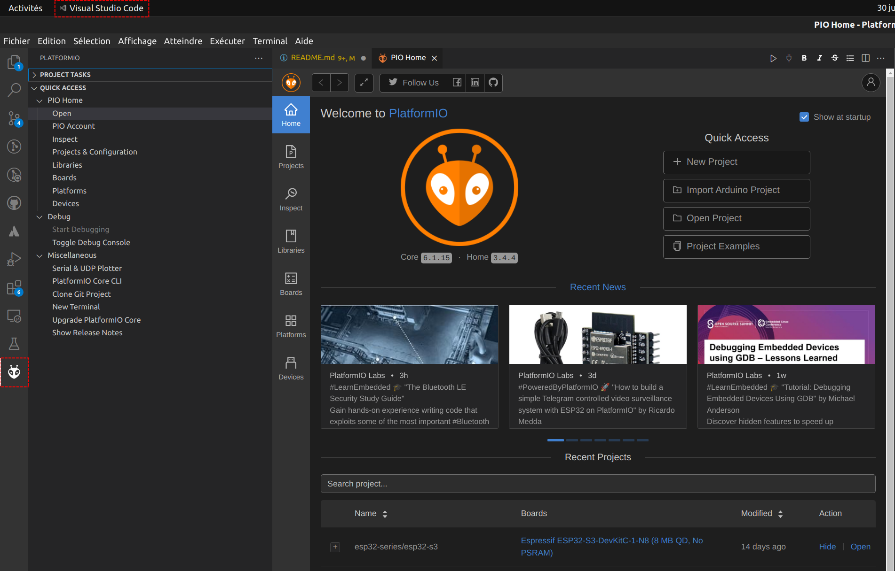

On accède à la fabrication (_build_), au téléversage (_upload_) et au moniteur série par la barre bleue en bas de l'IDE :

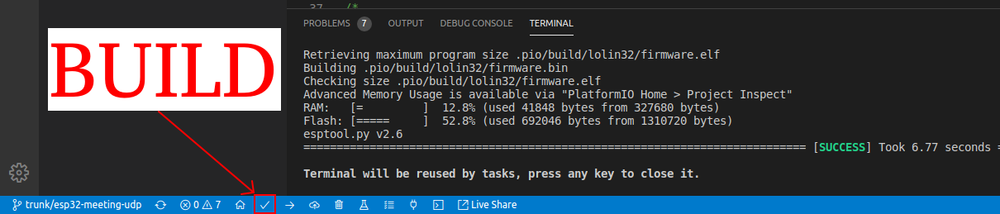

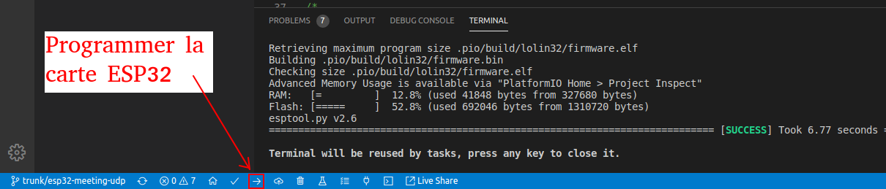

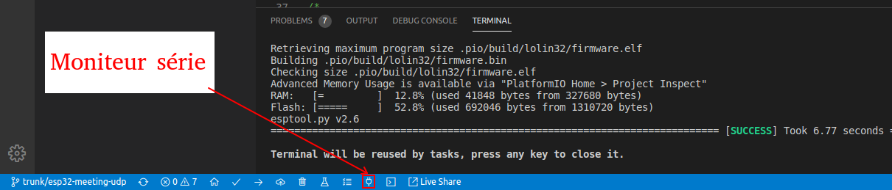

### Créer un projet

On commence par créer un nouveau projet :

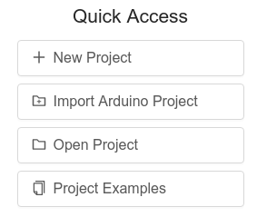

On donne un nom au projet et on choisit sa carte (ici une carte __ESP32 LoRa de chez Heltec__) :

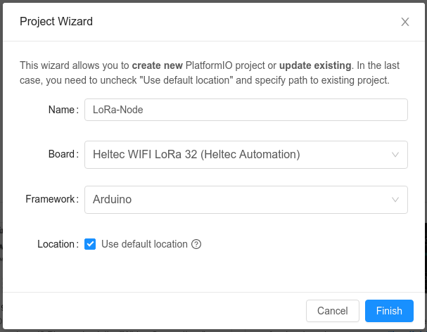

> [!NOTE]
> En fonction de la carte choisie, il peut y avoir plusieurs plateformes de développement.

Exemple d'architecture d'un projet PlaformIO :

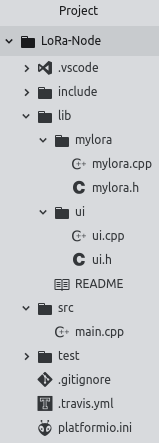

Le code source de l'application se situe dans le dossier `src` avec le fichier `main.cpp` (par défaut pour un _framework_ Arduino)  :

```cpp
#include <Arduino.h>

void setup() {
  // put your setup code here, to run once:
}

void loop() {
  // put your main code here, to run repeatedly:
}
```

> [!TIP]
> Il est possible d'ajouter ses fichiers d'en-tête (_header_) `.h` dans le dossier `include` et ses propres bibliothèques dans le dossier `lib`.

Le fichier `platformio.ini` contient la configuration du projet :

```ini
[env:heltec_wifi_lora_32]
platform = espressif32
board = heltec_wifi_lora_32
framework = arduino
lib_deps =
  LoRa
  ESP8266_SSD1306
  Adafruit Unified Sensor
  DHT sensor library
;upload_port = /dev/ttyUSB0
;upload_speed = 115200
;monitor_port = /dev/ttyUSB0
;monitor_speed = 115200
```

> [!IMPORTANT]
> Les options du fichier `platformio.ini` sont décrites dans la [documentation](https://docs.platformio.org/en/latest/projectconf.html).

### Bibliothèques

Pour ajouter des bibliothèques de la communauté au projet, il suffit d'ajouter leur nom (ou leur ID) dans la variable `lib_deps`.

PlatformIO fournit un outil de recherche de bibliothèques bien pratique :

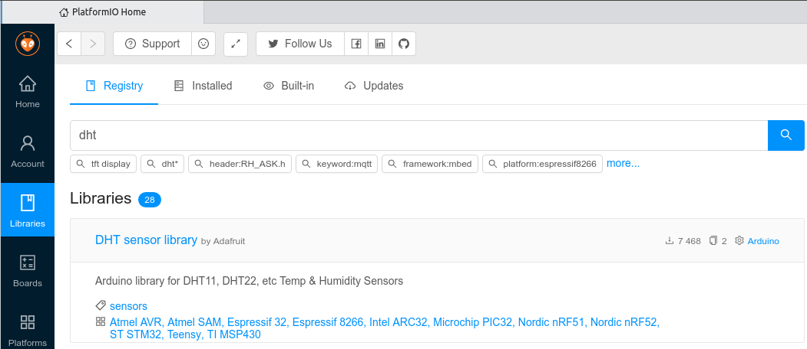

On choisit sa bibliothèque et on accède à l'ensemble de ces informations :

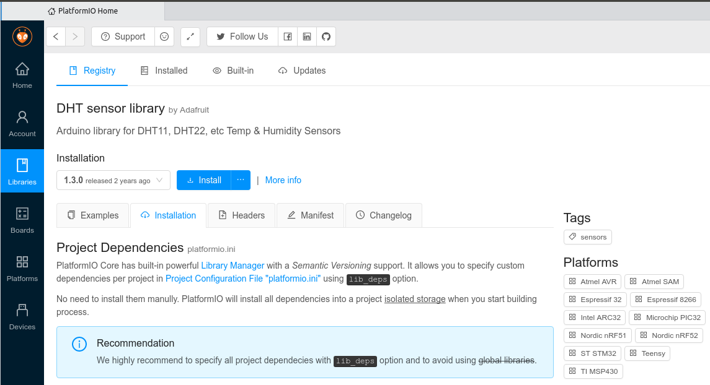

> [!TIP]
> Il est aussi possible d'indiquer la version de la bibliothèque désirée en respectant les règles syntaxique définies [ici](https://docs.platformio.org/en/latest/userguide/lib/cmd_install.html#description).

## PlatformIO CLI

### Usage

PlatformIO fournit l'utilitaire `platformio` (ou son alias `pio`) pour programmer des systèmes embarqués (Arduino UNO, ESP32, etc.).

Dans VSCode, démarrer un terminal :

```sh
$ platformio --version
PlatformIO Core, version 6.1.4

$ pio --version
PlatformIO Core, version 6.1.4

$ platformio --help
$ pio --help
Usage: platformio [OPTIONS] COMMAND [ARGS]...

Options:
  --version          Show the version and exit.
  -f, --force        DEPRECATE
  -c, --caller TEXT  Caller ID (service)
  --no-ansi          Do not print ANSI control characters
  -h, --help         Show this message and exit.

Commands:
  account   Manage PIO Account
  boards    Embedded Board Explorer
  check     Run a static analysis tool on code
  ci        Continuous Integration
  debug     PIO Unified Debugger
  device    Monitor device or list existing
  home      PIO Home
  lib       Library Manager
  platform  Platform Manager
  project   Project Manager
  remote    PIO Remote
  run       Process project environments
  settings  Manage PlatformIO settings
  test      Unit Testing
  update    Update installed platforms, packages and libraries
  upgrade   Upgrade PlatformIO to the latest version
```

> [!TIP]
> Pour y accéder à partir d'un terminal, on peut ajouter ces lignes à la fin du fichier `~/.bashrc` :
> ```sh
> # plaformio
> export PLATFORMIO_INSTALL="$HOME/.platformio"
> export PATH=$PLATFORMIO_INSTALL/penv/bin:$PLATFORMIO_INSTALL/packages/tool-esptoolpy/:$PATH
> ```

Les paramètres de PlatformIO :

```sh
$ platformio settings get
Name                          Current value [Default]                 Description
----------------------------  --------------------------------------  --------------------------------------------------------------------
check_platformio_interval     7                                       Check for the new PlatformIO Core interval (days)
check_prune_system_threshold  1024                                    Check for pruning unnecessary data threshold (megabytes)
enable_cache                  Yes                                     Enable caching for HTTP API requests
enable_proxy_strict_ssl       Yes                                     Verify the proxy server certificate against the list of supplied CAs
enable_telemetry              Yes                                     Telemetry service <https://bit.ly/pio-telemetry> (Yes/No)
force_verbose                 No                                      Force verbose output when processing environments
projects_dir                  ~/Documents/PlatformIO/Projects  Default location for PlatformIO projects (PlatformIO Home)

************************************************************************************************************************************************************
We found 261.77MB of unnecessary PlatformIO system data (temporary files, unnecessary packages, etc.).
Use `pio system prune --dry-run` to list them or `pio system prune` to save disk space.
```

> Guide : https://docs.platformio.org/en/stable/core/userguide/index.html

L'arborescence de PlatformIO est la suivante :

```sh
$ ls -l $HOME/.platformio/
-rw-rw-r--  1 tv tv  177 juin  10 06:02 appstate.json
-rw-rw-r--  1 tv tv 2178 juin  16 07:25 homestate.json
drwxrwxr-x 15 tv tv 4096 juin  16 07:24 packages
drwxrwxr-x  5 tv tv 4096 mars  30 22:16 penv
drwxrwxr-x  5 tv tv 4096 sept.  3  2023 platforms
```

L'utilitaire `platformio` (et `pio`) se trouve dans le dossier `$HOME/.platformio/penv/bin/`.

Et on retrouve l'ensemble des outils dans le dossier `packages`.

```sh
$ ls -l $HOME/.platformio/packages/
drwx------ 4 tv tv 4096 mai   23  2023 contrib-piohome
drwx------ 8 tv tv 4096 avril 11  2023 framework-arduino-avr
drwx------ 6 tv tv 4096 mars  25  2023 framework-arduinoespressif32
drwx------ 2 tv tv 4096 mai   23  2023 tool-avrdude
drwx------ 8 tv tv 4096 avril 11  2023 toolchain-atmelavr
drwx------ 7 tv tv 4096 juin  16 07:24 toolchain-riscv32-esp
drwx------ 7 tv tv 4096 mars  25  2023 toolchain-xtensa-esp32
drwx------ 7 tv tv 4096 juin  16 07:24 toolchain-xtensa-esp32s3
drwx------ 7 tv tv 4096 mars  25  2023 tool-esptoolpy
drwx------ 2 tv tv 4096 mars  25  2023 tool-mkfatfs
drwx------ 2 tv tv 4096 mars  25  2023 tool-mklittlefs
drwx------ 2 tv tv 4096 mars  25  2023 tool-mkspiffs
drwx------ 3 tv tv 4096 mars  30 22:16 tool-scons
```

Ici, on peut y trouver :

* des outils pour _flasher_ des cartes Atmel SAM et ST (STM32) avec [OpenOCD](http://openocd.org/), des cartes à base d'ESP avec [esptool](https://github.com/espressif/esptool) ou encore des cartes Arduino avec [avrdude](https://www.nongnu.org/avrdude/) ...

* des chaînes développement pour processeur ARM avec [gccarmnoneeabi](https://launchpad.net/gcc-arm-embedded), Atmel avec [atmelavr](https://www.microchip.com/mplab/avr-support/avr-and-arm-toolchains-c-compilers), ESP32 [xtensa32](https://github.com/espressif/esp-idf) et ESP8266 avec [xtensa](https://github.com/jcmvbkbc/gcc-xtensa) ...

* des _frameworks_ Arduino, mbed, espressif, ...

```sh
$ ls -l $HOME/.platformio/platforms/
drwx------ 6 tv tv 4096 janv. 11 11:50 atmelavr
drwx------ 7 tv tv 4096 mars  26 10:54 espressif32
drwx------ 7 tv tv 4096 mars  27 18:05 espressif8266
drwx------ 9 tv tv 4096 avril  1 06:38 ststm32
```

### Créer un nouveau projet

- Créer un répertoire pour le projet

```sh
$ mkdir -p nom-projet
$ cd nom-projet
```

- Initialiser le projet pour une carte et un _framework_

```sh
$ pio project init --board uno --project-option="framework=arduino"
...
include : Put project header files here
lib : Put here project specific (private) libraries
src : Put project source files here
platformio.ini : Project Configuration File
...
Project has been successfully initialized! Useful commands:
pio run : process/build project from the current directory
pio run --target upload or pio run -t upload : upload firmware to a target
pio run --target clean : clean project (remove compiled files)
...
```

- Voir l'état initial du projet

```sh
$ ls -l
drwxrwxr-x 2 tv tv 4096 sept. 27 07:59 include
drwxrwxr-x 2 tv tv 4096 sept. 27 07:59 lib
-rw-rw-r-- 1 tv tv  427 sept. 27 07:59 platformio.ini
drwxrwxr-x 2 tv tv 4096 sept. 27 07:59 src
drwxrwxr-x 2 tv tv 4096 sept. 27 07:59 test

$ cat platformio.ini
[env:uno]
platform = atmelavr
board = uno
framework = arduino
```

Les **fichiers sources** sont à placer dans `src/`, par exemple `src/main.cpp` pour un _framework_ Arduino :

```cpp
#include <Arduino.h>

void setup()
{
}

void loop()
{
}
```

### Fabriquer un projet (_build_)

```sh
$ pio run -v
```

### Programmer le système embarqué (_upload_)

```sh
$ pio run -t upload -v
```

Les fichiers générés pendant la fabrication sont stockés dans un répertoire `.pio`.

> [!IMPORTANT]
> Ces fichiers ne doivent jamais être conservés dans un dépôt `git`.

### Nettoyer un projet

Les fichiers générés à la fabrication peuvent être supprimés avec la commande suivante :

```sh
$ pio run --target clean
```

### Monitorer

Les options disponibles sont :

```sh
$ platformio device monitor --help
Usage: platformio device monitor [OPTIONS]

Options:
  -p, --port TEXT       Port, a number or a device name
  -b, --baud INTEGER    Set baud rate, default=9600
  --parity [N|E|O|S|M]  Set parity, default=N
  --rtscts              Enable RTS/CTS flow control, default=Off
  --xonxoff             Enable software flow control, default=Off
  --rts [0|1]           Set initial RTS line state, default=0
  --dtr [0|1]           Set initial DTR line state, default=0
  --echo                Enable local echo, default=Off
  --encoding TEXT       Set the encoding for the serial port (e.g. hexlify,
                        Latin1, UTF-8), default: UTF-8
  -f, --filter TEXT     Add filters / text transformation
  --eol [CR|LF|CRLF]    End of line mode, default=CRLF
  --raw                 Do not apply any encodings/transformations
  --exit-char INTEGER   ASCII code of special character that is used to exit
                        the application, default=29 (DEC)
  --menu-char INTEGER   ASCII code of special character that is used to
                        control miniterm (menu), default=20 (DEC)
  --quiet               Diagnostics: suppress non-error messages, default=Off
  -h, --help            Show this message and exit.
```

Liste des ports disponibles :

```sh
$ platformio device list
...
/dev/ttyACM0
------------
Hardware ID: USB VID:PID=0483:374B SER=0672FF555051897267243807 LOCATION=1-4.4.2:1.2
Description: STM32 STLink - ST-Link VCP Ctrl
```

Liens :

* [platformio device monitor](https://docs.platformio.org/en/latest/core/userguide/device/cmd_monitor.html)
* ["platformio.ini" (Project Configuration File)](https://docs.platformio.org/en/latest/projectconf/index.html#projectconf)

Les options peuvent être placées directement dans le fichier `plaftform.ini`, par exemple :

```ini
...
upload_port = /dev/ttyUSB0
upload_speed = 115200
monitor_port = /dev/ttyUSB0
monitor_speed = 115200
monitor_filters = colorize, debug
monitor_flags =
    --encoding
    hexlify
```

Exemple :

```sh
$ platformio device monitor -p /dev/ttyACM0
--- Available filters and text transformations: colorize, debug, default, direct, hexlify, log2file, nocontrol, printable, send_on_enter, time
--- More details at http://bit.ly/pio-monitor-filters
--- Miniterm on /dev/ttyACM0  9600,8,N,1 ---
--- Quit: Ctrl+C | Menu: Ctrl+T | Help: Ctrl+T followed by Ctrl+H ---
Start STM32L475

$ platformio device monitor -p /dev/ttyACM0 --encoding hexlify
...
--- Miniterm on /dev/ttyACM0  9600,8,N,1 ---
--- Quit: Ctrl+C | Menu: Ctrl+T | Help: Ctrl+T followed by Ctrl+H ---
53 74 61 72 74 20 53 54 4D 33 32 4C 34 37 35 0A
```

### Les bibliothèques

La gestion des bibliothèques sous PlatormIO est contrôlée par la commande `pio pkg`

> `pio lib` est considérée maintenant comme obsolète. Elle disparaîtra probablement dans les nouvelles versions.

Les bibliothèques peuvent être installées :

- globalement (dans le dossier d'installation de PlatformIO)

```sh
$ pio lib -g list
$ pio pkg list --global --only-libraries
...
```

- localement (dans le dossier du projet)

```sh
$ pio lib list
$ pio pkg list --only-libraries
```

Et de manière générale : `pio pkg list`

Les commandes utiles :

- rechercher une bibliothèque :

```sh
$ pio pkg search xxx
```

- voir les informations sur une bibliothèque :

```sh
$ pio pkg show xxx
```

- installer une bibliothèque (avec l'option `--global` pour l'installer globalement) :

```sh
$ pio pkg install xxx
```

Des informations spécifiques sur les bibliothèques peuvent être conservées avec `lib_deps` dans le fichier du projet `platformio.ini` :

```ini
...
lib_deps =
  fastled/FastLED @ ^3.4.0
```

> [!NOTE]
> Il est possible de créer ses propres bibliothèques à l’intérieur du projet dans le dossier `lib`. Le principe est de créer un sous-répertoire qui porte le même nom que le nom des fichiers sources (`.h` et `.cpp`).
>
> Il est aussi possible de placer des fichiers d’entête (`.h`) dans le dossier `include` du projet. Il ne faut pas oublier d'indiquer le répertoire qui contient des fichiers d'entêtes dans le fichier `plaformio.ini` :
>
> ```ini
> ...
> build_flags = -I./include
> ```

Il est aussi poussible de distribuer des bibliothèques pour les partager avec la communauté.

Il faut deux conditions pour enregistrer sa bibliothèque dans [PlatformIO](https://platformio.org/lib) :

* compléter et fournir un fichier `library.json` (ou `library.properties` ou `module.json`)
* partager publiquement son code (git, svn, mercurial, ou http)

```sh
$ platformio lib register https://os.mbed.com/users/tvaira/code/DISCO_L475VG_IOT01_HTS221//raw-file/576400702b64/library.json
The library has been successfully registered and is waiting for moderation
```

## Framework Arduino

### Module testé : ESP32 AZ-Delivery Dev Kit C (NODEMCU)

Module testé : https://www.az-delivery.de/fr/products/esp32-developmentboard

L'[AZ-Delivery Dev Kit C](https://www.az-delivery.de/fr/products/esp32-developmentboard) (ESP32 NODEMCU) a été conçu par [Espressif](https://www.espressif.com/) pour programmer le microcontrôleur [ESP32](https://www.espressif.com/en/products/socs/esp32).

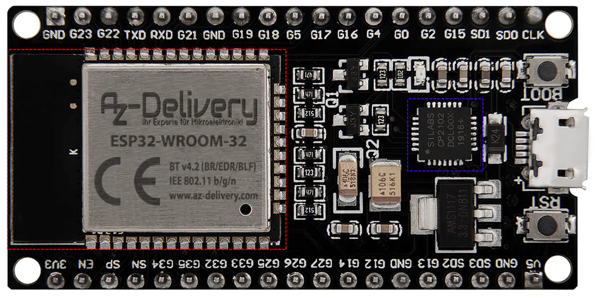

L'ESP32 utilisé possède une unité centrale composée de 2 cœurs Tensilica LX6 32 bits à 240 MHz.

Quelques caractéristiques :

|||
|---|---|
|RAM|512 kB (520 kB pour l'ESP32-D0WDQ6)|
|Mémoire flash externe|4 MB|
|GPIOs|34|
|Interfaces|SPI, I2C, I2S, CAN, UART|
|WiFi|802.11 b/g/n, 802.11n (2.4 GHz) up to 150 Mbps|
|Bluetooth|V4.2 - BLE et Bluetooth classique|
|Antenne sans fil|PCB|
|Pont USB/UART|CP2102|

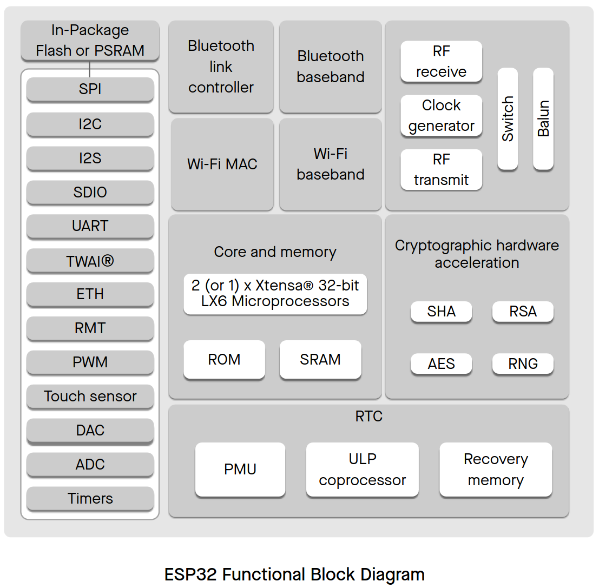

### Détection

> Sous GNU/Linux, cf. https://docs.platformio.org/en/latest/core/installation/udev-rules.html

```bash
$ sudo dmesg
...
[1973869.449241] usb 1-2: New USB device found, idVendor=10c4, idProduct=ea60, bcdDevice= 1.00
[1973869.449245] usb 1-2: New USB device strings: Mfr=1, Product=2, SerialNumber=3
[1973869.449247] usb 1-2: Product: CP2102 USB to UART Bridge Controller
[1973869.449249] usb 1-2: Manufacturer: Silicon Labs
[1973869.449250] usb 1-2: SerialNumber: 0001
[1973869.458370] cp210x 1-2:1.0: cp210x converter detected
[1973869.459262] usb 1-2: cp210x converter now attached to ttyUSB0

$ lsusb
...
Bus 001 Device 030: ID 10c4:ea60 Silicon Labs CP210x UART Bridge
...
```

> L'ESP32 s'interface via un pont USB/UART [CP2102](https://www.silabs.com/interface/usb-bridges/classic/device.cp2102?tab=specs)

```bash
$ esptool.py --port /dev/ttyUSB0 --chip esp32 flash_id
esptool.py v4.5
Serial port /dev/ttyUSB0
Connecting.....
Chip is ESP32-D0WDQ6 (revision v1.0)
Features: WiFi, BT, Dual Core, 240MHz, VRef calibration in efuse, Coding Scheme None
Crystal is 40MHz
MAC: 24:62:ab:f2:5a:18
Uploading stub...
Running stub...
Stub running...
Manufacturer: 68
Device: 4016
Detected flash size: 4MB
Hard resetting via RTS pin...
```

> Datasheets : [esp32_datasheet_en.pdf](https://www.espressif.com/sites/default/files/documentation/esp32_datasheet_en.pdf) et [esp32-wroom-32_datasheet_en.pdf](https://www.espressif.com/sites/default/files/documentation/esp32-wroom-32_datasheet_en.pdf)

Nomenclature ESP32-D0WDQ6

- `D` : _Dual core_
- `0` : _No in-package flash_
- `WD` : _Wi-Fi b/g/n + Bluetooth/Bluetooth LE dual mode_
- `Q6` : _Package QFN 6*6_

### platformio.ini

[platformio.ini](https://docs.platformio.org/en/latest/projectconf/index.html) est le fichier de configuration d'un projet PlatformIO.

> [!NOTE]
> Un [fichier INI](https://fr.wikipedia.org/wiki/Fichier_INI) est un **fichier de configuration** dans un format de données introduit par les systèmes d’exploitation Windows en 1985. Par convention les noms de ces fichiers portent l’extension `.ini`.
> 
> Les fichiers INI sont des **fichiers texte** : ils peuvent donc être manipulés avec un éditeur de texte (`vim`, `emacs`, etc.). Les fichiers sont divisés en **sections**. Chaque section comporte un certain nombre de **paramètres de configuration**. Chaque section commence par un titre placé entre crochets `[` et `]`.
> 
> La valeur de chaque paramètre de configuration est indiquée par une formule : `paramètre = valeur`. Les fichiers peuvent contenir des **commentaires**. Les commentaires sont souvent utilisés pour décrire les paramètres et les valeurs à introduire. Ils sont précédés d’un point-virgule `;` ou plus rarement d’un dièse `#`.

Le fichier [platformio.ini](https://docs.platformio.org/en/latest/projectconf/index.html) peut contenir plusieurs sections :

- La section `[platformio]` permet de modifier les valeurs par défaut de PlatformIO (notamment des chemins).
- La section `[common]` permet de regrouper des paramétres communs au projet.
- La (ou les) section(s) `[env]` permet de déclarer un environnement de configuration définissant les tâches pour la construction, la programmation, le débogage, les tests unitaires, la surveillance des périphériques, les dépendances de bibliothèque, etc.

> Chaque projet peut avoir plusieurs environnements de configuration. Dans ce cas, on doit lui donner un **nom** (`[env:nom]`). Le nom peut être alors utilisé en option `-e` (ou `--environment`) des commandes `pio` de PlatformIO. Le nom peut aussi être récupéré dans la variable `$PIOENV`.

Exemple de fichier [platformio.ini](https://docs.platformio.org/en/latest/projectconf/index.html) :

```ini
[platformio]
default_envs = lolin32

; paramétres communs au projet
[common]
build_flags = -DDEBUG

; paramétres globaux à tous les environnements
[env]
platform = espressif8266
framework = arduino
board = lolin32
...
```

Un environnement (`[env]`) est défini par au moins trois paramètres :

- la plateforme (_platform_) qui permet l'intégration des cartes spécifiques d'un fabricant (kits de développement, MCU), de _frameworks_ et de SDK.
- la carte (_board_) qui dispose de paramètres préconfigurés pour les tâches de fabrication, programmation, débogage, etc.
- le _framework_ de développement

#### Carte (_board_)

Recherche des cartes ESP32 :

```bash
$ pio boards esp32

Platform: espressif32
===============================================================================================================================================================================================
ID                                   MCU      Frequency    Flash    RAM     Name
-----------------------------------  -------  -----------  -------  ------  ---------------------------------------------------
...
esp32dev                             ESP32    240MHz       4MB      320KB   Espressif ESP32 Dev Module
...
nodemcu-32s                          ESP32    240MHz       4MB      320KB   NodeMCU-32S
...
lolin32                              ESP32    240MHz       4MB      320KB   WEMOS LOLIN32
...
```

> PlatformIO prend en charge plus de [1500 cartes](https://docs.platformio.org/en/latest/boards/index.html#boards).

Sachant que ce module d'[AZ-Delivery](https://www.az-delivery.de/fr/) ne possède pas de définition dans PlatormIO, on va choisir l'ID [lolin32](https://docs.platformio.org/en/latest/boards/espressif32/lolin32.html) que l'on déclare dans `platformio.ini` de la manière suivante :

```ini
[env]
platform = espressif32
board = lolin32
```

#### Plateforme (_platform_)

Dans PlatformIO, une plateforme (_platform_) de développement est une architecture particulière de microcontrôleur sur laquelle les projets peuvent être compilés pour s'exécuter.

Pour chaque plateforme de développement, PlatformIO définit :

- les scripts de construction pour les frameworks et SDK pris en charge
- des préréglages
- les chaînes d'outils pour la ou les architectures

Chaque projet doit spécifier le **nom** de la plateforme à l'aide de l'option `platform` dans le fichier de configuration du projet `platformio.ini`.

Pour les micro-contrôleurs ESP32, la plateforme est `espressif32`.

```ini
[env]
platform = espressif32
...
```

Lien : https://docs.platformio.org/en/latest/platforms/espressif32.html#platform-espressif32

> PlatformIO prend en charge plus de [40 plateformes](https://registry.platformio.org/search?t=platform) dont `espressif32`, `espressif8266`, `atmelavr`, `ststm32` etc.

#### Framework

La plateforme [espressif32](https://docs.platformio.org/en/latest/platforms/espressif32.html#platform-espressif32) supporte deux _frameworks_ :

- [arduino](https://docs.platformio.org/en/latest/frameworks/arduino.html) : un portage du _framework_ [Arduino pour ESP32](https://github.com/espressif/arduino-esp32)
- [espidf](https://docs.platformio.org/en/latest/frameworks/espidf.html#framework-espidf) : le _framework_ officiel d'[Espressif](https://github.com/espressif/esp-idf)

### Exemple 1 (un environnement)

#### Configuration

On crée un nouveau projet pour ce module avec le framework Arduino :

```bash
$ pio project init --board lolin32 --project-option="framework=arduino"
The following files/directories have been created in ~/Documents/git/bts-lasalle-avignon-ressources/PlatformIO/src/arduino-esp32
include - Put project header files here
lib - Put project specific (private) libraries here
src - Put project source files here
platformio.ini - Project Configuration File
Resolving lolin32 dependencies...
Already up-to-date.
Project has been successfully initialized!

$ ls -l
drwxrwxr-x 2 tv tv 4096 juil.  3 08:50 include
drwxrwxr-x 2 tv tv 4096 juil.  3 08:50 lib
-rw-rw-r-- 1 tv tv  438 juil.  3 08:50 platformio.ini
drwxrwxr-x 2 tv tv 4096 juil.  3 08:50 src
drwxrwxr-x 2 tv tv 4096 juil.  3 08:50 test

$ cat platformio.ini
```

```ini
; Exemple 1 : un environnement
[env:lolin32]
platform = espressif32
board = lolin32
framework = arduino
```

Le _framework_ [Arduino pour ESP32](https://github.com/espressif/arduino-esp32) est installé localement :

```bash
$ ls - l $HOME/.platformio/packages/framework-arduinoespressif32/
```

Les brochages spécifiques sont définis dans un fichier `pins_arduino.h` situé dans `$HOME/.platformio/packages/framework-arduinoespressif32/variants/`

> Par exemple pour la carte `lolin32` : `$HOME/.platformio/packages/framework-arduinoespressif32/variants/lolin32`

L'ensemble des paramètres sont dans `$HOME/.platformio/packages/framework-arduinoespressif32/boards.txt`. Il y a plus de 22000 lignes donc un `grep` est souvent nécessaire :

```bash
$ cat $HOME/.platformio/packages/framework-arduinoespressif32/boards.txt | grep "^lolin32\..*"
lolin32.name=WEMOS LOLIN32
lolin32.bootloader.tool=esptool_py
lolin32.bootloader.tool.default=esptool_py
lolin32.upload.tool=esptool_py
lolin32.upload.tool.default=esptool_py
lolin32.upload.tool.network=esp_ota
lolin32.upload.maximum_size=1310720
lolin32.upload.maximum_data_size=327680
...
lolin32.build.target=esp32
lolin32.build.mcu=esp32
lolin32.build.core=esp32
lolin32.build.variant=lolin32
lolin32.build.board=LOLIN32
lolin32.build.f_cpu=240000000L
lolin32.build.flash_mode=dio
lolin32.build.flash_size=4MB
lolin32.build.boot=dio
lolin32.build.partitions=default
...
```

Les paramètres utilisés par défaut pour une carte sont fixés dans un fichier [JSON](https://fr.wikipedia.org/wiki/JavaScript_Object_Notation), ici : `$HOME/.platformio/platforms/espressif32/boards/lolin32.json` :

```json
{
  "build": {
    "arduino":{
      "ldscript": "esp32_out.ld"
    },
    "core": "esp32",
    "extra_flags": "-DARDUINO_LOLIN32",
    "f_cpu": "240000000L",
    "f_flash": "40000000L",
    "flash_mode": "dio",
    "mcu": "esp32",
    "variant": "lolin32"
  },
  "connectivity": [
    "wifi",
    "bluetooth",
    "ethernet",
    "can"
  ],
  "debug": {
    "openocd_board": "esp-wroom-32.cfg"
  },
  "frameworks": [
    "arduino",
    "espidf"
  ],
  "name": "WEMOS LOLIN32",
  "upload": {
    "flash_size": "4MB",
    "maximum_ram_size": 327680,
    "maximum_size": 4194304,
    "require_upload_port": true,
    "speed": 460800
  },
  "url": "https://wiki.wemos.cc/products:lolin32:lolin32",
  "vendor": "WEMOS"
}
```

On peut personnaliser ces paramètres dans `platformio.ini` avec la syntaxe suivante :

```ini
[env:lolin32]
platform = espressif32
framework = arduino
board = lolin32
board_build.mcu = esp32
board_build.f_cpu = 240000000L
board_build.partitions=huge_app.csv
```

> [!TIP]
> Corrélation entre le fichier `.json` et `platformio.ini` :
> 
> ```json
> {
>     "build": {
>         ...,
>         "f_cpu": "240000000L", /* donc board_build.f_cpu */
>     },
>     ...
> }
> ```

Le SDK spécifique pour l'esp32 se situe dans `$HOME/.platformio/packages/framework-arduinoespressif32/tools/sdk/esp32` et tous les fichiers d'entête dans `include/`

La configuration (des `#define`) se trouve toujours dans un fichier _header_ `sdkconfig.h`, ici pour l'esp32 : `$HOME/.platformio/packages/framework-arduinoespressif32/tools/sdk/esp32/dio_qspi/include/sdkconfig.h`

#### Code source

Exemple de programme [src/arduino-esp32/src/main.cpp](src/arduino-esp32/src/main.cpp) :

```cpp
#include <Arduino.h>

uint8_t esp32Led = 1; // LED_BUILTIN

void setup()
{
    Serial.begin(115200);
    pinMode(esp32Led, OUTPUT);
#ifdef DEBUG
    Serial.println("Setup done");
#endif
    Serial.print("CPU freq : ");
    Serial.println(String(ESP.getCpuFreqMHz()) + " MHz");
    Serial.print("CPU cores : ");
    esp_chip_info_t out_info;
    esp_chip_info(&out_info);
    Serial.println(String(out_info.cores));
    Serial.print("Flash size : ");
    Serial.println(String(ESP.getFlashChipSize() / 1000000) + " MB");
    Serial.print("Free RAM : ");
    Serial.println(String((long)ESP.getFreeHeap()) + " bytes");
}

void loop()
{
#ifdef DEBUG
    Serial.println("Start blink");
#endif
    // "Hello world!" ? non blink!
    digitalWrite(esp32Led, HIGH);
    delay(1000);
    digitalWrite(esp32Led, LOW);
    delay(1000);
}
```

#### Build

Fabrication du projet :

```sh
$ pio run -v
Processing lolin32 (platform: espressif32; board: lolin32; framework: arduino; build_flags: -DDEBUG; monitor_port: /dev/ttyUSB0; monitor_speed: 115200)

CONFIGURATION: https://docs.platformio.org/page/boards/espressif32/lolin32.html
PLATFORM: Espressif 32 (6.1.0) > WEMOS LOLIN32
HARDWARE: ESP32 240MHz, 320KB RAM, 4MB Flash
DEBUG: Current (cmsis-dap) External (cmsis-dap, esp-bridge, esp-prog, iot-bus-jtag, jlink, minimodule, olimex-arm-usb-ocd, olimex-arm-usb-ocd-h, olimex-arm-usb-tiny-h, olimex-jtag-tiny, tumpa)
PACKAGES: 
 - framework-arduinoespressif32 @ 3.20007.0 (2.0.7) 
 - tool-esptoolpy @ 1.40500.0 (4.5.0) 
 - toolchain-xtensa-esp32 @ 8.4.0+2021r2-patch5
LDF: Library Dependency Finder -> https://bit.ly/configure-pio-ldf
LDF Modes: Finder ~ chain, Compatibility ~ soft
Found 33 compatible libraries
Scanning dependencies...
No dependencies
Building in release mode
xtensa-esp32-elf-g++ -o .pio/build/lolin32/src/main.cpp.o -c \
-Wno-frame-address -std=gnu++11 -fexceptions -fno-rtti -Os -mlongcalls \
-ffunction-sections -fdata-sections -Wno-error=unused-function \
-Wno-error=unused-variable -Wno-error=deprecated-declarations \
-Wno-unused-parameter -Wno-sign-compare -ggdb -freorder-blocks \
 -Wwrite-strings -fstack-protector -fstrict-volatile-bitfields \
-Wno-error=unused-but-set-variable -fno-jump-tables \
-fno-tree-switch-conversion -MMD -DPLATFORMIO=60115 -DARDUINO_LOLIN32 -DDEBUG \
-DHAVE_CONFIG_H -DMBEDTLS_CONFIG_FILE=\"mbedtls/esp_config.h\" \
-DUNITY_INCLUDE_CONFIG_H -DWITH_POSIX -D_GNU_SOURCE -DIDF_VER=\"v4.4.4\" \
-DESP_PLATFORM -D_POSIX_READER_WRITER_LOCKS -DARDUINO_ARCH_ESP32 -DESP32 \
-DF_CPU=240000000L -DARDUINO=10812 -DARDUINO_VARIANT=\"lolin32\" \
"-DARDUINO_BOARD=\"WEMOS LOLIN32\"" -DARDUINO_PARTITION_default -Iinclude -Isrc ... \
src/main.cpp
...
xtensa-esp32-elf-g++ -o .pio/build/lolin32/FrameworkArduino/USBCDC.cpp.o -c ... \
~/.platformio/packages/framework-arduinoespressif32/cores/esp32/USBCDC.cpp
...
xtensa-esp32-elf-gcc -o .pio/build/lolin32/FrameworkArduino/wiring_shift.c.o  -c ... \
~/.platformio/packages/framework-arduinoespressif32/cores/esp32/wiring_shift.c
...
xtensa-esp32-elf-ar rc .pio/build/lolin32/libFrameworkArduino.a \
.pio/build/lolin32/FrameworkArduino/Esp.cpp.o\
.pio/build/lolin32/FrameworkArduino/FirmwareMSC.cpp.o ...\
.pio/build/lolin32/FrameworkArduino/wiring_shift.c.o
...
xtensa-esp32-elf-ranlib .pio/build/lolin32/libFrameworkArduino.a
...
xtensa-esp32-elf-g++ -o .pio/build/lolin32/firmware.elf ... .pio/build/lolin32/src/main.cpp.o ... \
 -Wl,--start-group .pio/build/lolin32/libFrameworkArduino.a -lesp_ringbuf -lefuse ... \
 -lstdc++ -lpthread -lgcc -lcxx -lapp_trace -lgcov -lapp_trace -lgcov -lc -Wl,--end-group
...
RAM:   [=         ]   6.8% (used 22424 bytes from 327680 bytes)
Flash: [==        ]  20.3% (used 266513 bytes from 1310720 bytes)
.pio/build/lolin32/firmware.elf  :
section                                                                                size         addr
...
Total                                                                               5900891
"~/.platformio/penv/bin/python" "~/.platformio/packages/tool-esptoolpy/esptool.py" --chip esp32 elf2image --flash_mode dio --flash_freq 40m --flash_size 4MB --elf-sha256-offset 0xb0 -o .pio/build/lolin32/firmware.bin .pio/build/lolin32/firmware.elf
esptool.py v4.5
Creating esp32 image...
Merged 2 ELF sections
Successfully created esp32 image.
[SUCCESS] Took 5.84 seconds
```

Les outils utilisés ici par PlaformIO sont :

- `toolchain-xtensa-esp32` dans `~/.platformio/packages/toolchain-xtensa-esp32/bin/`
- `framework-arduinoespressif32` dans `~/.platformio/packages/framework-arduinoespressif32/`
- `tool-esptoolpy` dans `~ /.platformio/packages/tool-esptoolpy/`

La chaîne de développement `xtensa-esp32` (pour les 2 cœurs Tensilica LX6 32 bits de l'ESP32) fournit notamment les compilateurs C++ `xtensa-esp32-elf-g++` et C `xtensa-esp32-elf-gcc`. Ils servent à compiler le fichier source `src/main.cpp` et l'ensemble du framework `arduinoespressif32`. Les fichiers objets `.o` produits sont stockés dans l'arborescence `.pio/build/lolin32/` (`src` et `FrameworkArduino`).

> [!TIP]
> L'étiquette `DEBUG` a été ajouté au moment de la compilation (`xtensa-esp32-elf-g++ -c`). L'option `-DDEBUG` ajouté (et équivalente à `#define DEBUG`) provient du paramétre `build_flags` du fichier `platformio.ini`.

```sh
$ ls -l .pio/build/lolin32/src/
-rw-rw-r-- 1 tv tv 14625 juil.  3 18:09 main.cpp.d
-rw-rw-r-- 1 tv tv 94552 juil.  3 18:09 main.cpp.o

$ file .pio/build/lolin32/src/main.cpp.o
.pio/build/lolin32/src/main.cpp.o: ELF 32-bit LSB relocatable, Tensilica Xtensa, version 1 (SYSV), with debug_info, not stripped

$ cat .pio/build/lolin32/src/main.cpp.d 
.pio/build/lolin32/src/main.cpp.o: src/main.cpp \
 ~/.platformio/packages/framework-arduinoespressif32/cores/esp32/Arduino.h \
 ~/.platformio/packages/framework-arduinoespressif32/cores/esp32/esp_arduino_version.h \
 ...
 ~/.platformio/packages/framework-arduinoespressif32/tools/sdk/esp32/include/esp_hw_support/include/soc/esp32/spiram.h

$ ls -l .pio/build/lolin32/FrameworkArduino/
-rw-rw-r-- 1 tv tv  15061 juil.  3 18:09 base64.cpp.d
-rw-rw-r-- 1 tv tv  90244 juil.  3 18:09 base64.cpp.o
...
-rw-rw-r-- 1 tv tv  14798 juil.  3 18:09 WString.cpp.d
-rw-rw-r-- 1 tv tv 291112 juil.  3 18:09 WString.cpp.o
```

L'utilitaire `xtensa-esp32-elf-ar` crée l'archive `libFrameworkArduino.a` avec l'ensemble des fichiers objets `.o` du framework `arduinoespressif32` et `xtensa-esp32-elf-ranlib` génère l'index de l'archive à l'intérieur de celle-ci. L'index répertorie chaque symbole défini dans l'archive (table de symboles). L'archive `libFrameworkArduino.a` est une **[bibliothèque logicielle](https://fr.wikipedia.org/wiki/Biblioth%C3%A8que_logicielle) statique**. L'utilitaire `xtensa-esp32-elf-nm` permet de lister la table des symboles de l'archive.

> [!NOTE]
> Une bibliothèque statique est destinée à être copiée dans le programme lors de la construction de ce dernier (c'est la phase d'édition de liens).

```sh
$ ls -lh .pio/build/lolin32/libFrameworkArduino.a
-rw-rw-r-- 1 tv tv 3,2M juil.  3 21:32 .pio/build/lolin32/libFrameworkArduino.a
$ file .pio/build/lolin32/libFrameworkArduino.a
.pio/build/lolin32/libFrameworkArduino.a: current ar archive

$ ~/.platformio/packages/toolchain-xtensa-esp32/bin/xtensa-esp32-elf-nm -s .pio/build/lolin32/libFrameworkArduino.a
```

Ensuite, `xtensa-esp32-elf-g++` réalise l'édition de liens pour produire l'"exécutable" `firmware.elf`.

> [!NOTE]
> ELF (_Executable and Linkable Format_) est un format de fichier binaire utilisé pour l'enregistrement de code compilé. Il est par exemple utilisé dans la plupart des systèmes d'exploitation de type Unix comme GNU/Linux.

L'utilitaire `esptool.py` finalise le processus de fabrication en produisant le fichier `firmware.bin` à partir de `firmware.elf`. C'est le fichier `firmware.bin` qui sera "téléversé" (_upload_) vers l'ESP32.

```sh
$ ls -lh .pio/build/lolin32/firmware.*
-rw-rw-r-- 1 tv tv 261K juil.  3 20:22 .pio/build/lolin32/firmware.bin
-rwxrwxr-x 1 tv tv 5,8M juil.  3 20:22 .pio/build/lolin32/firmware.elf
-rw-rw-r-- 1 tv tv 8,6M juil.  3 20:22 .pio/build/lolin32/firmware.map

$ file .pio/build/lolin32/firmware.elf
.pio/build/lolin32/firmware.elf: ELF 32-bit LSB executable, Tensilica Xtensa, version 1 (SYSV), statically linked, with debug_info, not stripped

$ ~/.platformio/packages/toolchain-xtensa-esp32/bin/xtensa-esp32-elf-size -B -d .pio/build/lolin32/firmware.elf
   text	   data	    bss	    dec	    hex	filename
 196465	  70304	   3809	 270578	  420f2	.pio/build/lolin32/firmware.elf

$ ~/.platformio/packages/toolchain-xtensa-esp32/bin/xtensa-esp32-elf-objdump -f .pio/build/lolin32/firmware.elf

.pio/build/lolin32/firmware.elf:     file format elf32-xtensa-le
architecture: xtensa, flags 0x00000112:
EXEC_P, HAS_SYMS, D_PAGED
start address 0x4008290c
```

> [!NOTE]
> Un [firmware](https://fr.wikipedia.org/wiki/Firmware) (ou micrologiciel, microprogramme, microcode, logiciel interne ou encore logiciel embarqué) est un programme intégré dans un matériel informatique, ici l'ESP32, pour qu'il puisse fonctionner.

#### Flash

Téléversement (_upload_) :

```sh
$ pio run -t upload -v
Processing lolin32 (platform: espressif32; board: lolin32; framework: arduino; build_flags: -DDEBUG; monitor_port: /dev/ttyUSB0; monitor_speed: 115200)
-----------------------------------------------------------------------------------------------------------------------------------------------------------------------------------------------
CONFIGURATION: https://docs.platformio.org/page/boards/espressif32/lolin32.html
PLATFORM: Espressif 32 (6.1.0) > WEMOS LOLIN32
HARDWARE: ESP32 240MHz, 320KB RAM, 4MB Flash
DEBUG: Current (cmsis-dap) External (cmsis-dap, esp-bridge, esp-prog, iot-bus-jtag, jlink, minimodule, olimex-arm-usb-ocd, olimex-arm-usb-ocd-h, olimex-arm-usb-tiny-h, olimex-jtag-tiny, tumpa)
PACKAGES: 
 - framework-arduinoespressif32 @ 3.20007.0 (2.0.7) 
 - tool-esptoolpy @ 1.40500.0 (4.5.0) 
 - tool-mkfatfs @ 2.0.1 
 - tool-mklittlefs @ 1.203.210628 (2.3) 
 - tool-mkspiffs @ 2.230.0 (2.30) 
 - toolchain-xtensa-esp32 @ 8.4.0+2021r2-patch5
LDF: Library Dependency Finder -> https://bit.ly/configure-pio-ldf
LDF Modes: Finder ~ chain, Compatibility ~ soft
Found 33 compatible libraries
Scanning dependencies...
No dependencies
Building in release mode
<lambda>(["checkprogsize"], [".pio/build/lolin32/firmware.elf"])
MethodWrapper(["checkprogsize"], [".pio/build/lolin32/firmware.elf"])
Advanced Memory Usage is available via "PlatformIO Home > Project Inspect"
RAM:   [=         ]   6.8% (used 22424 bytes from 327680 bytes)
Flash: [==        ]  20.3% (used 266513 bytes from 1310720 bytes)
.pio/build/lolin32/firmware.elf  :
section                                                                                size         addr
.rtc.text                                                                                 0   1074528256
...
<lambda>(["upload"], [".pio/build/lolin32/firmware.bin"])
AVAILABLE: cmsis-dap, esp-bridge, esp-prog, espota, esptool, iot-bus-jtag, jlink, minimodule, olimex-arm-usb-ocd, olimex-arm-usb-ocd-h, olimex-arm-usb-tiny-h, olimex-jtag-tiny, tumpa
CURRENT: upload_protocol = esptool
BeforeUpload(["upload"], [".pio/build/lolin32/firmware.bin"])
Auto-detected: /dev/ttyUSB0
"~/.platformio/penv/bin/python" "~/.platformio/packages/tool-esptoolpy/esptool.py" --chip esp32 --port "/dev/ttyUSB0" --baud 460800 --before default_reset --after hard_reset write_flash -z --flash_mode dio --flash_freq 40m --flash_size 4MB 0x1000 ~/Documents/git/bts-lasalle-avignon-ressources/PlatformIO/src/arduino-esp32/.pio/build/lolin32/bootloader.bin 0x8000 ~/Documents/git/bts-lasalle-avignon-ressources/PlatformIO/src/arduino-esp32/.pio/build/lolin32/partitions.bin 0xe000 ~/.platformio/packages/framework-arduinoespressif32/tools/partitions/boot_app0.bin 0x10000 .pio/build/lolin32/firmware.bin
esptool.py v4.5
Serial port /dev/ttyUSB0
Connecting....
Chip is ESP32-D0WDQ6 (revision v1.0)
Features: WiFi, BT, Dual Core, 240MHz, VRef calibration in efuse, Coding Scheme None
Crystal is 40MHz
MAC: 24:62:ab:f2:5a:18
Uploading stub...
Running stub...
Stub running...
Changing baud rate to 460800
Changed.
Configuring flash size...
Flash will be erased from 0x00001000 to 0x00005fff...
Flash will be erased from 0x00008000 to 0x00008fff...
Flash will be erased from 0x0000e000 to 0x0000ffff...
Flash will be erased from 0x00010000 to 0x00051fff...
Compressed 17488 bytes to 12168...
Writing at 0x00001000... (100 %)
Wrote 17488 bytes (12168 compressed) at 0x00001000 in 0.6 seconds (effective 245.5 kbit/s)...
Hash of data verified.
Compressed 3072 bytes to 146...
Writing at 0x00008000... (100 %)
Wrote 3072 bytes (146 compressed) at 0x00008000 in 0.1 seconds (effective 389.8 kbit/s)...
Hash of data verified.
Compressed 8192 bytes to 47...
Writing at 0x0000e000... (100 %)
Wrote 8192 bytes (47 compressed) at 0x0000e000 in 0.1 seconds (effective 512.0 kbit/s)...
Hash of data verified.
Compressed 266880 bytes to 147807...
Writing at 0x00010000... (10 %)
Writing at 0x0001c812... (20 %)
Writing at 0x00024f36... (30 %)
Writing at 0x0002a059... (40 %)
Writing at 0x0002f5a1... (50 %)
Writing at 0x00034ce0... (60 %)
Writing at 0x0003e0ec... (70 %)
Writing at 0x000461c5... (80 %)
Writing at 0x0004b6af... (90 %)
Writing at 0x000510be... (100 %)
Wrote 266880 bytes (147807 compressed) at 0x00010000 in 3.4 seconds (effective 623.1 kbit/s)...
Hash of data verified.

Leaving...
Hard resetting via RTS pin...
[SUCCESS] Took 6.83 seconds
```

Par défaut, PlatformIO utilise l'utilitaire `esptool.py` pour écrire dans la mémoire FLASH (`write_flash`) l'ensemble des fichiers nécessaires à l'exécutation du programme `firmware.bin` sur l'ESP32 :

| Adresse |     Fichier      | Description                         |
| ------- | :--------------: | ----------------------------------- |
| 0x1000  |  bootloader.bin  | Le chargeur d'amorçage de l'ESP32   |
| 0x8000  |  partitions.bin  | Le partitionnement de la mémoire    |
| 0xe000  |  boot_app0.bin   | Le chargeur du programme exécutable |
| 0x10000 | **firmware.bin** | Le programme exécutable             |

A la fin, l'utilitaire `esptool.py` effectue un _reset_ (`hard_reset`) de la carte ESP32. L'ESP32 reboote et exécute le programme `firmware.bin`.

On peut monitorer l'exécution du programme sur le port série virtuel :

```sh
$ pio device monitor --baud 115200 --port /dev/ttyUSB0
--- Terminal on /dev/ttyUSB0 | 115200 8-N-1
--- Available filters and text transformations: colorize, debug, default, direct, esp32_exception_decoder, hexlify, log2file, nocontrol, printable, send_on_enter, time
--- More details at https://bit.ly/pio-monitor-filters
--- Quit: Ctrl+C | Menu: Ctrl+T | Help: Ctrl+T followed by Ctrl+H
ets Jun  8 2016 00:22:57

rst:0x1 (POWERON_RESET),boot:0x13 (SPI_FAST_FLASH_BOOT)
configsip: 0, SPIWP:0xee
clk_drv:0x00,q_drv:0x00,d_drv:0x00,cs0_drv:0x00,hd_drv:0x00,wp_drv:0x00
mode:DIO, clock div:2
load:0x3fff0030,len:1184
load:0x40078000,len:13192
load:0x40080400,len:3028
entry 0x400805e4
Setup done
CPU freq : 240 MHz
CPU cores : 2
Flash size : 4 MB
Free RAM : 291464 bytes
Start blink
Start blink
...
```

#### Partitions

La mémoire _flash_ de l'ESP32 est partitionnée.

> La mémoire flash est découpée en secteurs d'une taille de 4 kB. Les partitions peuvent être cryptées (`encrypted`) et en lecteur seule (`readonly`)

La table de partition se situe à l'offset `0x8000` par défaut et elle fournit les informations sur le découpage de la mémoire non-volatile.

Elle occupe un secteur (4096 octets) qui permet d'y stocker 95 entrées max et une somme de contrôle MD5 pour vérifier son intégrité.

Le [partitionnement](https://docs.espressif.com/projects/esp-idf/en/latest/esp32/api-guides/partition-tables.html) de la mémoire flash a été défini (par défaut) par le fichier `default.csv` :

```sh
$ cat ~/.platformio/packages/framework-arduinoespressif32/tools/partitions/default.csv
# Name,   Type, SubType, Offset,  Size, Flags
nvs,      data, nvs,     0x9000,  0x5000,
otadata,  data, ota,     0xe000,  0x2000,
app0,     app,  ota_0,   0x10000, 0x140000,
app1,     app,  ota_1,   0x150000,0x140000,
spiffs,   data, spiffs,  0x290000,0x160000,
coredump, data, coredump,0x3F0000,0x10000,
```

> Il existe d'autres partitionnements disponibles. On utilisera le paramétre `board_build.partitions` dans `platformio.ini` pour changer de format.

Les partitions sont de deux types : `app` ou `data`.

Les partitions `app` peuvent avoir le sous-type `factory` (le type par défaut pour les _firmwares_) ou `ota_x` (x de `0` à `15`).

> [!NOTE]
> [OTA](https://fr.wikipedia.org/wiki/Over-the-air_programming) (_Over The Air_) est un mécanisme de mise à jour du _firmware_ par transfert de données à distance (via WiFi, Bluetooth ou Ethernet).

[OTA](https://docs.espressif.com/projects/esp-idf/en/latest/esp32/api-reference/system/ota.html) nécessite de configurer les tables de partition avec au moins deux partitions d'emplacement d'application OTA (`ota_0` et `ota_1`) et une partition de données OTA (`otadata`).

Les partitions `data` peuvent avoir de nombreux sous-types : `nvs`, `ota`, `spiffs`, `coredump`, ...

Le fichier `default.csv` a été converti au format `.bin` par l'utilitaire `gen_esp32part.py` :

```sh
$ ls -l .pio/build/lolin32/partitions.bin
-rw-rw-r-- 1 tv tv 3072 juil.  4 18:56 .pio/build/lolin32/partitions.bin

$ python ~/.platformio/packages/framework-arduinoespressif32/tools/gen_esp32part.py .pio/build/lolin32/partitions.bin
Parsing binary partition input...
Verifying table...
# ESP-IDF Partition Table
# Name, Type, SubType, Offset, Size, Flags
nvs,data,nvs,0x9000,20K,
otadata,data,ota,0xe000,8K,
app0,app,ota_0,0x10000,1280K,
app1,app,ota_1,0x150000,1280K,
spiffs,data,spiffs,0x290000,1408K,
coredump,data,coredump,0x3f0000,64K,
```

Ce qui donne le partionnement suivant :

| Mémoire flash   |
| :-------------: |
| bootloader      |
| partition_table |
| nvs (20K)       |
| otadata (8K)    |
| app0 (1280K)    |
| app1 (1280K)    |
| spiffs (1408K)  |
| coredump (64K)  |

Le _firmware_ (`app`) doit être stocké à l'_offset_ `0x10000` pour être chargé par le _bootloader_ (par défaut).

La partition [NVS](https://docs.espressif.com/projects/esp-idf/en/latest/esp32/api-reference/storage/nvs_flash.html) (_Non-Volatile Storage_) est utilisée pour stocker des données de configuration (WiFi, Bluetooth, ...) dans la mémoire falsh (non volatile). La partition `nvs` est aussi utilisé pour stocker des certificats ou des données sensibles car elle prend en charge le cryptage (cf. la partition `nvs_keys` pour y stocker les clés). La taille recommandée pour cette partition est de 12 kB à 64 kB (par défaut 24 kB). Il est recommandé d'utiliser un système de fichiers FAT ou SPIFFS pour le stockage de plus grandes quantités de données.

La bibliothèque [Preferences](https://docs.espressif.com/projects/arduino-esp32/en/latest/tutorials/preferences.html) utilise la partition NVS intégrée à l'ESP32 pour stocker des données. Ces données sont conservées lors des redémarrages et des événements de perte d'alimentation du système.

> [!WARNING]
> La bibliothèque [Preferences](https://docs.espressif.com/projects/arduino-esp32/en/latest/tutorials/preferences.html) est unique au _framework_ Arduino pour ESP32. Elle remplace l'obsolète bibliothèque Arduino EEPROM.

Les données sont stockées dans des sections appelées « espace de noms » (_namespaces_). Dans chaque espace de noms se trouvent un ensemble de paires **clé-valeur**. La paire clé-valeur a un type de données.

- Plusieurs espaces de noms sont autorisés dans NVS
- Le nom de chaque espace de noms doit être unique
- Les espaces de noms et les noms de clés sont sensibles à la casse
- Chaque nom de clé doit être unique dans un espace de noms
- Les noms d’espace de noms et de clés sont des chaînes de caractères et sont limités à un maximum de 15 caractères.
- Un seul espace de noms peut être ouvert (en cours d'utilisation) à la fois

L'ESP32 supporte trois systèmes de fichiers (pour les partitions de type `data`) :

- `fat` ([FAT Filesystem Support](https://docs.espressif.com/projects/esp-idf/en/latest/esp32/api-reference/storage/fatfs.html))
- `spiffs` ([SPIFFS Filesystem](https://docs.espressif.com/projects/esp-idf/en/latest/esp32/api-reference/storage/spiffs.html))
- `littlefs` ([LittleFS filesystem](https://github.com/littlefs-project/littlefs))

Si le _firmware_ à flasher est trop grand, on peut modifier le partitionnement en récupérant des espaces non utilisés (ota, spiffs, ...) :

- `huge_app.csv` pour un _firmware_ de 3 MB :

```sh
$ cat ~/.platformio/packages/framework-arduinoespressif32/tools/partitions/huge_app.csv
# Name,   Type, SubType, Offset,  Size, Flags
nvs,      data, nvs,     0x9000,  0x5000,
otadata,  data, ota,     0xe000,  0x2000,
app0,     app,  ota_0,   0x10000, 0x300000,
spiffs,   data, spiffs,  0x310000,0xE0000,
coredump, data, coredump,0x3F0000,0x10000,
```

- `no_ota.csv` pour un _firmware_ de 2 MB :

```sh
$ cat ~/.platformio/packages/framework-arduinoespressif32/tools/partitions/no_ota.csv
# Name,   Type, SubType, Offset,  Size, Flags
nvs,      data, nvs,     0x9000,  0x5000,
otadata,  data, ota,     0xe000,  0x2000,
app0,     app,  ota_0,   0x10000, 0x200000,
spiffs,   data, spiffs,  0x210000,0x1E0000,
coredump, data, coredump,0x3F0000,0x10000,
```

> Il est aussi possible de personnaliser son partitionnement.

### Exemple 2 (deux environnements)

On modifie le fichier `platformio.ini` :

```ini
; Exemple 2 : deux environnements
[env]
platform = espressif32
board = lolin32
framework = arduino
monitor_port = /dev/ttyUSB0
monitor_speed = 115200

[env:esp32_debug]
build_flags = -DDEBUG -D$PIOENV

[env:esp32_release]
build_flags = -D$PIOENV
```

> [!NOTE]
> Le paramétre `build_flags` est très souvent utilisé par les développeurs car il permet de passer des options au compilateur C/C++. Les plus utilisés sont : `-Detiquette` (qui permet déclarer une étiquette constante), `-Ichemin` (pour indiquer un chemin vers des fichiers _headers_), `-Lchemin`  (pour indiquer un chemin vers des bibliothèques) et `-llib` (pour indiquer le nom d'une bibliothèque à lier pendant la phase d'édition de liens). Le paramétre `build_src_flags` peut être utilisé à la place si on souhaite limiter les options au répertoire `src/` du projet. Voir aussi [LDF](https://docs.platformio.org/en/latest/librarymanager/ldf.html) (_Library Dependency Finder_) associé au paramétre `lib_ldf_mode`.

On peut regrouper des paramétres communs dans la section `[env]`, puis créer deux environnements distincts avec les sections `[env:esp32_debug]` et `[env:esp32_release]`.

> [!TIP]
> Le nom de l'environnement peut être récupéré via la variable `$PIOENV` !

On peut ensuite adapter le code source en fonction de l'environnement :

```cpp
#include <Arduino.h>

#ifdef DEBUG
#warning "Debug mode enabled"
#else
#warning "Release mode enabled"
#endif

#ifdef esp32_debug
#warning "env esp32_debug enabled"
#endif

#ifdef esp32_release
#warning "env esp32_release enabled"
#endif
...
```

Tests :

- on commence par nettoyer

```sh
$ pio run --target clean
Processing esp32_debug (platform: espressif32; board: lolin32; framework: arduino)

Verbose mode can be enabled via `-v, --verbose` option
Removing .pio/build/esp32_debug
Done cleaning
[SUCCESS] Took 0.18 seconds

Processing esp32_release (platform: espressif32; board: lolin32; framework: arduino)

Verbose mode can be enabled via `-v, --verbose` option
Removing .pio/build/esp32_release
Done cleaning
[SUCCESS] Took 0.19 seconds

Environment    Status    Duration
-------------  --------  ------------
esp32_debug    SUCCESS   00:00:00.182
esp32_release  SUCCESS   00:00:00.185
2 succeeded in 00:00:00.368
```

- On fabrique en sélectionnant l'environnement `esp32_release`

```sh
$ pio run -e esp32_release -v
...
src/main.cpp:6:2: warning: #warning "Release mode enabled" [-Wcpp]
 #warning "Release mode enabled"
  ^
src/main.cpp:14:2: warning: #warning "env release enabled" [-Wcpp]
 #warning "env release enabled"
...

"~/.platformio/penv/bin/python" "~/.platformio/packages/tool-esptoolpy/esptool.py" --chip esp32 elf2image --flash_mode dio --flash_freq 40m --flash_size 4MB -o .pio/build/esp32_release/firmware.bin .pio/build/esp32_release/firmware.elf
esptool.py v3.1
Merged 1 ELF section
[SUCCESS] Took 2.68 seconds

Environment    Status    Duration
-------------  --------  ------------
esp32_debug    IGNORED
esp32_release  SUCCESS   00:00:02.676
1 succeeded in 00:00:02.676
```

> Les options indiquées dans `build_flags` pour cet environnement ont bien été prises en compte (cf. `#warning`).

- on peut flasher l'ESP32 et démarrer le moniteur série

```sh
$ pio run -e esp32_release -t upload -v && pio device monitor --baud 115200 --port /dev/ttyUSB0
Processing esp32_release (build_flags: -D$PIOENV; platform: espressif32; board: lolin32; framework: arduino; monitor_port: /dev/ttyUSB0; monitor_speed: 115200)

CONFIGURATION: https://docs.platformio.org/page/boards/espressif32/lolin32.html
PLATFORM: Espressif 32 (3.5.0) > WEMOS LOLIN32
HARDWARE: ESP32 240MHz, 320KB RAM, 4MB Flash
DEBUG: Current (esp-prog) External (esp-prog, iot-bus-jtag, jlink, minimodule, olimex-arm-usb-ocd, olimex-arm-usb-ocd-h, olimex-arm-usb-tiny-h, olimex-jtag-tiny, tumpa)
PACKAGES: 
 - framework-arduinoespressif32 @ 3.10006.210326 (1.0.6) 
 - tool-esptoolpy @ 1.30100.210531 (3.1.0) 
 - tool-mkspiffs @ 2.230.0 (2.30) 
 - toolchain-xtensa32 @ 2.50200.97 (5.2.0)
LDF: Library Dependency Finder -> https://bit.ly/configure-pio-ldf
LDF Modes: Finder ~ chain, Compatibility ~ soft
Found 28 compatible libraries
Scanning dependencies...
No dependencies
Building in release mode
...
Auto-detected: /dev/ttyUSB0
"~/.platformio/penv/bin/python" "~/.platformio/packages/tool-esptoolpy/esptool.py" --chip esp32 --port "/dev/ttyUSB0" --baud 460800 --before default_reset --after hard_reset write_flash -z --flash_mode dio --flash_freq 40m --flash_size detect 0x1000 ~/.platformio/packages/framework-arduinoespressif32/tools/sdk/bin/bootloader_dio_40m.bin 0x8000 ~/Documents/git/bts-lasalle-avignon-ressources/PlatformIO/src/arduino-esp32/.pio/build/esp32_release/partitions.bin 0xe000 ~/.platformio/packages/framework-arduinoespressif32/tools/partitions/boot_app0.bin 0x10000 .pio/build/esp32_release/firmware.bin
esptool.py v3.1
Serial port /dev/ttyUSB0
Connecting....
Chip is ESP32-D0WDQ6 (revision 1)
Features: WiFi, BT, Dual Core, 240MHz, VRef calibration in efuse, Coding Scheme None
Crystal is 40MHz
MAC: 08:3a:f2:a8:e3:c0
Uploading stub...
Running stub...
Stub running...
Changing baud rate to 460800
Changed.
Configuring flash size...
Auto-detected Flash size: 4MB
Flash will be erased from 0x00001000 to 0x00005fff...
Flash will be erased from 0x00008000 to 0x00008fff...
Flash will be erased from 0x0000e000 to 0x0000ffff...
Flash will be erased from 0x00010000 to 0x00043fff...
Compressed 17104 bytes to 11191...
Writing at 0x00001000... (100 %)
Wrote 17104 bytes (11191 compressed) at 0x00001000 in 0.6 seconds (effective 246.1 kbit/s)...
Hash of data verified.
Compressed 3072 bytes to 128...
Writing at 0x00008000... (100 %)
Wrote 3072 bytes (128 compressed) at 0x00008000 in 0.1 seconds (effective 356.1 kbit/s)...
Hash of data verified.
Compressed 8192 bytes to 47...
Writing at 0x0000e000... (100 %)
Wrote 8192 bytes (47 compressed) at 0x0000e000 in 0.1 seconds (effective 488.9 kbit/s)...
Hash of data verified.
Compressed 211168 bytes to 108577...
Writing at 0x00010000... (14 %)
Writing at 0x0001f0ac... (28 %)
Writing at 0x00024845... (42 %)
Writing at 0x0002d656... (57 %)
Writing at 0x00034162... (71 %)
Writing at 0x00039d3b... (85 %)
Writing at 0x0003faf8... (100 %)
Wrote 211168 bytes (108577 compressed) at 0x00010000 in 2.6 seconds (effective 652.0 kbit/s)...
Hash of data verified.

Leaving...
Hard resetting via RTS pin...
[SUCCESS] Took 5.23 seconds

Environment    Status    Duration
-------------  --------  ------------
esp32_debug    IGNORED
esp32_release  SUCCESS   00:00:05.234
1 succeeded in 00:00:05.234

--- Terminal on /dev/ttyUSB0 | 115200 8-N-1
--- Available filters and text transformations: colorize, debug, default, direct, esp32_exception_decoder, hexlify, log2file, nocontrol, printable, send_on_enter, time
--- More details at https://bit.ly/pio-monitor-filters
--- Quit: Ctrl+C | Menu: Ctrl+T | Help: Ctrl+T followed by Ctrl+H
ets Jun  8 2016 00:22:57

rst:0x1 (POWERON_RESET),boot:0x13 (SPI_FAST_FLASH_BOOT)
configsip: 0, SPIWP:0xee
clk_drv:0x00,q_drv:0x00,d_drv:0x00,cs0_drv:0x00,hd_drv:0x00,wp_drv:0x00
mode:DIO, clock div:2
load:0x3fff0018,len:4
load:0x3fff001c,len:1044
load:0x40078000,len:10124
load:0x40080400,len:5828
entry 0x400806a8
CPU freq : 240 MHz
CPU cores : 2
Flash size : 4 MB
Free RAM : 376660 bytes
```

> Les affichages de `DEBUG` n'apparaissent plus pour cet environnement !

## Framework espidf

TODO

## Débugueur

Lien : https://docs.platformio.org/en/stable/plus/debugging.html

TODO

## Tests unitaires (Unity)

Les tests unitaires sont supportés par [PlatformIO](https://platformio.org/) avec le _framework_ [Unity](https://docs.platformio.org/en/latest/advanced/unit-testing/frameworks/unity.html) (par défaut) :

- [Unit Testing](https://docs.platformio.org/en/latest/advanced/unit-testing/index.html)
- [Exemples](https://docs.platformio.org/en/latest/advanced/unit-testing/introduction.html)
- [Unity Assertions Reference](https://github.com/ThrowTheSwitch/Unity/blob/master/docs/UnityAssertionsReference.md)
- [Assertions CheatSheet (PDF)](https://github.com/ThrowTheSwitch/Unity/blob/master/docs/UnityAssertionsCheatSheetSuitableforPrintingandPossiblyFraming.pdf)

Les tests peuvent être réalisés :

- en local (on utilise alors la plateforme `native`)

```ini
[env:native]
platform = native
test_filter = test_point
```

Les tests unitaires sont placés dans le répertoire `test`. Ici, dans `test/test_point/` :

```cpp
#include <unity.h>

#include "Point.h" // La classe Point

void setUp(void)
{
    // set stuff up here
}

void tearDown(void)
{
    // clean stuff up here
}

// "Q1 : Constructeur par défaut"
void test_unitaire_q1()
{
    Point p0;

    TEST_ASSERT_EQUAL_FLOAT(p0.getX(), 0.);
    TEST_ASSERT_EQUAL_FLOAT(p0.getY(), 0.);
}

// "Q2 : Constructeur d'initialisation"
void test_unitaire_q2()
{
    Point p1(1., 2.);
    Point p2(4., 0.);

    TEST_ASSERT_EQUAL_FLOAT(p1.getX(), 1.);
    TEST_ASSERT_EQUAL_FLOAT(p1.getY(), 2.);
    TEST_ASSERT_EQUAL_FLOAT(p2.getX(), 4.);
    TEST_ASSERT_EQUAL_FLOAT(p2.getY(), 0.);
}

// ...

// "Qx : Affiche les coordonnées d'un point"
/*
void test_unitaire_qx()
{
    Point p0;

    p0.affiche(); // la méthode existe
    TEST_IGNORE();
}
*/

int main()
{
    UNITY_BEGIN(); // IMPORTANT LINE!
    RUN_TEST(test_unitaire_q1);
    RUN_TEST(test_unitaire_q2);
    // ...
    return UNITY_END(); // stop unit testing
}
```

Tests unitaires pour les questions Q1, Q2, ... :

```cpp
$ pio test -e native
Verbosity level can be increased via `-v, -vv, or -vvv` option
Collected 8 tests

Processing test_point in native environment
------------------------------------------------------------------------------------------------------------------------------------------------------------------------------------------------------------------------------------------
Building...
Testing...
test/test_point/test_point_main.cpp:80: test_unitaire_q1        [PASSED]
test/test_point/test_point_main.cpp:81: test_unitaire_q2        [PASSED]
test/test_point/test_point_main.cpp:82: test_unitaire_q3        [PASSED]
test/test_point/test_point_main.cpp:53: test_unitaire_q4        [SKIPPED]
test/test_point/test_point_main.cpp:84: test_unitaire_q5        [PASSED]
test/test_point/test_point_main.cpp:85: test_unitaire_q6        [PASSED]
---------------------------------------------------------------------------------------------- native:test_point [PASSED] Took 0.68 seconds ----------------------------------------------------------------------------------------------

================================================================================================================ SUMMARY ================================================================================================================
Environment    Test        Status    Duration
-------------  ----------  --------  ------------
native         test_point  PASSED    00:00:00.676
========================================================================================== 6 test cases: 1 skipped, 5 succeeded in 00:00:00.676 ==========================================================================================
```

Test unitaire pour une question Q _n_ :

```cpp
$ pio test -e q1
Verbosity level can be increased via `-v, -vv, or -vvv` option
Collected 8 tests

Processing test_point_q1 in q1 environment
------------------------------------------------------------------------------------------------------------------------------------------------------------------------------------------------------------------------------------------
Building...
Testing...
test/test_point_q1/test_point_main.cpp:27: test_unitaire_q1     [PASSED]
---------------------------------------------------------------------------------------------- q1:test_point_q1 [PASSED] Took 0.28 seconds ----------------------------------------------------------------------------------------------

================================================================================================================ SUMMARY ================================================================================================================
Environment    Test           Status    Duration
-------------  -------------  --------  ------------
q1             test_point_q1  PASSED    00:00:00.282
=============================================================================================== 1 test cases: 1 succeeded in 00:00:00.282 ===============================================================================================
```

- en embarqué (ici, on utilise un ESP32 avec le _framework_ Arduino)

```ini
[env:lolin32]
platform = espressif32
board = lolin32
framework = arduino
lib_deps =
test_filter = test_point_esp32
upload_port = /dev/ttyUSB0
upload_speed = 115200
monitor_port = /dev/ttyUSB0
monitor_speed = 115200
```

Les tests unitaires sont placés dans le répertoire `test`. Ici, dans `test/test_point_esp32/` :

```cpp
#include <Arduino.h>
#include <unity.h>

#include "Point.h" // La classe Point

void setUp(void)
{
    // set stuff up here
}

void tearDown(void)
{
    // clean stuff up here
}

// "Q1 : Constructeur par défaut"
void test_unitaire_q1()
{
    Point p0;

    TEST_ASSERT_EQUAL_FLOAT(p0.getX(), 0.);
    TEST_ASSERT_EQUAL_FLOAT(p0.getY(), 0.);
}

// "Q2 : Constructeur d'initialisation"
void test_unitaire_q2()
{
    Point p1(1., 2.);
    Point p2(4., 0.);

    TEST_ASSERT_EQUAL_FLOAT(p1.getX(), 1.);
    TEST_ASSERT_EQUAL_FLOAT(p1.getY(), 2.);
    TEST_ASSERT_EQUAL_FLOAT(p2.getX(), 4.);
    TEST_ASSERT_EQUAL_FLOAT(p2.getY(), 0.);
}

// ...

void setup()
{
    UNITY_BEGIN(); // IMPORTANT LINE!
    RUN_TEST(test_unitaire_q1);
    RUN_TEST(test_unitaire_q2);
    // ...
    UNITY_END(); // stop unit testing
}

void loop()
{
}
```

Tests unitaires pour les questions Q1, Q2, ... sur un **ESP32** :

```cpp
$ pio test -e lolin32
Verbosity level can be increased via `-v, -vv, or -vvv` option
Collected 8 tests

Processing test_point_esp32 in lolin32 environment
------------------------------------------------------------------------------------------------------------------------------------------------------------------------------------------------------------------------------------------
Building & Uploading...
Testing...
If you don't see any output for the first 10 secs, please reset board (press reset button)

test/test_point_esp32/test_point_main.cpp:81: test_unitaire_q1  [PASSED]
test/test_point_esp32/test_point_main.cpp:82: test_unitaire_q2  [PASSED]
test/test_point_esp32/test_point_main.cpp:83: test_unitaire_q3  [PASSED]
test/test_point_esp32/test_point_main.cpp:54: test_unitaire_q4  [SKIPPED]
test/test_point_esp32/test_point_main.cpp:85: test_unitaire_q5  [PASSED]
test/test_point_esp32/test_point_main.cpp:86: test_unitaire_q6  [PASSED]
------------------------------------------------------------------------------------------ lolin32:test_point_esp32 [PASSED] Took 31.35 seconds ------------------------------------------------------------------------------------------

================================================================================================================ SUMMARY ================================================================================================================
Environment    Test              Status    Duration
-------------  ----------------  --------  ------------
lolin32        test_point_esp32  PASSED    00:00:31.347
========================================================================================== 6 test cases: 1 skipped, 5 succeeded in 00:00:31.347 ==========================================================================================
```

> Voir aussi avec Github Classroom : https://github.com/btssn-lasalle84/tp-poo-platformio

## Test distant

Lien : https://piolabs.com/blog/insights/unit-testing-part-3.html

TODO

## Intégration continue (GitHub Actions)

GitHub Actions permet d'automatiser des tâches associées à un dépôt GitHub.

La "tâche" (le travail) est décrite dans un fichier `.yml` stocké dans l'arborescence `.github/workflows/`.

Le fichier peut être créé directement à partir de l'interface web de GitHub dans l'onglet `Actions` puis `New workflow`.

GitHub Actions propose alors des modèles prêts à l'emploi. On peut créer son propre _workflow_ en cliquant sur `set up a workflow yourself`. Un squelette est alors fourni.

Il faut commencer par donner un nom au fichier, par exemple : `build-platformio.yml`

Le _workflow_ doit avoir un **nom** :

```yml
name: Build PlatformIO
```

Puis on définit l'évènement (_on_) déclencheur (_trigger_), ici un `git push` sur la branche principale `main` :

```yml
on:
  push:
    branches: [main]
```

Ensuite, on décrit le travail (_job_) à exécuter (_runs-on_) sur une machine (virtuelle, par exemple Ubuntu), qui est généralement composé d'étapes (_step_) :

- Extraction du dépôt
- Installation et configuration de PlatformIO
- Fabrication du projet PlatformIO

```yml
jobs:
  build:
    runs-on: ubuntu-latest
    steps:
      # Checkout repository
      - name: Checkout code
        uses: actions/checkout@v2

      # Setup PlatformIO in PATH
      - name: Setup PlatformIO
        uses: n-vr/setup-platformio-action@v1

      # Build the PlatformIO project
      - name: Build PlatformIO project
        run: pio run
```

> Le mot clé `uses` permet de récupérer des actions existantes fournies par des contributeurs.

Le fichier `.github/workflows/build-platformio.yml` complet :

```yml
name: Build PlatformIO
on:
  push:
    branches: [main]
  pull_request:
    branches: [main]

jobs:
  build:
    runs-on: ubuntu-latest
    steps:
      # Checkout repository
      - name: Checkout code
        uses: actions/checkout@v2

      # Setup PlatformIO in PATH
      - name: Setup PlatformIO
        uses: n-vr/setup-platformio-action@v1

      # Build the PlatformIO project
      - name: Build PlatformIO project
        run: pio run
```

Il est possible d'associer un badge d'état (une image) à un _workflow_.

Pour cela, il faut aller dans l'onglet `Actions` puis cliquer sur le _workflow_ (dans la liste à gauche). Il faut ensuite cliquer sur les trois petits points `...` (à droite de la zone de recherche) et sélectionner `Create status badge`. Une boîte de dialogue s'affiche et il faut récupérer le code Markdown (`Copy status badge Mardown`).

Ce code est à placer dans le fichier `README.md` du dépôt (généralement au tout début du fichier) pour afficher le badge sur la page d'accueil.

```markdown
[](https://github.com/<organisation>/<depot>/actions/workflows/build-platformio.yml)
```

## Auteurs

- [Thierry VAIRA](thierry.vaira@gmail.com) : [tvaira.free.fr](http://tvaira.free.fr/)

---
©️ 2024 BTS LaSalle Avignon
