![ESP32 PlatformIO](https://img.shields.io/badge/ESP32-PlatformIO-orange?logo=data%3Aimage%2Fsvg%2Bxml%3Bbase64%2CPHN2ZyB3aWR0aD0iMjUwMCIgaGVpZ2h0PSIyNTAwIiB2aWV3Qm94PSIwIDAgMjU2IDI1NiIgeG1sbnM9Imh0dHA6Ly93d3cudzMub3JnLzIwMDAvc3ZnIiBwcmVzZXJ2ZUFzcGVjdFJhdGlvPSJ4TWlkWU1pZCI+PHBhdGggZD0iTTEyOCAwQzkzLjgxIDAgNjEuNjY2IDEzLjMxNCAzNy40OSAzNy40OSAxMy4zMTQgNjEuNjY2IDAgOTMuODEgMCAxMjhjMCAzNC4xOSAxMy4zMTQgNjYuMzM0IDM3LjQ5IDkwLjUxQzYxLjY2NiAyNDIuNjg2IDkzLjgxIDI1NiAxMjggMjU2YzM0LjE5IDAgNjYuMzM0LTEzLjMxNCA5MC41MS0zNy40OUMyNDIuNjg2IDE5NC4zMzQgMjU2IDE2Mi4xOSAyNTYgMTI4YzAtMzQuMTktMTMuMzE0LTY2LjMzNC0zNy40OS05MC41MUMxOTQuMzM0IDEzLjMxNCAxNjIuMTkgMCAxMjggMCIgZmlsbD0iI0ZGN0YwMCIvPjxwYXRoIGQ9Ik0yNDkuMzg2IDEyOGMwIDY3LjA0LTU0LjM0NyAxMjEuMzg2LTEyMS4zODYgMTIxLjM4NkM2MC45NiAyNDkuMzg2IDYuNjEzIDE5NS4wNCA2LjYxMyAxMjggNi42MTMgNjAuOTYgNjAuOTYgNi42MTQgMTI4IDYuNjE0YzY3LjA0IDAgMTIxLjM4NiA1NC4zNDYgMTIxLjM4NiAxMjEuMzg2IiBmaWxsPSIjRkZGIi8+PHBhdGggZD0iTTE2MC44NjkgNzQuMDYybDUuMTQ1LTE4LjUzN2M1LjI2NC0uNDcgOS4zOTItNC44ODYgOS4zOTItMTAuMjczIDAtNS43LTQuNjItMTAuMzItMTAuMzItMTAuMzJzLTEwLjMyIDQuNjItMTAuMzIgMTAuMzJjMCAzLjc1NSAyLjAxMyA3LjAzIDUuMDEgOC44MzdsLTUuMDUgMTguMTk1Yy0xNC40MzctMy42Ny0yNi42MjUtMy4zOS0yNi42MjUtMy4zOWwtMi4yNTggMS4wMXYxNDAuODcybDIuMjU4Ljc1M2MxMy42MTQgMCA3My4xNzctNDEuMTMzIDczLjMyMy04NS4yNyAwLTMxLjYyNC0yMS4wMjMtNDUuODI1LTQwLjU1NS01Mi4xOTd6TTE0Ni41MyAxNjQuOGMtMTEuNjE3LTE4LjU1Ny02LjcwNi02MS43NTEgMjMuNjQzLTY3LjkyNSA4LjMyLTEuMzMzIDE4LjUwOSA0LjEzNCAyMS41MSAxNi4yNzkgNy41ODIgMjUuNzY2LTM3LjAxNSA2MS44NDUtNDUuMTUzIDUxLjY0NnptMTguMjE2LTM5Ljc1MmE5LjM5OSA5LjM5OSAwIDAgMC05LjM5OSA5LjM5OSA5LjM5OSA5LjM5OSAwIDAgMCA5LjQgOS4zOTkgOS4zOTkgOS4zOTkgMCAwIDAgOS4zOTgtOS40IDkuMzk5IDkuMzk5IDAgMCAwLTkuMzk5LTkuMzk4em0yLjgxIDguNjcyYTIuMzc0IDIuMzc0IDAgMSAxIDAtNC43NDkgMi4zNzQgMi4zNzQgMCAwIDEgMCA0Ljc0OXoiIGZpbGw9IiNFNTcyMDAiLz48cGF0aCBkPSJNMTAxLjM3MSA3Mi43MDlsLTUuMDIzLTE4LjkwMWMyLjg3NC0xLjgzMiA0Ljc4Ni01LjA0IDQuNzg2LTguNzAxIDAtNS43LTQuNjItMTAuMzItMTAuMzItMTAuMzItNS42OTkgMC0xMC4zMTkgNC42Mi0xMC4zMTkgMTAuMzIgMCA1LjY4MiA0LjU5MiAxMC4yODkgMTAuMjY3IDEwLjMxN0w5NS44IDc0LjM3OGMtMTkuNjA5IDYuNTEtNDAuODg1IDIwLjc0Mi00MC44ODUgNTEuODguNDM2IDQ1LjAxIDU5LjU3MiA4NS4yNjcgNzMuMTg2IDg1LjI2N1Y2OC44OTJzLTEyLjI1Mi0uMDYyLTI2LjcyOSAzLjgxN3ptMTAuMzk1IDkyLjA5Yy04LjEzOCAxMC4yLTUyLjczNS0yNS44OC00NS4xNTQtNTEuNjQ1IDMuMDAyLTEyLjE0NSAxMy4xOS0xNy42MTIgMjEuNTExLTE2LjI4IDMwLjM1IDYuMTc1IDM1LjI2IDQ5LjM2OSAyMy42NDMgNjcuOTI2em0tMTguODItMzkuNDZhOS4zOTkgOS4zOTkgMCAwIDAtOS4zOTkgOS4zOTggOS4zOTkgOS4zOTkgMCAwIDAgOS40IDkuNCA5LjM5OSA5LjM5OSAwIDAgMCA5LjM5OC05LjQgOS4zOTkgOS4zOTkgMCAwIDAtOS4zOTktOS4zOTl6bS0yLjgxIDguNjcxYTIuMzc0IDIuMzc0IDAgMSAxIDAtNC43NDggMi4zNzQgMi4zNzQgMCAwIDEgMCA0Ljc0OHoiIGZpbGw9IiNGRjdGMDAiLz48L3N2Zz4=)

[](https://github.com/bts-lasalle-avignon-ressources/PlatformIO/actions/workflows/build-platformio.yml) [](https://github.com/bts-lasalle-avignon-ressources/PlatformIO/actions/workflows/build-platformio-test.yml) [](https://github.com/bts-lasalle-avignon-ressources/PlatformIO/actions/workflows/build-platformio-remote.yml)

# PlatformIO

- [PlatformIO](#platformio)
  - [Présentation](#présentation)
  - [PlatformIO IDE](#platformio-ide)
    - [Installation](#installation)
    - [Créer un projet](#créer-un-projet)
    - [Bibliothèques](#bibliothèques)
  - [PlatformIO CLI](#platformio-cli)
    - [Usage](#usage)
    - [Mise à jour](#mise-à-jour)
    - [Créer un nouveau projet](#créer-un-nouveau-projet)
    - [Fabriquer un projet (_build_)](#fabriquer-un-projet-build)
    - [Programmer le système embarqué (_upload_)](#programmer-le-système-embarqué-upload)
    - [Nettoyer un projet](#nettoyer-un-projet)
    - [Monitorer](#monitorer)
    - [Les bibliothèques](#les-bibliothèques)
  - [Module testé](#module-testé)
    - [ESP32 AZ-Delivery Dev Kit C (NODEMCU)](#esp32-az-delivery-dev-kit-c-nodemcu)
    - [Détection](#détection)
  - [platformio.ini](#platformioini)
    - [Carte (_board_)](#carte-board)
    - [Plateforme (_platform_)](#plateforme-platform)
    - [Framework](#framework)
  - [Framework Arduino](#framework-arduino)
    - [Exemple 1 (un environnement)](#exemple-1-un-environnement)
      - [Configuration](#configuration)
      - [Mise à jour](#mise-à-jour-1)
      - [Code source](#code-source)
      - [Build](#build)
      - [Flash](#flash)
      - [Partitions](#partitions)
    - [Exemple 2 (deux environnements)](#exemple-2-deux-environnements)
  - [Framework espidf](#framework-espidf)
    - [Configuration](#configuration-1)
    - [Code source](#code-source-1)
    - [Build](#build-1)
    - [Flash](#flash-1)
    - [Partitions](#partitions-1)
    - [Voir aussi](#voir-aussi)
  - [Débugueur](#débugueur)
    - [JTAG](#jtag)
    - [J-Link SEGGER](#j-link-segger)
    - [OpenOCD](#openocd)
    - [ESP-PROG](#esp-prog)
    - [USB OTG (ESP32-S3)](#usb-otg-esp32-s3)
  - [Tests unitaires (Unity)](#tests-unitaires-unity)
  - [Intégration continue (GitHub Actions)](#intégration-continue-github-actions)
  - [Développement distant](#développement-distant)
  - [Auteurs](#auteurs)

---

## Présentation

[**PlatformIO**](https://platformio.org/) est un écosystème _open source_ dédié au développement IoT qui va faciliter le développement embarqué professionnel.

> [!NOTE]
> En juin 20204, il prend en charge plus de 1500 cartes de développement des principaux micro-contrôleurs (Atmel, ESP8266 et ESP32, STM32, etc ...), 40 plateformes et plus de 20 _frameworks_ regroupant plus de 130000 bibliothèques.


Site : [platformio.org](https://platformio.org/)

Documentations :

- https://docs.platformio.org/en/latest/
- https://docs.platformio.org/en/latest/what-is-platformio.html

## PlatformIO IDE

[__PlatformIO IDE__](https://platformio.org/platformio-ide) est l'environnement de développement C/C++ pour les systèmes embarqués supportés. Il est multi-plateformes (Windows, Mac et GNU/Linux) et il fournit une [extension](https://platformio.org/install/ide?install=vscode) à [VSCode](https://code.visualstudio.com/).

> [!NOTE]
> [VSCode](https://code.visualstudio.com/) (ou [Visual Studio Code](https://code.visualstudio.com/)) est un éditeur de code source extensible et disponible pour Windows, macOS et Linux.

Documentation : https://docs.platformio.org/en/latest/integration/ide/vscode.html#quick-start

### Installation

Liens :

* [Download VSCode](https://code.visualstudio.com/Download)
* [Installing VSCode on Linux](https://code.visualstudio.com/docs/setup/linux)
* [Installing PlatformIO IDE for VSCode](https://platformio.org/install/ide?install=vscode)

Étapes sous Debian/Ubuntu :

- Installer VSCode

Pré-requis :

```sh
sudo apt-get install wget gpg
sudo apt-get install apt-transport-https
```

Solution n°1 :

```sh
wget -c https://update.code.visualstudio.com/latest/linux-deb-x64/stable
sudo apt install stable
rm -f stable
```

Solution n°2 :

```sh
wget -qO- https://packages.microsoft.com/keys/microsoft.asc | gpg --dearmor > packages.microsoft.gpg
sudo install -D -o root -g root -m 644 packages.microsoft.gpg /etc/apt/keyrings/packages.microsoft.gpg
echo "deb [arch=amd64,arm64,armhf signed-by=/etc/apt/keyrings/packages.microsoft.gpg] https://packages.microsoft.com/repos/code stable main" |sudo tee /etc/apt/sources.list.d/vscode.list > /dev/null
rm -f packages.microsoft.gpg

sudo apt-get update
sudo apt-get install code
```

- Installer PlatformIO

Démarrer VSCode

Aller dans File &rarr; Preferences &rarr; Extensions

Rechercher le _package_ `platformio-ide` et l'installer

On obtient :


On accède à la fabrication (_build_), au téléversage (_upload_) et au moniteur série par la barre bleue en bas de l'IDE :

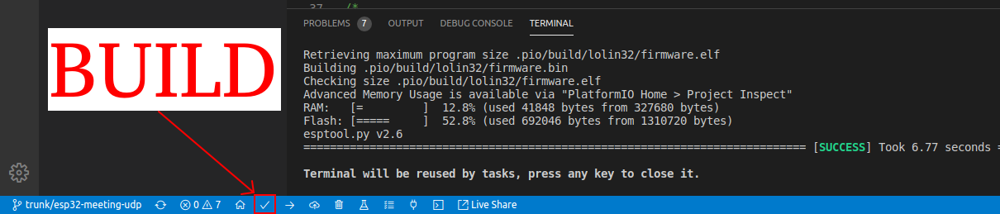


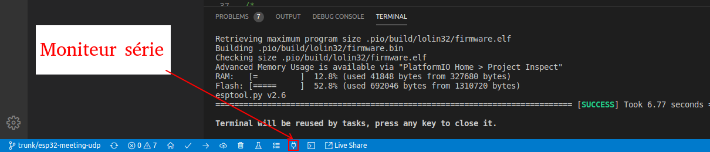

### Créer un projet

On commence par créer un nouveau projet :


On donne un nom au projet et on choisit sa carte (ici une carte __ESP32 LoRa de chez Heltec__) :

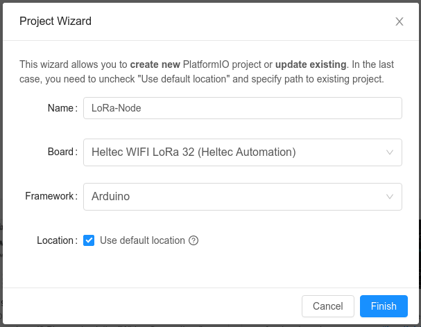

> [!NOTE]
> En fonction de la carte choisie, il peut y avoir plusieurs plateformes de développement.

Exemple d'architecture d'un projet PlaformIO :


Le code source de l'application se situe dans le dossier `src` avec le fichier `main.cpp` (par défaut pour un _framework_ Arduino)  :

```cpp
#include <Arduino.h>

void setup() {
  // put your setup code here, to run once:
}

void loop() {
  // put your main code here, to run repeatedly:
}
```

> [!TIP]
> Il est possible d'ajouter ses fichiers d'en-tête (_header_) `.h` dans le dossier `include` et ses propres bibliothèques dans le dossier `lib`.

Le fichier `platformio.ini` contient la configuration du projet :

```ini
[env:heltec_wifi_lora_32]
platform = espressif32
board = heltec_wifi_lora_32
framework = arduino
lib_deps =
  LoRa
  ESP8266_SSD1306
  Adafruit Unified Sensor
  DHT sensor library
;upload_port = /dev/ttyUSB0
;upload_speed = 115200
;monitor_port = /dev/ttyUSB0
;monitor_speed = 115200
```

> [!IMPORTANT]
> Les options du fichier `platformio.ini` sont décrites dans la [documentation](https://docs.platformio.org/en/latest/projectconf.html).

### Bibliothèques

Pour ajouter des bibliothèques de la communauté au projet, il suffit d'ajouter leur nom (ou leur ID) dans la variable `lib_deps`.

PlatformIO fournit un outil de recherche de bibliothèques bien pratique :


On choisit sa bibliothèque et on accède à l'ensemble de ces informations :


> [!TIP]
> Il est aussi possible d'indiquer la version de la bibliothèque désirée en respectant les règles syntaxique définies [ici](https://docs.platformio.org/en/latest/userguide/lib/cmd_install.html#description).

## PlatformIO CLI

Lien : https://docs.platformio.org/en/latest/core/index.html

### Usage

PlatformIO fournit l'utilitaire `platformio` (ou son alias `pio`) pour programmer des systèmes embarqués (Arduino UNO, ESP32, etc.).

Dans VSCode, démarrer un terminal :

```sh
$ platformio --version
PlatformIO Core, version 6.1.4

$ pio --version
PlatformIO Core, version 6.1.4

$ platformio --help
$ pio --help
Usage: platformio [OPTIONS] COMMAND [ARGS]...

Options:
  --version          Show the version and exit.
  -f, --force        DEPRECATE
  -c, --caller TEXT  Caller ID (service)
  --no-ansi          Do not print ANSI control characters
  -h, --help         Show this message and exit.

Commands:
  account   Manage PIO Account
  boards    Embedded Board Explorer
  check     Run a static analysis tool on code
  ci        Continuous Integration
  debug     PIO Unified Debugger
  device    Monitor device or list existing
  home      PIO Home
  lib       Library Manager
  platform  Platform Manager
  project   Project Manager
  remote    PIO Remote
  run       Process project environments
  settings  Manage PlatformIO settings
  test      Unit Testing
  update    Update installed platforms, packages and libraries
  upgrade   Upgrade PlatformIO to the latest version
```

> [!TIP]
> Pour y accéder à partir d'un terminal, on peut ajouter ces lignes à la fin du fichier `~/.bashrc` :
> ```sh
> # plaformio
> export PLATFORMIO_INSTALL="$HOME/.platformio"
> export PATH=$PLATFORMIO_INSTALL/penv/bin:$PLATFORMIO_INSTALL/packages/tool-esptoolpy/:$PATH
> ```

Les paramètres de PlatformIO :

```sh
$ platformio settings get
Name                          Current value [Default]                 Description
----------------------------  --------------------------------------  --------------------------------------------------------------------
check_platformio_interval     7                                       Check for the new PlatformIO Core interval (days)
check_prune_system_threshold  1024                                    Check for pruning unnecessary data threshold (megabytes)
enable_cache                  Yes                                     Enable caching for HTTP API requests
enable_proxy_strict_ssl       Yes                                     Verify the proxy server certificate against the list of supplied CAs
enable_telemetry              Yes                                     Telemetry service <https://bit.ly/pio-telemetry> (Yes/No)
force_verbose                 No                                      Force verbose output when processing environments
projects_dir                  ~/Documents/PlatformIO/Projects  Default location for PlatformIO projects (PlatformIO Home)

************************************************************************************************************************************************************
We found 261.77MB of unnecessary PlatformIO system data (temporary files, unnecessary packages, etc.).
Use `pio system prune --dry-run` to list them or `pio system prune` to save disk space.
```

> Guide : https://docs.platformio.org/en/stable/core/userguide/index.html

L'arborescence de PlatformIO est la suivante :

```sh
$ ls -l $HOME/.platformio/
-rw-rw-r--  1 tv tv  177 juin  10 06:02 appstate.json
-rw-rw-r--  1 tv tv 2178 juin  16 07:25 homestate.json
drwxrwxr-x 15 tv tv 4096 juin  16 07:24 packages
drwxrwxr-x  5 tv tv 4096 mars  30 22:16 penv
drwxrwxr-x  5 tv tv 4096 sept.  3  2023 platforms
```

L'utilitaire `platformio` (et `pio`) se trouve dans le dossier `$HOME/.platformio/penv/bin/`.

Et on retrouve l'ensemble des outils dans le dossier `packages`.

```sh
$ ls -l $HOME/.platformio/packages/
drwx------ 4 tv tv 4096 mai   23  2023 contrib-piohome
drwx------ 8 tv tv 4096 avril 11  2023 framework-arduino-avr
drwx------ 6 tv tv 4096 mars  25  2023 framework-arduinoespressif32
drwx------ 2 tv tv 4096 mai   23  2023 tool-avrdude
drwx------ 8 tv tv 4096 avril 11  2023 toolchain-atmelavr
drwx------ 7 tv tv 4096 juin  16 07:24 toolchain-riscv32-esp
drwx------ 7 tv tv 4096 mars  25  2023 toolchain-xtensa-esp32
drwx------ 7 tv tv 4096 juin  16 07:24 toolchain-xtensa-esp32s3
drwx------ 7 tv tv 4096 mars  25  2023 tool-esptoolpy
drwx------ 2 tv tv 4096 mars  25  2023 tool-mkfatfs
drwx------ 2 tv tv 4096 mars  25  2023 tool-mklittlefs
drwx------ 2 tv tv 4096 mars  25  2023 tool-mkspiffs
drwx------ 3 tv tv 4096 mars  30 22:16 tool-scons
```

Ici, on peut y trouver :

* des outils pour _flasher_ des cartes Atmel SAM et ST (STM32) avec [OpenOCD](http://openocd.org/), des cartes à base d'ESP avec [esptool](https://github.com/espressif/esptool) ou encore des cartes Arduino avec [avrdude](https://www.nongnu.org/avrdude/) ...

* des chaînes développement pour processeur ARM avec [gccarmnoneeabi](https://launchpad.net/gcc-arm-embedded), Atmel avec [atmelavr](https://www.microchip.com/mplab/avr-support/avr-and-arm-toolchains-c-compilers), ESP32 [xtensa32](https://github.com/espressif/esp-idf) et ESP8266 avec [xtensa](https://github.com/jcmvbkbc/gcc-xtensa) ...

* des _frameworks_ Arduino, mbed, espressif, ...

```sh
$ ls -l $HOME/.platformio/platforms/
drwx------ 6 tv tv 4096 janv. 11 11:50 atmelavr
drwx------ 7 tv tv 4096 mars  26 10:54 espressif32
drwx------ 7 tv tv 4096 mars  27 18:05 espressif8266
drwx------ 9 tv tv 4096 avril  1 06:38 ststm32
```

### Mise à jour

Pour mettre à jour PlatformIO :

```sh
$ pio upgrade --help
Usage: pio upgrade [OPTIONS]

Options:
  --dev                Use development branch
  --only-dependencies
  -v, --verbose
  -h, --help           Show this message and exit.

$ pio upgrade --dev
Please wait while upgrading PlatformIO Core ...
PlatformIO has been successfully upgraded to 6.1.16a1
Release notes: https://docs.platformio.org/en/latest/history.html
```

### Créer un nouveau projet

- Créer un répertoire pour le projet

```sh
$ mkdir -p nom-projet
$ cd nom-projet
```

- Initialiser le projet pour une carte et un _framework_

```sh
$ pio project init --board uno --project-option="framework=arduino"
...
include : Put project header files here
lib : Put here project specific (private) libraries
src : Put project source files here
platformio.ini : Project Configuration File
...
Project has been successfully initialized! Useful commands:
pio run : process/build project from the current directory
pio run --target upload or pio run -t upload : upload firmware to a target
pio run --target clean : clean project (remove compiled files)
...
```

- Voir l'état initial du projet

```sh
$ ls -l
drwxrwxr-x 2 tv tv 4096 sept. 27 07:59 include
drwxrwxr-x 2 tv tv 4096 sept. 27 07:59 lib
-rw-rw-r-- 1 tv tv  427 sept. 27 07:59 platformio.ini
drwxrwxr-x 2 tv tv 4096 sept. 27 07:59 src
drwxrwxr-x 2 tv tv 4096 sept. 27 07:59 test

$ cat platformio.ini
[env:uno]
platform = atmelavr
board = uno
framework = arduino
```

Les **fichiers sources** sont à placer dans `src/`, par exemple `src/main.cpp` pour un _framework_ Arduino :

```cpp
#include <Arduino.h>

void setup()
{
}

void loop()
{
}
```

### Fabriquer un projet (_build_)

```sh
$ pio run -v
```

### Programmer le système embarqué (_upload_)

```sh
$ pio run -t upload -v
```

Les fichiers générés pendant la fabrication sont stockés dans un répertoire `.pio`.

> [!IMPORTANT]
> Ces fichiers ne doivent jamais être conservés dans un dépôt `git`.

### Nettoyer un projet

Les fichiers générés à la fabrication peuvent être supprimés avec la commande suivante :

```sh
$ pio run --target clean
```

### Monitorer

Les options disponibles sont :

```sh
$ platformio device monitor --help
Usage: platformio device monitor [OPTIONS]

Options:
  -p, --port TEXT       Port, a number or a device name
  -b, --baud INTEGER    Set baud rate, default=9600
  --parity [N|E|O|S|M]  Set parity, default=N
  --rtscts              Enable RTS/CTS flow control, default=Off
  --xonxoff             Enable software flow control, default=Off
  --rts [0|1]           Set initial RTS line state, default=0
  --dtr [0|1]           Set initial DTR line state, default=0
  --echo                Enable local echo, default=Off
  --encoding TEXT       Set the encoding for the serial port (e.g. hexlify,
                        Latin1, UTF-8), default: UTF-8
  -f, --filter TEXT     Add filters / text transformation
  --eol [CR|LF|CRLF]    End of line mode, default=CRLF
  --raw                 Do not apply any encodings/transformations
  --exit-char INTEGER   ASCII code of special character that is used to exit
                        the application, default=29 (DEC)
  --menu-char INTEGER   ASCII code of special character that is used to
                        control miniterm (menu), default=20 (DEC)
  --quiet               Diagnostics: suppress non-error messages, default=Off
  -h, --help            Show this message and exit.
```

Liste des ports disponibles :

```sh
$ platformio device list
...
/dev/ttyACM0
------------
Hardware ID: USB VID:PID=0483:374B SER=0672FF555051897267243807 LOCATION=1-4.4.2:1.2
Description: STM32 STLink - ST-Link VCP Ctrl
```

Liens :

* [platformio device monitor](https://docs.platformio.org/en/latest/core/userguide/device/cmd_monitor.html)
* ["platformio.ini" (Project Configuration File)](https://docs.platformio.org/en/latest/projectconf/index.html#projectconf)

Les options peuvent être placées directement dans le fichier `plaftform.ini`, par exemple :

```ini
...
upload_port = /dev/ttyUSB0
upload_speed = 115200
monitor_port = /dev/ttyUSB0
monitor_speed = 115200
monitor_filters = colorize, debug
monitor_flags =
    --encoding
    hexlify
```

Exemple :

```sh
$ platformio device monitor -p /dev/ttyACM0
--- Available filters and text transformations: colorize, debug, default, direct, hexlify, log2file, nocontrol, printable, send_on_enter, time
--- More details at http://bit.ly/pio-monitor-filters
--- Miniterm on /dev/ttyACM0  9600,8,N,1 ---
--- Quit: Ctrl+C | Menu: Ctrl+T | Help: Ctrl+T followed by Ctrl+H ---
Start STM32L475

$ platformio device monitor -p /dev/ttyACM0 --encoding hexlify
...
--- Miniterm on /dev/ttyACM0  9600,8,N,1 ---
--- Quit: Ctrl+C | Menu: Ctrl+T | Help: Ctrl+T followed by Ctrl+H ---
53 74 61 72 74 20 53 54 4D 33 32 4C 34 37 35 0A
```

### Les bibliothèques

La gestion des bibliothèques sous PlatormIO est contrôlée par la commande `pio pkg`

> `pio lib` est considérée maintenant comme obsolète. Elle disparaîtra probablement dans les nouvelles versions.

Les bibliothèques peuvent être installées :

- globalement (dans le dossier d'installation de PlatformIO)

```sh
$ pio lib -g list
$ pio pkg list --global --only-libraries
...
```

- localement (dans le dossier du projet)

```sh
$ pio lib list
$ pio pkg list --only-libraries
```

Et de manière générale : `pio pkg list`

Les commandes utiles :

- rechercher une bibliothèque :

```sh
$ pio pkg search xxx
```

- voir les informations sur une bibliothèque :

```sh
$ pio pkg show xxx
```

- installer une bibliothèque (avec l'option `--global` pour l'installer globalement) :

```sh
$ pio pkg install xxx
```

Des informations spécifiques sur les bibliothèques peuvent être conservées avec `lib_deps` dans le fichier du projet `platformio.ini` :

```ini
...
lib_deps =
  fastled/FastLED @ ^3.4.0
```

> [!NOTE]
> Il est possible de créer ses propres bibliothèques à l’intérieur du projet dans le dossier `lib`. Le principe est de créer un sous-répertoire qui porte le même nom que le nom des fichiers sources (`.h` et `.cpp`).
>
> Il est aussi possible de placer des fichiers d’entête (`.h`) dans le dossier `include` du projet. Il ne faut pas oublier d'indiquer le répertoire qui contient des fichiers d'entêtes dans le fichier `plaformio.ini` :
>
> ```ini
> ...
> build_flags = -I./include
> ```

Il est aussi poussible de distribuer des bibliothèques pour les partager avec la communauté.

Il faut deux conditions pour enregistrer sa bibliothèque dans [PlatformIO](https://platformio.org/lib) :

* compléter et fournir un fichier `library.json` (ou `library.properties` ou `module.json`)
* partager publiquement son code (git, svn, mercurial, ou http)

```sh
$ platformio lib register https://os.mbed.com/users/tvaira/code/DISCO_L475VG_IOT01_HTS221//raw-file/576400702b64/library.json
The library has been successfully registered and is waiting for moderation
```

## Module testé

### ESP32 AZ-Delivery Dev Kit C (NODEMCU)

Module testé : https://www.az-delivery.de/fr/products/esp32-developmentboard

L'[AZ-Delivery Dev Kit C](https://www.az-delivery.de/fr/products/esp32-developmentboard) (ESP32 NODEMCU) a été conçu par [Espressif](https://www.espressif.com/) pour programmer le microcontrôleur [ESP32](https://www.espressif.com/en/products/socs/esp32).

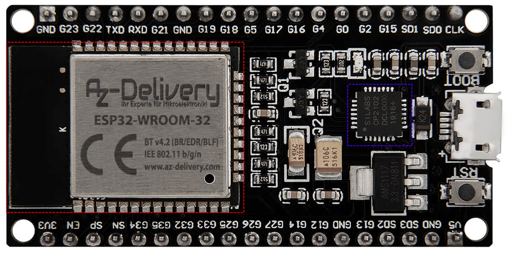

L'ESP32 utilisé possède une unité centrale composée de 2 cœurs Tensilica LX6 32 bits à 240 MHz.

Quelques caractéristiques :

|||
|---|---|
|RAM|512 kB (520 kB pour l'ESP32-D0WDQ6)|
|Mémoire flash externe|4 MB|
|GPIOs|34|
|Interfaces|SPI, I2C, I2S, CAN, UART|
|WiFi|802.11 b/g/n, 802.11n (2.4 GHz) up to 150 Mbps|
|Bluetooth|V4.2 - BLE et Bluetooth classique|
|Antenne sans fil|PCB|
|Pont USB/UART|CP2102|

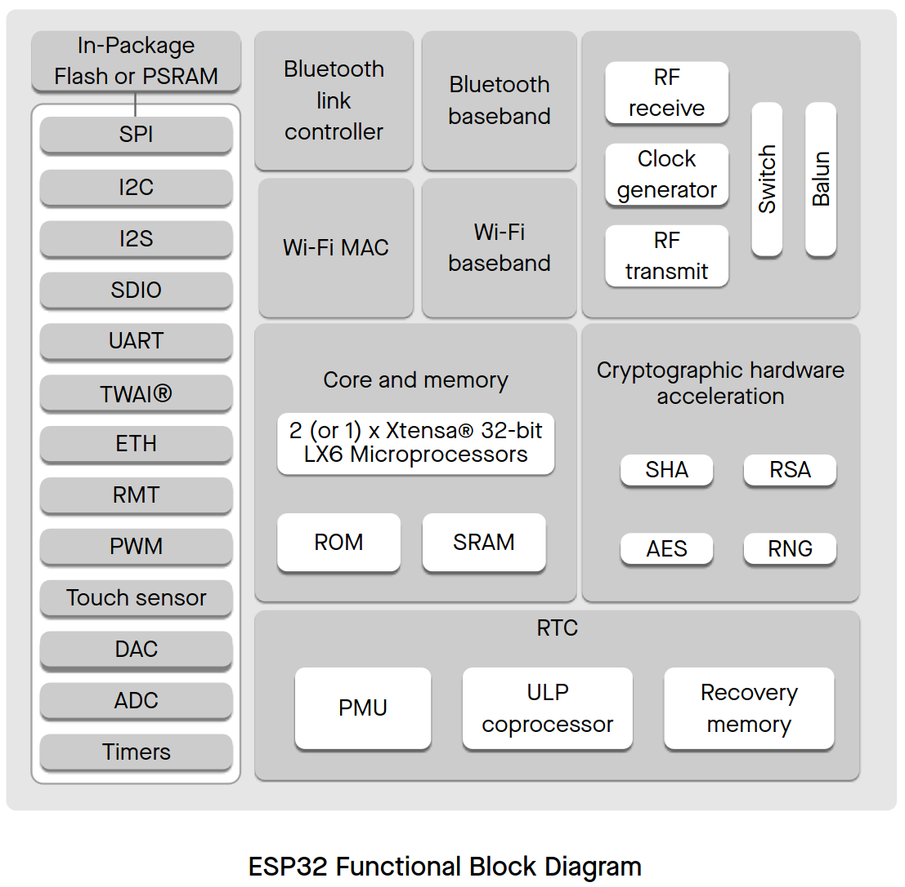

> Sur ce module, la Led intégrée est sur la broche 1.

### Détection

> Sous GNU/Linux, cf. https://docs.platformio.org/en/latest/core/installation/udev-rules.html

```bash
$ sudo dmesg
...
[1973869.449241] usb 1-2: New USB device found, idVendor=10c4, idProduct=ea60, bcdDevice= 1.00
[1973869.449245] usb 1-2: New USB device strings: Mfr=1, Product=2, SerialNumber=3
[1973869.449247] usb 1-2: Product: CP2102 USB to UART Bridge Controller
[1973869.449249] usb 1-2: Manufacturer: Silicon Labs
[1973869.449250] usb 1-2: SerialNumber: 0001
[1973869.458370] cp210x 1-2:1.0: cp210x converter detected
[1973869.459262] usb 1-2: cp210x converter now attached to ttyUSB0

$ lsusb
...
Bus 001 Device 030: ID 10c4:ea60 Silicon Labs CP210x UART Bridge
...
```

> L'ESP32 s'interface via un pont USB/UART [CP2102](https://www.silabs.com/interface/usb-bridges/classic/device.cp2102?tab=specs)

```bash
$ esptool.py --port /dev/ttyUSB0 --chip esp32 flash_id
esptool.py v4.5
Serial port /dev/ttyUSB0
Connecting.....
Chip is ESP32-D0WDQ6 (revision v1.0)
Features: WiFi, BT, Dual Core, 240MHz, VRef calibration in efuse, Coding Scheme None
Crystal is 40MHz
MAC: 24:62:ab:f2:5a:18
Uploading stub...
Running stub...
Stub running...
Manufacturer: 68
Device: 4016
Detected flash size: 4MB
Hard resetting via RTS pin...
```

> Datasheets : [esp32_datasheet_en.pdf](https://www.espressif.com/sites/default/files/documentation/esp32_datasheet_en.pdf) et [esp32-wroom-32_datasheet_en.pdf](https://www.espressif.com/sites/default/files/documentation/esp32-wroom-32_datasheet_en.pdf)

Nomenclature ESP32-D0WDQ6

- `D` : _Dual core_
- `0` : _No in-package flash_
- `WD` : _Wi-Fi b/g/n + Bluetooth/Bluetooth LE dual mode_
- `Q6` : _Package QFN 6*6_

## platformio.ini

[platformio.ini](https://docs.platformio.org/en/latest/projectconf/index.html) est le fichier de configuration d'un projet PlatformIO.

> [!NOTE]
> Un [fichier INI](https://fr.wikipedia.org/wiki/Fichier_INI) est un **fichier de configuration** dans un format de données introduit par les systèmes d’exploitation Windows en 1985. Par convention les noms de ces fichiers portent l’extension `.ini`.
> 
> Les fichiers INI sont des **fichiers texte** : ils peuvent donc être manipulés avec un éditeur de texte (`vim`, `emacs`, etc.). Les fichiers sont divisés en **sections**. Chaque section comporte un certain nombre de **paramètres de configuration**. Chaque section commence par un titre placé entre crochets `[` et `]`.
> 
> La valeur de chaque paramètre de configuration est indiquée par une formule : `paramètre = valeur`. Les fichiers peuvent contenir des **commentaires**. Les commentaires sont souvent utilisés pour décrire les paramètres et les valeurs à introduire. Ils sont précédés d’un point-virgule `;` ou plus rarement d’un dièse `#`.

Le fichier [platformio.ini](https://docs.platformio.org/en/latest/projectconf/index.html) peut contenir plusieurs sections :

- La section `[platformio]` permet de modifier les valeurs par défaut de PlatformIO (notamment des chemins).
- La section `[common]` permet de regrouper des paramétres communs au projet.
- La (ou les) section(s) `[env]` permet de déclarer un environnement de configuration définissant les tâches pour la construction, la programmation, le débogage, les tests unitaires, la surveillance des périphériques, les dépendances de bibliothèque, etc.

> Chaque projet peut avoir plusieurs environnements de configuration. Dans ce cas, on doit lui donner un **nom** (`[env:nom]`). Le nom peut être alors utilisé en option `-e` (ou `--environment`) des commandes `pio` de PlatformIO. Le nom peut aussi être récupéré dans la variable `$PIOENV`.

Exemple de fichier [platformio.ini](https://docs.platformio.org/en/latest/projectconf/index.html) :

```ini
[platformio]
default_envs = lolin32

; paramétres communs au projet
[common]
build_flags = -DDEBUG

; paramétres globaux à tous les environnements
[env]
platform = espressif8266
framework = arduino
board = lolin32
...
```

Un environnement (`[env]`) est défini par au moins trois paramètres :

- la plateforme (_platform_) qui permet l'intégration des cartes spécifiques d'un fabricant (kits de développement, MCU), de _frameworks_ et de SDK.
- la carte (_board_) qui dispose de paramètres préconfigurés pour les tâches de fabrication, programmation, débogage, etc.
- le _framework_ de développement

### Carte (_board_)

Recherche des cartes ESP32 :

```bash
$ pio boards esp32

Platform: espressif32
===============================================================================================================================================================================================
ID                                   MCU      Frequency    Flash    RAM     Name
-----------------------------------  -------  -----------  -------  ------  ---------------------------------------------------
...
esp32dev                             ESP32    240MHz       4MB      320KB   Espressif ESP32 Dev Module
...
nodemcu-32s                          ESP32    240MHz       4MB      320KB   NodeMCU-32S
...
lolin32                              ESP32    240MHz       4MB      320KB   WEMOS LOLIN32
...
```

> PlatformIO prend en charge plus de [1500 cartes](https://docs.platformio.org/en/latest/boards/index.html#boards).

Sachant que ce module d'[AZ-Delivery](https://www.az-delivery.de/fr/) ne possède pas de définition dans PlatormIO, on puet choisir un des trois IDs : [lolin32](https://docs.platformio.org/en/latest/boards/espressif32/lolin32.html), [esp32dev](https://docs.platformio.org/en/latest/boards/espressif32/esp32dev.html) ou [nodemcu-32s](https://docs.platformio.org/en/latest/boards/espressif32/nodemcu-32s.html) que l'on déclare dans `platformio.ini` de la manière suivante :

```ini
[env]
platform = espressif32
board = lolin32
```

### Plateforme (_platform_)

Dans PlatformIO, une plateforme (_platform_) de développement est une architecture particulière de microcontrôleur sur laquelle les projets peuvent être compilés pour s'exécuter.

Pour chaque plateforme de développement, PlatformIO définit :

- les scripts de construction pour les frameworks et SDK pris en charge
- des préréglages
- les chaînes d'outils pour la ou les architectures

Chaque projet doit spécifier le **nom** de la plateforme à l'aide de l'option `platform` dans le fichier de configuration du projet `platformio.ini`.

Pour les micro-contrôleurs ESP32, la plateforme est `espressif32`.

```ini
[env]
platform = espressif32
...
```

Liens :

- https://docs.platformio.org/en/latest/platforms/espressif32.html#platform-espressif32
- https://github.com/platformio/platform-espressif32/tree/master/examples

> PlatformIO prend en charge plus de [40 plateformes](https://registry.platformio.org/search?t=platform) dont `espressif32`, `espressif8266`, `atmelavr`, `ststm32` etc.
> Voir aussi : https://docs.platformio.org/en/latest/projectconf/sections/env/options/platform/platform_packages.html

### Framework

La plateforme [espressif32](https://docs.platformio.org/en/latest/platforms/espressif32.html#platform-espressif32) supporte deux _frameworks_ :

- [arduino](https://docs.platformio.org/en/latest/frameworks/arduino.html) : un portage du _framework_ [Arduino pour ESP32](https://github.com/espressif/arduino-esp32)
- [espidf](https://docs.platformio.org/en/latest/frameworks/espidf.html#framework-espidf) : le _framework_ officiel d'[Espressif](https://github.com/espressif/esp-idf)

## Framework Arduino

Lien : https://docs.platformio.org/en/latest/frameworks/arduino.html

### Exemple 1 (un environnement)

#### Configuration

On crée un nouveau projet pour ce module avec le framework Arduino :

```bash
$ pio project init --board lolin32 --project-option="framework=arduino"
The following files/directories have been created in ~/Documents/git/bts-lasalle-avignon-ressources/PlatformIO/src/arduino-esp32
include - Put project header files here
lib - Put project specific (private) libraries here
src - Put project source files here
platformio.ini - Project Configuration File
Resolving lolin32 dependencies...
Already up-to-date.
Project has been successfully initialized!

$ ls -l
drwxrwxr-x 2 tv tv 4096 juil.  3 08:50 include
drwxrwxr-x 2 tv tv 4096 juil.  3 08:50 lib
-rw-rw-r-- 1 tv tv  438 juil.  3 08:50 platformio.ini
drwxrwxr-x 2 tv tv 4096 juil.  3 08:50 src
drwxrwxr-x 2 tv tv 4096 juil.  3 08:50 test

$ cat platformio.ini
```

```ini
; Exemple 1 : un environnement
[env:lolin32]
platform = espressif32
board = lolin32
framework = arduino
```

#### Mise à jour

Mettre à jour des dépendances et des _packages_ du projet :

```sh
$ pio pkg update
Resolving lolin32 dependencies...
Platform Manager: Updating espressif32 @ 6.1.0
Platform Manager: Removing espressif32 @ 6.1.0
Platform Manager: espressif32@6.1.0 has been removed!
Platform Manager: Installing platformio/espressif32 @ 6.7.0
Downloading  [####################################]  100%
Unpacking  [####################################]  100%
Platform Manager: espressif32@6.7.0 has been installed!
Tool Manager: Installing platformio/tool-esptoolpy @ ~1.40501.0
Downloading  [####################################]  100%
Unpacking  [####################################]  100%
Tool Manager: tool-esptoolpy@1.40501.0 has been installed!
Already up-to-date.
```

Le _framework_ [Arduino pour ESP32](https://github.com/espressif/arduino-esp32) est installé localement :

```bash
$ ls - l $HOME/.platformio/packages/framework-arduinoespressif32/
```

Les brochages spécifiques sont définis dans un fichier `pins_arduino.h` situé dans `$HOME/.platformio/packages/framework-arduinoespressif32/variants/`

> Par exemple pour la carte `lolin32` : `$HOME/.platformio/packages/framework-arduinoespressif32/variants/lolin32`

L'ensemble des paramètres sont dans `$HOME/.platformio/packages/framework-arduinoespressif32/boards.txt`. Il y a plus de 22000 lignes donc un `grep` est souvent nécessaire :

```bash
$ cat $HOME/.platformio/packages/framework-arduinoespressif32/boards.txt | grep "^lolin32\..*"
lolin32.name=WEMOS LOLIN32
lolin32.bootloader.tool=esptool_py
lolin32.bootloader.tool.default=esptool_py
lolin32.upload.tool=esptool_py
lolin32.upload.tool.default=esptool_py
lolin32.upload.tool.network=esp_ota
lolin32.upload.maximum_size=1310720
lolin32.upload.maximum_data_size=327680
...
lolin32.build.target=esp32
lolin32.build.mcu=esp32
lolin32.build.core=esp32
lolin32.build.variant=lolin32
lolin32.build.board=LOLIN32
lolin32.build.f_cpu=240000000L
lolin32.build.flash_mode=dio
lolin32.build.flash_size=4MB
lolin32.build.boot=dio
lolin32.build.partitions=default
...
```

Les paramètres utilisés par défaut pour une carte sont fixés dans un fichier [JSON](https://fr.wikipedia.org/wiki/JavaScript_Object_Notation), ici : `$HOME/.platformio/platforms/espressif32/boards/lolin32.json` :

```json
{
  "build": {
    "arduino":{
      "ldscript": "esp32_out.ld"
    },
    "core": "esp32",
    "extra_flags": "-DARDUINO_LOLIN32",
    "f_cpu": "240000000L",
    "f_flash": "40000000L",
    "flash_mode": "dio",
    "mcu": "esp32",
    "variant": "lolin32"
  },
  "connectivity": [
    "wifi",
    "bluetooth",
    "ethernet",
    "can"
  ],
  "debug": {
    "openocd_board": "esp-wroom-32.cfg"
  },
  "frameworks": [
    "arduino",
    "espidf"
  ],
  "name": "WEMOS LOLIN32",
  "upload": {
    "flash_size": "4MB",
    "maximum_ram_size": 327680,
    "maximum_size": 4194304,
    "require_upload_port": true,
    "speed": 460800
  },
  "url": "https://wiki.wemos.cc/products:lolin32:lolin32",
  "vendor": "WEMOS"
}
```

On peut personnaliser ces paramètres dans `platformio.ini` avec la syntaxe suivante :

```ini
[env:lolin32]
platform = espressif32
framework = arduino
board = lolin32
board_build.mcu = esp32
board_build.f_cpu = 240000000L
board_build.partitions=huge_app.csv
```

> [!TIP]
> Corrélation entre le fichier `.json` et `platformio.ini` :
> 
> ```json
> {
>     "build": {
>         ...,
>         "f_cpu": "240000000L", /* donc board_build.f_cpu */
>     },
>     ...
> }
> ```

Le SDK spécifique pour l'esp32 se situe dans `$HOME/.platformio/packages/framework-arduinoespressif32/tools/sdk/esp32` et tous les fichiers d'entête dans `include/`

La configuration (des `#define`) se trouve toujours dans un fichier _header_ `sdkconfig.h`, ici pour l'esp32 : `$HOME/.platformio/packages/framework-arduinoespressif32/tools/sdk/esp32/dio_qspi/include/sdkconfig.h`

#### Code source

Exemple de programme [src/arduino-esp32/src/main.cpp](src/arduino-esp32/src/main.cpp) :

```cpp
#include <Arduino.h>

uint8_t esp32Led = 1; // LED_BUILTIN

void setup()
{
    Serial.begin(115200);
    pinMode(esp32Led, OUTPUT);
#ifdef DEBUG
    Serial.println("Setup done");
#endif
    Serial.print("CPU freq : ");
    Serial.println(String(ESP.getCpuFreqMHz()) + " MHz");
    Serial.print("CPU cores : ");
    esp_chip_info_t out_info;
    esp_chip_info(&out_info);
    Serial.println(String(out_info.cores));
    Serial.print("Flash size : ");
    Serial.println(String(ESP.getFlashChipSize() / 1000000) + " MB");
    Serial.print("Free RAM : ");
    Serial.println(String((long)ESP.getFreeHeap()) + " bytes");
}

void loop()
{
#ifdef DEBUG
    Serial.println("Start blink");
#endif
    // "Hello world!" ? non blink!
    digitalWrite(esp32Led, HIGH);
    delay(1000);
    digitalWrite(esp32Led, LOW);
    delay(1000);
}
```

#### Build

Fabrication du projet :

```sh
$ pio run -v
Processing lolin32 (platform: espressif32; board: lolin32; framework: arduino; build_flags: -DDEBUG; monitor_port: /dev/ttyUSB0; monitor_speed: 115200)

CONFIGURATION: https://docs.platformio.org/page/boards/espressif32/lolin32.html
PLATFORM: Espressif 32 (6.1.0) > WEMOS LOLIN32
HARDWARE: ESP32 240MHz, 320KB RAM, 4MB Flash
DEBUG: Current (cmsis-dap) External (cmsis-dap, esp-bridge, esp-prog, iot-bus-jtag, jlink, minimodule, olimex-arm-usb-ocd, olimex-arm-usb-ocd-h, olimex-arm-usb-tiny-h, olimex-jtag-tiny, tumpa)
PACKAGES: 
 - framework-arduinoespressif32 @ 3.20007.0 (2.0.7) 
 - tool-esptoolpy @ 1.40500.0 (4.5.0) 
 - toolchain-xtensa-esp32 @ 8.4.0+2021r2-patch5
LDF: Library Dependency Finder -> https://bit.ly/configure-pio-ldf
LDF Modes: Finder ~ chain, Compatibility ~ soft
Found 33 compatible libraries
Scanning dependencies...
No dependencies
Building in release mode
xtensa-esp32-elf-g++ -o .pio/build/lolin32/src/main.cpp.o -c \
-Wno-frame-address -std=gnu++11 -fexceptions -fno-rtti -Os -mlongcalls \
-ffunction-sections -fdata-sections -Wno-error=unused-function \
-Wno-error=unused-variable -Wno-error=deprecated-declarations \
-Wno-unused-parameter -Wno-sign-compare -ggdb -freorder-blocks \
 -Wwrite-strings -fstack-protector -fstrict-volatile-bitfields \
-Wno-error=unused-but-set-variable -fno-jump-tables \
-fno-tree-switch-conversion -MMD -DPLATFORMIO=60115 -DARDUINO_LOLIN32 -DDEBUG \
-DHAVE_CONFIG_H -DMBEDTLS_CONFIG_FILE=\"mbedtls/esp_config.h\" \
-DUNITY_INCLUDE_CONFIG_H -DWITH_POSIX -D_GNU_SOURCE -DIDF_VER=\"v4.4.4\" \
-DESP_PLATFORM -D_POSIX_READER_WRITER_LOCKS -DARDUINO_ARCH_ESP32 -DESP32 \
-DF_CPU=240000000L -DARDUINO=10812 -DARDUINO_VARIANT=\"lolin32\" \
"-DARDUINO_BOARD=\"WEMOS LOLIN32\"" -DARDUINO_PARTITION_default -Iinclude -Isrc ... \
src/main.cpp
...
xtensa-esp32-elf-g++ -o .pio/build/lolin32/FrameworkArduino/USBCDC.cpp.o -c ... \
~/.platformio/packages/framework-arduinoespressif32/cores/esp32/USBCDC.cpp
...
xtensa-esp32-elf-gcc -o .pio/build/lolin32/FrameworkArduino/wiring_shift.c.o  -c ... \
~/.platformio/packages/framework-arduinoespressif32/cores/esp32/wiring_shift.c
...
xtensa-esp32-elf-ar rc .pio/build/lolin32/libFrameworkArduino.a \
.pio/build/lolin32/FrameworkArduino/Esp.cpp.o\
.pio/build/lolin32/FrameworkArduino/FirmwareMSC.cpp.o ...\
.pio/build/lolin32/FrameworkArduino/wiring_shift.c.o
...
xtensa-esp32-elf-ranlib .pio/build/lolin32/libFrameworkArduino.a
...
xtensa-esp32-elf-g++ -o .pio/build/lolin32/firmware.elf ... .pio/build/lolin32/src/main.cpp.o ... \
 -Wl,--start-group .pio/build/lolin32/libFrameworkArduino.a -lesp_ringbuf -lefuse ... \
 -lstdc++ -lpthread -lgcc -lcxx -lapp_trace -lgcov -lapp_trace -lgcov -lc -Wl,--end-group
...
RAM:   [=         ]   6.8% (used 22424 bytes from 327680 bytes)
Flash: [==        ]  20.3% (used 266513 bytes from 1310720 bytes)
.pio/build/lolin32/firmware.elf  :
section                                                                                size         addr
...
Total                                                                               5900891
"~/.platformio/penv/bin/python" "~/.platformio/packages/tool-esptoolpy/esptool.py" --chip esp32 elf2image --flash_mode dio --flash_freq 40m --flash_size 4MB --elf-sha256-offset 0xb0 -o .pio/build/lolin32/firmware.bin .pio/build/lolin32/firmware.elf
esptool.py v4.5
Creating esp32 image...
Merged 2 ELF sections
Successfully created esp32 image.
[SUCCESS] Took 5.84 seconds
```

Les outils utilisés ici par PlaformIO sont :

- `toolchain-xtensa-esp32` dans `~/.platformio/packages/toolchain-xtensa-esp32/bin/`
- `framework-arduinoespressif32` dans `~/.platformio/packages/framework-arduinoespressif32/`
- `tool-esptoolpy` dans `~ /.platformio/packages/tool-esptoolpy/`

La chaîne de développement `xtensa-esp32` (pour les 2 cœurs Tensilica LX6 32 bits de l'ESP32) fournit notamment les compilateurs C++ `xtensa-esp32-elf-g++` et C `xtensa-esp32-elf-gcc`. Ils servent à compiler le fichier source `src/main.cpp` et l'ensemble du framework `arduinoespressif32`. Les fichiers objets `.o` produits sont stockés dans l'arborescence `.pio/build/lolin32/` (`src` et `FrameworkArduino`).

> [!TIP]
> L'étiquette `DEBUG` a été ajouté au moment de la compilation (`xtensa-esp32-elf-g++ -c`). L'option `-DDEBUG` ajouté (et équivalente à `#define DEBUG`) provient du paramétre `build_flags` du fichier `platformio.ini`.

```sh
$ ls -l .pio/build/lolin32/src/
-rw-rw-r-- 1 tv tv 14625 juil.  3 18:09 main.cpp.d
-rw-rw-r-- 1 tv tv 94552 juil.  3 18:09 main.cpp.o

$ file .pio/build/lolin32/src/main.cpp.o
.pio/build/lolin32/src/main.cpp.o: ELF 32-bit LSB relocatable, Tensilica Xtensa, version 1 (SYSV), with debug_info, not stripped

$ cat .pio/build/lolin32/src/main.cpp.d 
.pio/build/lolin32/src/main.cpp.o: src/main.cpp \
 ~/.platformio/packages/framework-arduinoespressif32/cores/esp32/Arduino.h \
 ~/.platformio/packages/framework-arduinoespressif32/cores/esp32/esp_arduino_version.h \
 ...
 ~/.platformio/packages/framework-arduinoespressif32/tools/sdk/esp32/include/esp_hw_support/include/soc/esp32/spiram.h

$ ls -l .pio/build/lolin32/FrameworkArduino/
-rw-rw-r-- 1 tv tv  15061 juil.  3 18:09 base64.cpp.d
-rw-rw-r-- 1 tv tv  90244 juil.  3 18:09 base64.cpp.o
...
-rw-rw-r-- 1 tv tv  14798 juil.  3 18:09 WString.cpp.d
-rw-rw-r-- 1 tv tv 291112 juil.  3 18:09 WString.cpp.o
```

L'utilitaire `xtensa-esp32-elf-ar` crée l'archive `libFrameworkArduino.a` avec l'ensemble des fichiers objets `.o` du framework `arduinoespressif32` et `xtensa-esp32-elf-ranlib` génère l'index de l'archive à l'intérieur de celle-ci. L'index répertorie chaque symbole défini dans l'archive (table de symboles). L'archive `libFrameworkArduino.a` est une **[bibliothèque logicielle](https://fr.wikipedia.org/wiki/Biblioth%C3%A8que_logicielle) statique**. L'utilitaire `xtensa-esp32-elf-nm` permet de lister la table des symboles de l'archive.

> [!NOTE]
> Une bibliothèque statique est destinée à être copiée dans le programme lors de la construction de ce dernier (c'est la phase d'édition de liens).

```sh
$ ls -lh .pio/build/lolin32/libFrameworkArduino.a
-rw-rw-r-- 1 tv tv 3,2M juil.  3 21:32 .pio/build/lolin32/libFrameworkArduino.a
$ file .pio/build/lolin32/libFrameworkArduino.a
.pio/build/lolin32/libFrameworkArduino.a: current ar archive

$ ~/.platformio/packages/toolchain-xtensa-esp32/bin/xtensa-esp32-elf-nm -s .pio/build/lolin32/libFrameworkArduino.a
```

Ensuite, `xtensa-esp32-elf-g++` réalise l'édition de liens pour produire l'"exécutable" `firmware.elf`.

> [!NOTE]
> ELF (_Executable and Linkable Format_) est un format de fichier binaire utilisé pour l'enregistrement de code compilé. Il est par exemple utilisé dans la plupart des systèmes d'exploitation de type Unix comme GNU/Linux.

L'utilitaire `esptool.py` finalise le processus de fabrication en produisant le fichier `firmware.bin` à partir de `firmware.elf`. C'est le fichier `firmware.bin` qui sera "téléversé" (_upload_) vers l'ESP32.

```sh
$ ls -lh .pio/build/lolin32/firmware.*
-rw-rw-r-- 1 tv tv 261K juil.  3 20:22 .pio/build/lolin32/firmware.bin
-rwxrwxr-x 1 tv tv 5,8M juil.  3 20:22 .pio/build/lolin32/firmware.elf
-rw-rw-r-- 1 tv tv 8,6M juil.  3 20:22 .pio/build/lolin32/firmware.map

$ file .pio/build/lolin32/firmware.elf
.pio/build/lolin32/firmware.elf: ELF 32-bit LSB executable, Tensilica Xtensa, version 1 (SYSV), statically linked, with debug_info, not stripped

$ ~/.platformio/packages/toolchain-xtensa-esp32/bin/xtensa-esp32-elf-size -B -d .pio/build/lolin32/firmware.elf
   text	   data	    bss	    dec	    hex	filename
 196465	  70304	   3809	 270578	  420f2	.pio/build/lolin32/firmware.elf

$ ~/.platformio/packages/toolchain-xtensa-esp32/bin/xtensa-esp32-elf-objdump -f .pio/build/lolin32/firmware.elf

.pio/build/lolin32/firmware.elf:     file format elf32-xtensa-le
architecture: xtensa, flags 0x00000112:
EXEC_P, HAS_SYMS, D_PAGED
start address 0x4008290c
```

> [!NOTE]
> Un [firmware](https://fr.wikipedia.org/wiki/Firmware) (ou micrologiciel, microprogramme, microcode, logiciel interne ou encore logiciel embarqué) est un programme intégré dans un matériel informatique, ici l'ESP32, pour qu'il puisse fonctionner.

#### Flash

Téléversement (_upload_) :

```sh
$ pio run -t upload -v
Processing lolin32 (platform: espressif32; board: lolin32; framework: arduino; build_flags: -DDEBUG; monitor_port: /dev/ttyUSB0; monitor_speed: 115200)
-----------------------------------------------------------------------------------------------------------------------------------------------------------------------------------------------
CONFIGURATION: https://docs.platformio.org/page/boards/espressif32/lolin32.html
PLATFORM: Espressif 32 (6.1.0) > WEMOS LOLIN32
HARDWARE: ESP32 240MHz, 320KB RAM, 4MB Flash
DEBUG: Current (cmsis-dap) External (cmsis-dap, esp-bridge, esp-prog, iot-bus-jtag, jlink, minimodule, olimex-arm-usb-ocd, olimex-arm-usb-ocd-h, olimex-arm-usb-tiny-h, olimex-jtag-tiny, tumpa)
PACKAGES: 
 - framework-arduinoespressif32 @ 3.20007.0 (2.0.7) 
 - tool-esptoolpy @ 1.40500.0 (4.5.0) 
 - tool-mkfatfs @ 2.0.1 
 - tool-mklittlefs @ 1.203.210628 (2.3) 
 - tool-mkspiffs @ 2.230.0 (2.30) 
 - toolchain-xtensa-esp32 @ 8.4.0+2021r2-patch5
LDF: Library Dependency Finder -> https://bit.ly/configure-pio-ldf
LDF Modes: Finder ~ chain, Compatibility ~ soft
Found 33 compatible libraries
Scanning dependencies...
No dependencies
Building in release mode
<lambda>(["checkprogsize"], [".pio/build/lolin32/firmware.elf"])
MethodWrapper(["checkprogsize"], [".pio/build/lolin32/firmware.elf"])
Advanced Memory Usage is available via "PlatformIO Home > Project Inspect"
RAM:   [=         ]   6.8% (used 22424 bytes from 327680 bytes)
Flash: [==        ]  20.3% (used 266513 bytes from 1310720 bytes)
.pio/build/lolin32/firmware.elf  :
section                                                                                size         addr
.rtc.text                                                                                 0   1074528256
...
<lambda>(["upload"], [".pio/build/lolin32/firmware.bin"])
AVAILABLE: cmsis-dap, esp-bridge, esp-prog, espota, esptool, iot-bus-jtag, jlink, minimodule, olimex-arm-usb-ocd, olimex-arm-usb-ocd-h, olimex-arm-usb-tiny-h, olimex-jtag-tiny, tumpa
CURRENT: upload_protocol = esptool
BeforeUpload(["upload"], [".pio/build/lolin32/firmware.bin"])
Auto-detected: /dev/ttyUSB0
"~/.platformio/penv/bin/python" "~/.platformio/packages/tool-esptoolpy/esptool.py" --chip esp32 --port "/dev/ttyUSB0" --baud 460800 --before default_reset --after hard_reset write_flash -z --flash_mode dio --flash_freq 40m --flash_size 4MB 0x1000 ~/Documents/git/bts-lasalle-avignon-ressources/PlatformIO/src/arduino-esp32/.pio/build/lolin32/bootloader.bin 0x8000 ~/Documents/git/bts-lasalle-avignon-ressources/PlatformIO/src/arduino-esp32/.pio/build/lolin32/partitions.bin 0xe000 ~/.platformio/packages/framework-arduinoespressif32/tools/partitions/boot_app0.bin 0x10000 .pio/build/lolin32/firmware.bin
esptool.py v4.5
Serial port /dev/ttyUSB0
Connecting....
Chip is ESP32-D0WDQ6 (revision v1.0)
Features: WiFi, BT, Dual Core, 240MHz, VRef calibration in efuse, Coding Scheme None
Crystal is 40MHz
MAC: 24:62:ab:f2:5a:18
Uploading stub...
Running stub...
Stub running...
Changing baud rate to 460800
Changed.
Configuring flash size...
Flash will be erased from 0x00001000 to 0x00005fff...
Flash will be erased from 0x00008000 to 0x00008fff...
Flash will be erased from 0x0000e000 to 0x0000ffff...
Flash will be erased from 0x00010000 to 0x00051fff...
Compressed 17488 bytes to 12168...
Writing at 0x00001000... (100 %)
Wrote 17488 bytes (12168 compressed) at 0x00001000 in 0.6 seconds (effective 245.5 kbit/s)...
Hash of data verified.
Compressed 3072 bytes to 146...
Writing at 0x00008000... (100 %)
Wrote 3072 bytes (146 compressed) at 0x00008000 in 0.1 seconds (effective 389.8 kbit/s)...
Hash of data verified.
Compressed 8192 bytes to 47...
Writing at 0x0000e000... (100 %)
Wrote 8192 bytes (47 compressed) at 0x0000e000 in 0.1 seconds (effective 512.0 kbit/s)...
Hash of data verified.
Compressed 266880 bytes to 147807...
Writing at 0x00010000... (10 %)
Writing at 0x0001c812... (20 %)
Writing at 0x00024f36... (30 %)
Writing at 0x0002a059... (40 %)
Writing at 0x0002f5a1... (50 %)
Writing at 0x00034ce0... (60 %)
Writing at 0x0003e0ec... (70 %)
Writing at 0x000461c5... (80 %)
Writing at 0x0004b6af... (90 %)
Writing at 0x000510be... (100 %)
Wrote 266880 bytes (147807 compressed) at 0x00010000 in 3.4 seconds (effective 623.1 kbit/s)...
Hash of data verified.

Leaving...
Hard resetting via RTS pin...
[SUCCESS] Took 6.83 seconds
```

Par défaut, PlatformIO utilise l'utilitaire `esptool.py` pour écrire dans la mémoire FLASH (`write_flash`) l'ensemble des fichiers nécessaires à l'exécutation du programme `firmware.bin` sur l'ESP32 :

| Adresse |     Fichier      | Description                         |
| ------- | :--------------: | ----------------------------------- |
| 0x1000  |  bootloader.bin  | Le chargeur d'amorçage de l'ESP32   |
| 0x8000  |  partitions.bin  | Le partitionnement de la mémoire    |
| 0xe000  |  boot_app0.bin   | Le chargeur du programme exécutable |
| 0x10000 | **firmware.bin** | Le programme exécutable             |

A la fin, l'utilitaire `esptool.py` effectue un _reset_ (`hard_reset`) de la carte ESP32. L'ESP32 reboote et exécute le programme `firmware.bin`.

On peut monitorer l'exécution du programme sur le port série virtuel :

```sh
$ pio device monitor --baud 115200 --port /dev/ttyUSB0
--- Terminal on /dev/ttyUSB0 | 115200 8-N-1
--- Available filters and text transformations: colorize, debug, default, direct, esp32_exception_decoder, hexlify, log2file, nocontrol, printable, send_on_enter, time
--- More details at https://bit.ly/pio-monitor-filters
--- Quit: Ctrl+C | Menu: Ctrl+T | Help: Ctrl+T followed by Ctrl+H
ets Jun  8 2016 00:22:57

rst:0x1 (POWERON_RESET),boot:0x13 (SPI_FAST_FLASH_BOOT)
configsip: 0, SPIWP:0xee
clk_drv:0x00,q_drv:0x00,d_drv:0x00,cs0_drv:0x00,hd_drv:0x00,wp_drv:0x00
mode:DIO, clock div:2
load:0x3fff0030,len:1184
load:0x40078000,len:13192
load:0x40080400,len:3028
entry 0x400805e4
Setup done
CPU freq : 240 MHz
CPU cores : 2
Flash size : 4 MB
Free RAM : 291464 bytes
Start blink
Start blink
...
```

#### Partitions

La mémoire _flash_ de l'ESP32 est partitionnée.

> La mémoire flash est découpée en secteurs d'une taille de 4 kB. Les partitions peuvent être cryptées (`encrypted`) et en lecteur seule (`readonly`)

La table de partition se situe à l'offset `0x8000` par défaut et elle fournit les informations sur le découpage de la mémoire non-volatile.

Elle occupe un secteur (4096 octets) qui permet d'y stocker 95 entrées max et une somme de contrôle MD5 pour vérifier son intégrité.

Le [partitionnement](https://docs.espressif.com/projects/esp-idf/en/latest/esp32/api-guides/partition-tables.html) de la mémoire flash a été défini (par défaut) par le fichier `default.csv` :

```sh
$ cat ~/.platformio/packages/framework-arduinoespressif32/tools/partitions/default.csv
# Name,   Type, SubType, Offset,  Size, Flags
nvs,      data, nvs,     0x9000,  0x5000,
otadata,  data, ota,     0xe000,  0x2000,
app0,     app,  ota_0,   0x10000, 0x140000,
app1,     app,  ota_1,   0x150000,0x140000,
spiffs,   data, spiffs,  0x290000,0x160000,
coredump, data, coredump,0x3F0000,0x10000,
```

> Il existe d'autres partitionnements disponibles. On utilisera le paramétre `board_build.partitions` dans `platformio.ini` pour changer de format.

Les partitions sont de deux types : `app` ou `data`.

Les partitions `app` peuvent avoir le sous-type `factory` (le type par défaut pour les _firmwares_) ou `ota_x` (x de `0` à `15`).

> [!NOTE]
> [OTA](https://fr.wikipedia.org/wiki/Over-the-air_programming) (_Over The Air_) est un mécanisme de mise à jour du _firmware_ par transfert de données à distance (via WiFi, Bluetooth ou Ethernet).

[OTA](https://docs.espressif.com/projects/esp-idf/en/latest/esp32/api-reference/system/ota.html) nécessite de configurer les tables de partition avec au moins deux partitions d'emplacement d'application OTA (`ota_0` et `ota_1`) et une partition de données OTA (`otadata`).

Les partitions `data` peuvent avoir de nombreux sous-types : `nvs`, `ota`, `spiffs`, `coredump`, ...

Le fichier `default.csv` a été converti au format `.bin` par l'utilitaire `gen_esp32part.py` :

```sh
$ ls -l .pio/build/lolin32/partitions.bin
-rw-rw-r-- 1 tv tv 3072 juil.  4 18:56 .pio/build/lolin32/partitions.bin

$ python ~/.platformio/packages/framework-arduinoespressif32/tools/gen_esp32part.py .pio/build/lolin32/partitions.bin
Parsing binary partition input...
Verifying table...
# ESP-IDF Partition Table
# Name, Type, SubType, Offset, Size, Flags
nvs,data,nvs,0x9000,20K,
otadata,data,ota,0xe000,8K,
app0,app,ota_0,0x10000,1280K,
app1,app,ota_1,0x150000,1280K,
spiffs,data,spiffs,0x290000,1408K,
coredump,data,coredump,0x3f0000,64K,
```

Ce qui donne le partionnement suivant :

| Mémoire flash   |
| :-------------: |
| bootloader      |
| partition_table |
| nvs (20K)       |
| otadata (8K)    |
| app0 (1280K)    |
| app1 (1280K)    |
| spiffs (1408K)  |
| coredump (64K)  |

Le _firmware_ (`app`) doit être stocké à l'_offset_ `0x10000` pour être chargé par le _bootloader_ (par défaut).

La partition [NVS](https://docs.espressif.com/projects/esp-idf/en/latest/esp32/api-reference/storage/nvs_flash.html) (_Non-Volatile Storage_) est utilisée pour stocker des données de configuration (WiFi, Bluetooth, ...) dans la mémoire falsh (non volatile). La partition `nvs` est aussi utilisé pour stocker des certificats ou des données sensibles car elle prend en charge le cryptage (cf. la partition `nvs_keys` pour y stocker les clés). La taille recommandée pour cette partition est de 12 kB à 64 kB (par défaut 24 kB). Il est recommandé d'utiliser un système de fichiers FAT ou SPIFFS pour le stockage de plus grandes quantités de données.

La bibliothèque [Preferences](https://docs.espressif.com/projects/arduino-esp32/en/latest/tutorials/preferences.html) utilise la partition NVS intégrée à l'ESP32 pour stocker des données. Ces données sont conservées lors des redémarrages et des événements de perte d'alimentation du système.

> [!WARNING]
> La bibliothèque [Preferences](https://docs.espressif.com/projects/arduino-esp32/en/latest/tutorials/preferences.html) est unique au _framework_ Arduino pour ESP32. Elle remplace l'obsolète bibliothèque Arduino EEPROM.

Les données sont stockées dans des sections appelées « espace de noms » (_namespaces_). Dans chaque espace de noms se trouvent un ensemble de paires **clé-valeur**. La paire clé-valeur a un type de données.

- Plusieurs espaces de noms sont autorisés dans NVS
- Le nom de chaque espace de noms doit être unique
- Les espaces de noms et les noms de clés sont sensibles à la casse
- Chaque nom de clé doit être unique dans un espace de noms
- Les noms d’espace de noms et de clés sont des chaînes de caractères et sont limités à un maximum de 15 caractères.
- Un seul espace de noms peut être ouvert (en cours d'utilisation) à la fois

L'ESP32 supporte trois systèmes de fichiers (pour les partitions de type `data`) :

- `fat` ([FAT Filesystem Support](https://docs.espressif.com/projects/esp-idf/en/latest/esp32/api-reference/storage/fatfs.html))
- `spiffs` ([SPIFFS Filesystem](https://docs.espressif.com/projects/esp-idf/en/latest/esp32/api-reference/storage/spiffs.html))
- `littlefs` ([LittleFS filesystem](https://github.com/littlefs-project/littlefs))

Si le _firmware_ à flasher est trop grand, on peut modifier le partitionnement en récupérant des espaces non utilisés (ota, spiffs, ...) :

- `huge_app.csv` pour un _firmware_ de 3 MB :

```sh
$ cat ~/.platformio/packages/framework-arduinoespressif32/tools/partitions/huge_app.csv
# Name,   Type, SubType, Offset,  Size, Flags
nvs,      data, nvs,     0x9000,  0x5000,
otadata,  data, ota,     0xe000,  0x2000,
app0,     app,  ota_0,   0x10000, 0x300000,
spiffs,   data, spiffs,  0x310000,0xE0000,
coredump, data, coredump,0x3F0000,0x10000,
```

- `no_ota.csv` pour un _firmware_ de 2 MB :

```sh
$ cat ~/.platformio/packages/framework-arduinoespressif32/tools/partitions/no_ota.csv
# Name,   Type, SubType, Offset,  Size, Flags
nvs,      data, nvs,     0x9000,  0x5000,
otadata,  data, ota,     0xe000,  0x2000,
app0,     app,  ota_0,   0x10000, 0x200000,
spiffs,   data, spiffs,  0x210000,0x1E0000,
coredump, data, coredump,0x3F0000,0x10000,
```

> Il est aussi possible de personnaliser son partitionnement.

### Exemple 2 (deux environnements)

On modifie le fichier `platformio.ini` :

```ini
; Exemple 2 : deux environnements
[env]
platform = espressif32
board = esp32dev
framework = arduino
monitor_port = /dev/ttyUSB0
monitor_speed = 115200

[env:esp32_debug]
build_flags = -DDEBUG -D$PIOENV

[env:esp32_release]
build_flags = -D$PIOENV
```

> [!NOTE]
> Le paramétre `build_flags` est très souvent utilisé par les développeurs car il permet de passer des options au compilateur C/C++. Les plus utilisés sont : `-Detiquette` (qui permet déclarer une étiquette constante), `-Ichemin` (pour indiquer un chemin vers des fichiers _headers_), `-Lchemin`  (pour indiquer un chemin vers des bibliothèques) et `-llib` (pour indiquer le nom d'une bibliothèque à lier pendant la phase d'édition de liens). Le paramétre `build_src_flags` peut être utilisé à la place si on souhaite limiter les options au répertoire `src/` du projet. Voir aussi [LDF](https://docs.platformio.org/en/latest/librarymanager/ldf.html) (_Library Dependency Finder_) associé au paramétre `lib_ldf_mode`.

On peut regrouper des paramétres communs dans la section `[env]`, puis créer deux environnements distincts avec les sections `[env:esp32_debug]` et `[env:esp32_release]`.

> [!TIP]
> Le nom de l'environnement peut être récupéré via la variable `$PIOENV` !

On peut ensuite adapter le code source en fonction de l'environnement :

```cpp
#include <Arduino.h>

#ifdef DEBUG
#warning "Debug mode enabled"
#else
#warning "Release mode enabled"
#endif

#ifdef esp32_debug
#warning "env esp32_debug enabled"
#endif

#ifdef esp32_release
#warning "env esp32_release enabled"
#endif
...
```

Tests :

- on commence par nettoyer

```sh
$ pio run --target clean
Processing esp32_debug (platform: espressif32; board: lolin32; framework: arduino)

Verbose mode can be enabled via `-v, --verbose` option
Removing .pio/build/esp32_debug
Done cleaning
[SUCCESS] Took 0.18 seconds

Processing esp32_release (platform: espressif32; board: lolin32; framework: arduino)

Verbose mode can be enabled via `-v, --verbose` option
Removing .pio/build/esp32_release
Done cleaning
[SUCCESS] Took 0.19 seconds

Environment    Status    Duration
-------------  --------  ------------
esp32_debug    SUCCESS   00:00:00.182
esp32_release  SUCCESS   00:00:00.185
2 succeeded in 00:00:00.368
```

- On fabrique en sélectionnant l'environnement `esp32_release`

```sh
$ pio run -e esp32_release -v
...
src/main.cpp:6:2: warning: #warning "Release mode enabled" [-Wcpp]
 #warning "Release mode enabled"
  ^
src/main.cpp:14:2: warning: #warning "env release enabled" [-Wcpp]
 #warning "env release enabled"
...

"~/.platformio/penv/bin/python" "~/.platformio/packages/tool-esptoolpy/esptool.py" --chip esp32 elf2image --flash_mode dio --flash_freq 40m --flash_size 4MB -o .pio/build/esp32_release/firmware.bin .pio/build/esp32_release/firmware.elf
esptool.py v3.1
Merged 1 ELF section
[SUCCESS] Took 2.68 seconds

Environment    Status    Duration
-------------  --------  ------------
esp32_debug    IGNORED
esp32_release  SUCCESS   00:00:02.676
1 succeeded in 00:00:02.676
```

> Les options indiquées dans `build_flags` pour cet environnement ont bien été prises en compte (cf. `#warning`).

- on peut flasher l'ESP32 et démarrer le moniteur série

```sh
$ pio run -e esp32_release -t upload -v && pio device monitor --baud 115200 --port /dev/ttyUSB0
Processing esp32_release (build_flags: -D$PIOENV; platform: espressif32; board: lolin32; framework: arduino; monitor_port: /dev/ttyUSB0; monitor_speed: 115200)

CONFIGURATION: https://docs.platformio.org/page/boards/espressif32/lolin32.html
PLATFORM: Espressif 32 (3.5.0) > WEMOS LOLIN32
HARDWARE: ESP32 240MHz, 320KB RAM, 4MB Flash
DEBUG: Current (esp-prog) External (esp-prog, iot-bus-jtag, jlink, minimodule, olimex-arm-usb-ocd, olimex-arm-usb-ocd-h, olimex-arm-usb-tiny-h, olimex-jtag-tiny, tumpa)
PACKAGES: 
 - framework-arduinoespressif32 @ 3.10006.210326 (1.0.6) 
 - tool-esptoolpy @ 1.30100.210531 (3.1.0) 
 - tool-mkspiffs @ 2.230.0 (2.30) 
 - toolchain-xtensa32 @ 2.50200.97 (5.2.0)
LDF: Library Dependency Finder -> https://bit.ly/configure-pio-ldf
LDF Modes: Finder ~ chain, Compatibility ~ soft
Found 28 compatible libraries
Scanning dependencies...
No dependencies
Building in release mode
...
Auto-detected: /dev/ttyUSB0
"~/.platformio/penv/bin/python" "~/.platformio/packages/tool-esptoolpy/esptool.py" --chip esp32 --port "/dev/ttyUSB0" --baud 460800 --before default_reset --after hard_reset write_flash -z --flash_mode dio --flash_freq 40m --flash_size detect 0x1000 ~/.platformio/packages/framework-arduinoespressif32/tools/sdk/bin/bootloader_dio_40m.bin 0x8000 ~/Documents/git/bts-lasalle-avignon-ressources/PlatformIO/src/arduino-esp32/.pio/build/esp32_release/partitions.bin 0xe000 ~/.platformio/packages/framework-arduinoespressif32/tools/partitions/boot_app0.bin 0x10000 .pio/build/esp32_release/firmware.bin
esptool.py v3.1
Serial port /dev/ttyUSB0
Connecting....
Chip is ESP32-D0WDQ6 (revision 1)
Features: WiFi, BT, Dual Core, 240MHz, VRef calibration in efuse, Coding Scheme None
Crystal is 40MHz
MAC: 08:3a:f2:a8:e3:c0
Uploading stub...
Running stub...
Stub running...
Changing baud rate to 460800
Changed.
Configuring flash size...
Auto-detected Flash size: 4MB
Flash will be erased from 0x00001000 to 0x00005fff...
Flash will be erased from 0x00008000 to 0x00008fff...
Flash will be erased from 0x0000e000 to 0x0000ffff...
Flash will be erased from 0x00010000 to 0x00043fff...
Compressed 17104 bytes to 11191...
Writing at 0x00001000... (100 %)
Wrote 17104 bytes (11191 compressed) at 0x00001000 in 0.6 seconds (effective 246.1 kbit/s)...
Hash of data verified.
Compressed 3072 bytes to 128...
Writing at 0x00008000... (100 %)
Wrote 3072 bytes (128 compressed) at 0x00008000 in 0.1 seconds (effective 356.1 kbit/s)...
Hash of data verified.
Compressed 8192 bytes to 47...
Writing at 0x0000e000... (100 %)
Wrote 8192 bytes (47 compressed) at 0x0000e000 in 0.1 seconds (effective 488.9 kbit/s)...
Hash of data verified.
Compressed 211168 bytes to 108577...
Writing at 0x00010000... (14 %)
Writing at 0x0001f0ac... (28 %)
Writing at 0x00024845... (42 %)
Writing at 0x0002d656... (57 %)
Writing at 0x00034162... (71 %)
Writing at 0x00039d3b... (85 %)
Writing at 0x0003faf8... (100 %)
Wrote 211168 bytes (108577 compressed) at 0x00010000 in 2.6 seconds (effective 652.0 kbit/s)...
Hash of data verified.

Leaving...
Hard resetting via RTS pin...
[SUCCESS] Took 5.23 seconds

Environment    Status    Duration
-------------  --------  ------------
esp32_debug    IGNORED
esp32_release  SUCCESS   00:00:05.234
1 succeeded in 00:00:05.234

--- Terminal on /dev/ttyUSB0 | 115200 8-N-1
--- Available filters and text transformations: colorize, debug, default, direct, esp32_exception_decoder, hexlify, log2file, nocontrol, printable, send_on_enter, time
--- More details at https://bit.ly/pio-monitor-filters
--- Quit: Ctrl+C | Menu: Ctrl+T | Help: Ctrl+T followed by Ctrl+H
ets Jun  8 2016 00:22:57

rst:0x1 (POWERON_RESET),boot:0x13 (SPI_FAST_FLASH_BOOT)
configsip: 0, SPIWP:0xee
clk_drv:0x00,q_drv:0x00,d_drv:0x00,cs0_drv:0x00,hd_drv:0x00,wp_drv:0x00
mode:DIO, clock div:2
load:0x3fff0018,len:4
load:0x3fff001c,len:1044
load:0x40078000,len:10124
load:0x40080400,len:5828
entry 0x400806a8
CPU freq : 240 MHz
CPU cores : 2
Flash size : 4 MB
Free RAM : 376660 bytes
```

> Les affichages de `DEBUG` n'apparaissent plus pour cet environnement !

## Framework espidf

Liens :

- https://docs.platformio.org/en/latest/frameworks/espidf.html#framework-espidf
- https://github.com/espressif/esp-idf

```bash
$ pio project init --board lolin32 --project-option="framework=espidf"
The following files/directories have been created in ~/Documents/git/bts-lasalle-avignon-ressources/PlatformIO/src/espidf-esp32
include - Put project header files here
lib - Put project specific (private) libraries here
src - Put project source files here
platformio.ini - Project Configuration File
Resolving lolin32 dependencies...
Tool Manager: Installing espressif/toolchain-xtensa-esp32 @ 11.2.0+2022r1
Downloading  [####################################]  100%          
Unpacking  [####################################]  100%          
Tool Manager: toolchain-xtensa-esp32@11.2.0+2022r1 has been installed!
Tool Manager: Installing platformio/toolchain-esp32ulp @ ~1.23500.0
Downloading  [####################################]  100%
Unpacking  [####################################]  100%
Tool Manager: toolchain-esp32ulp@1.23500.220830 has been installed!
Tool Manager: Installing platformio/framework-espidf @ ~3.50001.0
Downloading  [####################################]  100%          
Unpacking  [####################################]  100%          
Tool Manager: framework-espidf@3.50001.0 has been installed!
Tool Manager: Installing platformio/tool-cmake @ ~3.16.0
Downloading  [####################################]  100%          
Unpacking  [####################################]  100%          
Tool Manager: tool-cmake@3.16.4 has been installed!
Tool Manager: Installing platformio/tool-ninja @ ^1.7.0
Downloading  [####################################]  100%
Unpacking  [####################################]  100%
Tool Manager: tool-ninja@1.7.1 has been installed!
Already up-to-date.
Project has been successfully initialized!
```

Si l'environnement n'est pas présent, PlatformIO installe les outils nécessaires au développement pour cette plateforme :

- `toolchain-xtensa-esp32@11.2.0+2022r1`
- `toolchain-esp32ulp@1.23500.220830`
- `framework-espidf@3.50001.0`
- `tool-cmake@3.16.4`
- `tool-ninja@1.7.1`

```sh
$ ls -l ~/.platformio/packages/
...
drwx------ 7 tv tv 4096 juil.  5 06:52 framework-espidf
drwx------ 6 tv tv 4096 juil.  5 06:52 toolchain-esp32ulp
drwx------ 7 tv tv 4096 juil.  5 06:52 toolchain-xtensa-esp32
drwx------ 6 tv tv 4096 juil.  5 06:52 tool-cmake
drwx------ 2 tv tv 4096 juil.  5 06:52 tool-ninja
```

On retrouve l'arborescence initiale d'un projet PlatformIO :

```sh
$ ls -l
drwxrwxr-x 2 tv tv 4096 juil.  5 06:52 include
drwxrwxr-x 2 tv tv 4096 juil.  5 06:52 lib
-rw-rw-r-- 1 tv tv  437 juil.  5 06:52 platformio.ini
drwxrwxr-x 2 tv tv 4096 juil.  5 06:52 src
drwxrwxr-x 2 tv tv 4096 juil.  5 06:52 test
```

Et le fichier de projet `platformio.ini` :

```sh
$ cat platformio.ini
[env:lolin32]
platform = espressif32
board = lolin32
framework = espidf
```

### Configuration

Le _framework_ ESP-IDF nécessite une structure de projet spécifique car il utilise le système de construction [CMake](https://cmake.org/).

D'autre part, la configuration générale du projet est définie dans un seul fichier appelé `sdkconfig` dans le dossier racine du projet. Ce fichier de configuration peut être créé et modifié :

```sh
$ pio run -t menuconfig
```

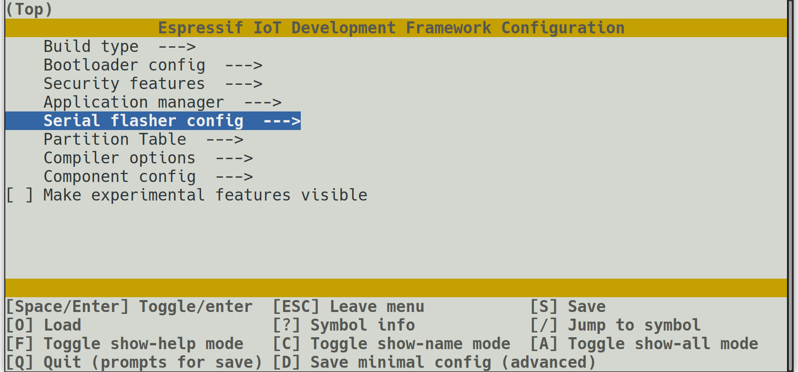

On séléctionne une mémoire _flash_ de 4MB :

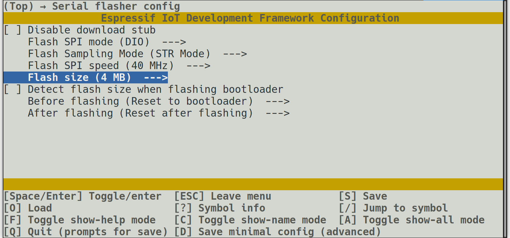

On obtient la structure de projet :

```sh
$ ls -l
drwxrwxr-x 7 tv tv  4096 juil.  7 09:08 ./
drwxrwxr-x 4 tv tv  4096 juil.  5 06:51 ../
-rw-rw-r-- 1 tv tv   111 juil.  7 09:08 CMakeLists.txt
-rw-rw-r-- 1 tv tv    13 juil.  7 08:42 .gitignore
drwxrwxr-x 2 tv tv  4096 juil.  5 06:52 include/
drwxrwxr-x 2 tv tv  4096 juil.  5 06:52 lib/
drwxrwxr-x 3 tv tv  4096 juil.  7 09:07 .pio/
-rw-rw-r-- 1 tv tv    72 juil.  5 07:02 platformio.ini
-rw-rw-r-- 1 tv tv 55801 juil.  7 09:10 sdkconfig.lolin32
drwxrwxr-x 2 tv tv  4096 juil.  7 09:08 src/
drwxrwxr-x 2 tv tv  4096 juil.  5 06:52 test/

$ ll src/
total 16
drwxrwxr-x 2 tv tv 4096 juil.  7 09:08 ./
drwxrwxr-x 7 tv tv 4096 juil.  7 09:08 ../
-rw-rw-r-- 1 tv tv  199 juil.  7 09:08 CMakeLists.txt
-rw-rw-r-- 1 tv tv   18 juil.  7 09:08 main.c

$ cat src/main.c
void app_main() {}
```

On modifie le fichier de projet `platformio.ini` :

```ini
[env:lolin32]
platform = espressif32
board = lolin32
framework = espidf
build_flags = -DDEBUG
```

### Code source

Exemple de programme [src/espidf-esp32/src/main.c](src/espidf-esp32/src/main.cpp) :

```cpp
#include <stdio.h>
#include "sdkconfig.h"
#include "esp_chip_info.h"
#include "esp_flash.h"
#include "esp_log.h"
#include <driver/gpio.h>
#include <rom/gpio.h>
#include <include/soc/rtc.h>
#include <esp_system.h>
#include <freertos/FreeRTOS.h>
#include <freertos/task.h>

#ifdef DEBUG
#warning "Debug mode enabled"
#else
#warning "Release mode enabled"
#endif

static const char* TAG = "app_main";

gpio_num_t esp32Led = 1; // LED_BUILTIN

void app_main()
{
#ifdef DEBUG
    // printf("Hello world!\n");
    ESP_LOGI(TAG, "Hello world!");
#endif

#ifdef DEBUG
    esp_chip_info_t chip_info;
    esp_chip_info(&chip_info);
    rtc_cpu_freq_config_t conf;
    rtc_clk_cpu_freq_get_config(&conf);
    uint32_t flash_size;

    ESP_LOGI(TAG, "Chip : %s", CONFIG_IDF_TARGET);
    ESP_LOGI(TAG, "CPU freq : %lu MHz ", conf.freq_mhz);
    ESP_LOGI(TAG, "CPU cores : %d", chip_info.cores);
    unsigned major_rev = chip_info.revision / 100;
    unsigned minor_rev = chip_info.revision % 100;
    ESP_LOGI(TAG, "Revision : v%d.%d", major_rev, minor_rev);

    if(esp_flash_get_size(NULL, &flash_size) == ESP_OK)
    {
        ESP_LOGI(TAG, "Flash size : %lu MB\n", flash_size / (1024 * 1024));
    }
    ESP_LOGI(TAG, "Free RAM : %ld bytes\n", esp_get_minimum_free_heap_size());
#endif

    // Start blink
    gpio_pad_select_gpio(esp32Led);
    gpio_set_direction(esp32Led, GPIO_MODE_OUTPUT);
    while(1)
    {
        /* Blink off (output low) */
        gpio_set_level(esp32Led, 0);
        vTaskDelay(2000 / portTICK_PERIOD_MS);
        /* Blink on (output high) */
        gpio_set_level(esp32Led, 1);
        vTaskDelay(2000 / portTICK_PERIOD_MS);
    }
}
```

### Build

Fabrication du projet :

```sh
$ pio run -e lolin32 -v
Processing lolin32 (platform: espressif32; board: lolin32; framework: espidf)
-----------------------------------------------------------------------------------------------------------------------------------------------------------------------------------------------
CONFIGURATION: https://docs.platformio.org/page/boards/espressif32/lolin32.html
PLATFORM: Espressif 32 (6.7.0) > WEMOS LOLIN32
HARDWARE: ESP32 240MHz, 320KB RAM, 4MB Flash
DEBUG: Current (cmsis-dap) External (cmsis-dap, esp-bridge, esp-prog, iot-bus-jtag, jlink, minimodule, olimex-arm-usb-ocd, olimex-arm-usb-ocd-h, olimex-arm-usb-tiny-h, olimex-jtag-tiny, tumpa)
PACKAGES: 
 - framework-espidf @ 3.50201.240515 (5.2.1) 
 - tool-cmake @ 3.16.4 
 - tool-esptoolpy @ 1.40501.0 (4.5.1) 
 - tool-ninja @ 1.7.1 
 - tool-riscv32-esp-elf-gdb @ 12.1.0+20221002 
 - tool-xtensa-esp-elf-gdb @ 12.1.0+20221002 
 - toolchain-esp32ulp @ 1.23500.220830 (2.35.0) 
 - toolchain-xtensa-esp-elf @ 13.2.0+20230928
Reading CMake configuration...
-- Found Git: /usr/bin/git (found version "2.34.1") 
-- git rev-parse returned 'fatal: ni ceci ni aucun de ses répertoires parents n'est un dépôt git : .git'
-- The C compiler identification is GNU 13.2.0
-- The CXX compiler identification is GNU 13.2.0
-- The ASM compiler identification is GNU
-- Found assembler: ~/.platformio/packages/toolchain-xtensa-esp-elf/bin/xtensa-esp32-elf-gcc
-- Check for working C compiler: ~/.platformio/packages/toolchain-xtensa-esp-elf/bin/xtensa-esp32-elf-gcc
-- Check for working C compiler: ~/.platformio/packages/toolchain-xtensa-esp-elf/bin/xtensa-esp32-elf-gcc -- works
-- Detecting C compiler ABI info
-- Detecting C compiler ABI info - done
-- Detecting C compile features
-- Detecting C compile features - done
-- Check for working CXX compiler: ~/.platformio/packages/toolchain-xtensa-esp-elf/bin/xtensa-esp32-elf-g++
-- Check for working CXX compiler: ~/.platformio/packages/toolchain-xtensa-esp-elf/bin/xtensa-esp32-elf-g++ -- works
-- Detecting CXX compiler ABI info
-- Detecting CXX compiler ABI info - done
-- Detecting CXX compile features
-- Detecting CXX compile features - done
-- Building ESP-IDF components for target esp32
-- Project sdkconfig file ~/Documents/git/bts-lasalle-avignon-ressources/PlatformIO/src/espidf-esp32/sdkconfig.lolin32
-- Compiler supported targets: xtensa-esp-elf
-- Looking for sys/types.h
-- Looking for sys/types.h - found
-- Looking for stdint.h
-- Looking for stdint.h - found
-- Looking for stddef.h
-- Looking for stddef.h - found
-- Check size of time_t
-- Check size of time_t - done
-- Found Python3: ~/.platformio/penv/.espidf-5.2.1/bin/python (found version "3.10.12") found components: Interpreter 
-- Performing Test C_COMPILER_SUPPORTS_WFORMAT_SIGNEDNESS
-- Performing Test C_COMPILER_SUPPORTS_WFORMAT_SIGNEDNESS - Success
-- App "espidf-esp32" version: 964c37f-dirty
-- Adding linker script ~/Documents/git/bts-lasalle-avignon-ressources/PlatformIO/src/espidf-esp32/.pio/build/lolin32/esp-idf/esp_system/ld/memory.ld
-- Adding linker script ~/.platformio/packages/framework-espidf/components/esp_system/ld/esp32/sections.ld.in
-- Adding linker script ~/.platformio/packages/framework-espidf/components/esp_rom/esp32/ld/esp32.rom.ld
-- Adding linker script ~/.platformio/packages/framework-espidf/components/esp_rom/esp32/ld/esp32.rom.api.ld
-- Adding linker script ~/.platformio/packages/framework-espidf/components/esp_rom/esp32/ld/esp32.rom.libgcc.ld
-- Adding linker script ~/.platformio/packages/framework-espidf/components/esp_rom/esp32/ld/esp32.rom.newlib-data.ld
-- Adding linker script ~/.platformio/packages/framework-espidf/components/esp_rom/esp32/ld/esp32.rom.syscalls.ld
-- Adding linker script ~/.platformio/packages/framework-espidf/components/esp_rom/esp32/ld/esp32.rom.newlib-funcs.ld
-- Adding linker script ~/.platformio/packages/framework-espidf/components/soc/esp32/ld/esp32.peripherals.ld
-- Components: __pio_env app_trace app_update bootloader bootloader_support bt cmock console cxx driver efuse esp-tls esp_adc esp_app_format esp_bootloader_format esp_coex esp_common esp_eth esp_event esp_gdbstub esp_hid esp_http_client esp_http_server esp_https_ota esp_https_server esp_hw_support esp_lcd esp_local_ctrl esp_mm esp_netif esp_netif_stack esp_partition esp_phy esp_pm esp_psram esp_ringbuf esp_rom esp_system esp_timer esp_wifi espcoredump esptool_py fatfs freertos hal heap http_parser idf_test ieee802154 json log lwip mbedtls mqtt newlib nvs_flash nvs_sec_provider openthread partition_table perfmon protobuf-c protocomm pthread sdmmc soc spi_flash spiffs src tcp_transport ulp unity usb vfs wear_levelling wifi_provisioning wpa_supplicant xtensa
-- Component paths: ...
-- Configuring done
-- Generating done
-- Build files have been written to: ~/Documents/git/bts-lasalle-avignon-ressources/PlatformIO/src/espidf-esp32/.pio/build/lolin32
...
-- Found Git: /usr/bin/git (found version "2.34.1") 
-- git rev-parse returned 'fatal: ni ceci ni aucun de ses répertoires parents n'est un dépôt git : .git'
-- The C compiler identification is GNU 13.2.0
-- The CXX compiler identification is GNU 13.2.0
-- The ASM compiler identification is GNU
-- Found assembler: ~/.platformio/packages/toolchain-xtensa-esp-elf/bin/xtensa-esp32-elf-gcc
-- Check for working C compiler: ~/.platformio/packages/toolchain-xtensa-esp-elf/bin/xtensa-esp32-elf-gcc
-- Check for working C compiler: ~/.platformio/packages/toolchain-xtensa-esp-elf/bin/xtensa-esp32-elf-gcc -- works
-- Detecting C compiler ABI info
-- Detecting C compiler ABI info - done
-- Detecting C compile features
-- Detecting C compile features - done
-- Check for working CXX compiler: ~/.platformio/packages/toolchain-xtensa-esp-elf/bin/xtensa-esp32-elf-g++
-- Check for working CXX compiler: ~/.platformio/packages/toolchain-xtensa-esp-elf/bin/xtensa-esp32-elf-g++ -- works
-- Detecting CXX compiler ABI info
-- Detecting CXX compiler ABI info - done
-- Detecting CXX compile features
-- Detecting CXX compile features - done
-- git rev-parse returned 'fatal: ni ceci ni aucun de ses répertoires parents n'est un dépôt git : .git'
-- Could not use 'git describe' to determine PROJECT_VER.
-- Building ESP-IDF components for target esp32
-- Project sdkconfig file ~/Documents/git/bts-lasalle-avignon-ressources/PlatformIO/src/espidf-esp32/sdkconfig.lolin32
-- Compiler supported targets: xtensa-esp-elf
-- Looking for sys/types.h
-- Looking for sys/types.h - found
-- Looking for stdint.h
-- Looking for stdint.h - found
-- Looking for stddef.h
-- Looking for stddef.h - found
-- Check size of time_t
-- Check size of time_t - done
-- Adding linker script ~/.platformio/packages/framework-espidf/components/soc/esp32/ld/esp32.peripherals.ld
-- Bootloader project name: "bootloader" version: 1
-- Adding linker script ~/.platformio/packages/framework-espidf/components/esp_rom/esp32/ld/esp32.rom.ld
-- Adding linker script ~/.platformio/packages/framework-espidf/components/esp_rom/esp32/ld/esp32.rom.api.ld
-- Adding linker script ~/.platformio/packages/framework-espidf/components/esp_rom/esp32/ld/esp32.rom.libgcc.ld
-- Adding linker script ~/.platformio/packages/framework-espidf/components/esp_rom/esp32/ld/esp32.rom.newlib-funcs.ld
-- Adding linker script ~/.platformio/packages/framework-espidf/components/bootloader/subproject/main/ld/esp32/bootloader.ld
-- Adding linker script ~/.platformio/packages/framework-espidf/components/bootloader/subproject/main/ld/esp32/bootloader.rom.ld
-- Components: bootloader bootloader_support efuse esp_app_format esp_bootloader_format esp_common esp_hw_support esp_rom esp_system esptool_py freertos hal log main micro-ecc newlib partition_table soc spi_flash xtensa
-- Component paths: ...
-- Configuring done
-- Generating done
-- Build files have been written to: ~/Documents/git/bts-lasalle-avignon-ressources/PlatformIO/src/espidf-esp32/.pio/build/lolin32/bootloader
...
~/.platformio/packages/tool-cmake/bin/cmake -DDATA_FILE=~/Documents/git/bts-lasalle-avignon-ressources/PlatformIO/src/espidf-esp32/.pio/build/lolin32/x509_crt_bundle -DSOURCE_FILE=~/Documents/git/bts-lasalle-avignon-ressources/PlatformIO/src/espidf-esp32/.pio/build/lolin32/x509_crt_bundle.S -DFILE_TYPE=BINARY -P ~/.platformio/packages/framework-espidf/tools/cmake/scripts/data_file_embed_asm.cmake
LDF: Library Dependency Finder -> https://bit.ly/configure-pio-ldf
LDF Modes: Finder ~ chain, Compatibility ~ soft
Found 0 compatible libraries
Scanning dependencies...
No dependencies
Building in release mode
xtensa-esp32-elf-gcc -o .pio/build/lolin32/src/main.c.o -c -Og -Wall -Werror=all -Wextra -Wno-enum-conversion -Wno-error=deprecated-declarations -Wno-error=unused-but-set-variable -Wno-error=unused-function -Wno-error=unused-variable -Wno-frame-address -Wno-old-style-declaration -Wno-sign-compare -Wno-unused-parameter -fdata-sections -ffunction-sections -fmacro-prefix-map=~/.platformio/packages/framework-espidf=/IDF -fmacro-prefix-map=~/Documents/git/bts-lasalle-avignon-ressources/PlatformIO/src/espidf-esp32=. -fno-jump-tables -fno-shrink-wrap -fno-tree-switch-conversion -fstrict-volatile-bitfields -gdwarf-4 -ggdb -mlongcalls -std=gnu17 -mlongcalls -Wno-frame-address -ffunction-sections -fdata-sections -Wall -Werror=all -Wno-error=unused-function -Wno-error=unused-variable -Wno-error=unused-but-set-variable -Wno-error=deprecated-declarations -Wextra -Wno-unused-parameter -Wno-sign-compare -Wno-enum-conversion -gdwarf-4 -ggdb -Og -fno-shrink-wrap -fmacro-prefix-map=~/Documents/git/bts-lasalle-avignon-ressources/PlatformIO/src/espidf-esp32=. -fmacro-prefix-map=~/.platformio/packages/framework-espidf=/IDF -fstrict-volatile-bitfields -fno-jump-tables -fno-tree-switch-conversion -Wno-old-style-declaration -D_POSIX_READER_WRITER_LOCKS -D_GNU_SOURCE -D_GLIBCXX_USE_POSIX_SEMAPHORE -D_GLIBCXX_HAVE_POSIX_SEMAPHORE -DSOC_XTAL_FREQ_MHZ=CONFIG_XTAL_FREQ -DSOC_MMU_PAGE_SIZE=CONFIG_MMU_PAGE_SIZE -DIDF_VER=\"5.2.1\" -DESP_PLATFORM -DPLATFORMIO=60116 -DARDUINO_LOLIN32 -I~/.platformio/packages/framework-espidf/components/xtensa/esp32/include ... -Iinclude -Isrc -I. src/main.c
...
xtensa-esp32-elf-gcc -o .pio/build/lolin32/bootloader.elf -Wl,--Map=~/Documents/git/bts-lasalle-avignon-ressources/PlatformIO/src/espidf-esp32/.pio/build/lolin32/bootloader/bootloader.map -Wl,--cref -Wl,--defsym=IDF_TARGET_ESP32=0 -Wl,--gc-sections -Wl,--no-warn-rwx-segments -Wl,--warn-common -Wno-frame-address -fno-lto -fno-rtti -mlongcalls -T esp32.rom.ld -T esp32.rom.api.ld -T esp32.rom.libgcc.ld -T esp32.rom.newlib-funcs.ld -T esp32.peripherals.ld -T bootloader.ld -T bootloader.rom.ld -u esp_dport_access_reg_read -u __assert_func -u esp_bootloader_desc -u abort -u __ubsan_include -u bootloader_hooks_include -Wl,--start-group .pio/build/lolin32/bootloader/esp-idf/xtensa/libxtensa.a .pio/build/lolin32/bootloader/esp-idf/main/libmain.a .pio/build/lolin32/bootloader/esp-idf/bootloader_support/libbootloader_support.a .pio/build/lolin32/bootloader/esp-idf/efuse/libefuse.a .pio/build/lolin32/bootloader/esp-idf/esp_bootloader_format/libesp_bootloader_format.a .pio/build/lolin32/bootloader/esp-idf/esp_common/libesp_common.a .pio/build/lolin32/bootloader/esp-idf/esp_hw_support/libesp_hw_support.a .pio/build/lolin32/bootloader/esp-idf/esp_rom/libesp_rom.a .pio/build/lolin32/bootloader/esp-idf/esp_system/libesp_system.a .pio/build/lolin32/bootloader/esp-idf/hal/libhal.a .pio/build/lolin32/bootloader/esp-idf/log/liblog.a .pio/build/lolin32/bootloader/esp-idf/micro-ecc/libmicro-ecc.a .pio/build/lolin32/bootloader/esp-idf/soc/libsoc.a .pio/build/lolin32/bootloader/esp-idf/spi_flash/libspi_flash.a -L.pio/build/lolin32 -L~/.platformio/packages/framework-espidf/components/esp_rom/esp32/ld -L~/.platformio/packages/framework-espidf/components/soc/esp32/ld -L~/.platformio/packages/framework-espidf/components/bootloader/subproject/main/ld/esp32 -L~/.platformio/packages/framework-espidf/components/xtensa/esp32 -Wl,--end-group -lxt_hal
"~/.platformio/penv/bin/python" "~/.platformio/packages/tool-esptoolpy/esptool.py" --chip esp32 elf2image --flash_mode dio --flash_freq 40m --flash_size 4MB -o .pio/build/lolin32/bootloader.bin .pio/build/lolin32/bootloader.elf
esptool.py v4.5.1
Creating esp32 image...
Merged 2 ELF sections
Successfully created esp32 image.
xtensa-esp32-elf-gcc -o .pio/build/lolin32/firmware.elf ... -Wl,--start-group .pio/build/lolin32/esp-idf/xtensa/libxtensa.a .pio/build/lolin32/esp-idf/app_trace/libapp_trace.a .pio/build/lolin32/esp-idf/unity/libunity.a .pio/build/lolin32/esp-idf/cmock/libcmock.a .pio/build/lolin32/esp-idf/console/libconsole.a .pio/build/lolin32/esp-idf/esp_hid/libesp_hid.a .pio/build/lolin32/esp-idf/esp_lcd/libesp_lcd.a .pio/build/lolin32/esp-idf/protobuf-c/libprotobuf-c.a .pio/build/lolin32/esp-idf/protocomm/libprotocomm.a .pio/build/lolin32/esp-idf/esp_local_ctrl/libesp_local_ctrl.a .pio/build/lolin32/esp-idf/espcoredump/libespcoredump.a .pio/build/lolin32/esp-idf/wear_levelling/libwear_levelling.a .pio/build/lolin32/esp-idf/sdmmc/libsdmmc.a .pio/build/lolin32/esp-idf/fatfs/libfatfs.a .pio/build/lolin32/esp-idf/json/libjson.a .pio/build/lolin32/esp-idf/mqtt/libmqtt.a .pio/build/lolin32/esp-idf/nvs_sec_provider/libnvs_sec_provider.a .pio/build/lolin32/esp-idf/perfmon/libperfmon.a .pio/build/lolin32/esp-idf/spiffs/libspiffs.a .pio/build/lolin32/esp-idf/wifi_provisioning/libwifi_provisioning.a .pio/build/lolin32/esp-idf/app_update/libapp_update.a .pio/build/lolin32/esp-idf/bootloader_support/libbootloader_support.a .pio/build/lolin32/esp-idf/cxx/libcxx.a .pio/build/lolin32/esp-idf/driver/libdriver.a .pio/build/lolin32/esp-idf/efuse/libefuse.a .pio/build/lolin32/esp-idf/esp-tls/libesp-tls.a .pio/build/lolin32/esp-idf/esp_adc/libesp_adc.a .pio/build/lolin32/esp-idf/esp_app_format/libesp_app_format.a .pio/build/lolin32/esp-idf/esp_bootloader_format/libesp_bootloader_format.a .pio/build/lolin32/esp-idf/esp_coex/libesp_coex.a .pio/build/lolin32/esp-idf/esp_common/libesp_common.a .pio/build/lolin32/esp-idf/esp_eth/libesp_eth.a .pio/build/lolin32/esp-idf/esp_event/libesp_event.a .pio/build/lolin32/esp-idf/esp_gdbstub/libesp_gdbstub.a .pio/build/lolin32/esp-idf/esp_http_client/libesp_http_client.a .pio/build/lolin32/esp-idf/esp_http_server/libesp_http_server.a .pio/build/lolin32/esp-idf/esp_https_ota/libesp_https_ota.a .pio/build/lolin32/esp-idf/esp_hw_support/libesp_hw_support.a .pio/build/lolin32/esp-idf/esp_mm/libesp_mm.a .pio/build/lolin32/esp-idf/esp_netif/libesp_netif.a .pio/build/lolin32/esp-idf/esp_partition/libesp_partition.a .pio/build/lolin32/esp-idf/esp_phy/libesp_phy.a .pio/build/lolin32/esp-idf/esp_pm/libesp_pm.a .pio/build/lolin32/esp-idf/esp_ringbuf/libesp_ringbuf.a .pio/build/lolin32/esp-idf/esp_rom/libesp_rom.a .pio/build/lolin32/esp-idf/esp_system/libesp_system.a .pio/build/lolin32/esp-idf/esp_timer/libesp_timer.a .pio/build/lolin32/esp-idf/esp_wifi/libesp_wifi.a .pio/build/lolin32/esp-idf/freertos/libfreertos.a .pio/build/lolin32/esp-idf/hal/libhal.a .pio/build/lolin32/esp-idf/heap/libheap.a .pio/build/lolin32/esp-idf/http_parser/libhttp_parser.a .pio/build/lolin32/esp-idf/log/liblog.a .pio/build/lolin32/esp-idf/lwip/liblwip.a .pio/build/lolin32/esp-idf/mbedtls/libmbedtls.a .pio/build/lolin32/esp-idf/newlib/libnewlib.a .pio/build/lolin32/esp-idf/nvs_flash/libnvs_flash.a .pio/build/lolin32/esp-idf/pthread/libpthread.a .pio/build/lolin32/esp-idf/soc/libsoc.a .pio/build/lolin32/esp-idf/spi_flash/libspi_flash.a .pio/build/lolin32/esp-idf/tcp_transport/libtcp_transport.a .pio/build/lolin32/esp-idf/vfs/libvfs.a .pio/build/lolin32/esp-idf/wpa_supplicant/libwpa_supplicant.a .pio/build/lolin32/esp-idf/mbedtls/mbedtls/3rdparty/everest/libeverest.a .pio/build/lolin32/esp-idf/mbedtls/mbedtls/library/libmbedcrypto.a .pio/build/lolin32/esp-idf/mbedtls/mbedtls/library/libmbedtls.a .pio/build/lolin32/esp-idf/mbedtls/mbedtls/library/libmbedx509.a .pio/build/lolin32/esp-idf/mbedtls/mbedtls/3rdparty/p256-m/libp256m.a -lcore -lespnow -lmesh -lnet80211 -lpp -lsmartconfig -lwapi -lxt_hal -lc -lm -lstdc++ -lgcc -lphy -lrtc -Wl,--end-group
<lambda>(["checkprogsize"], [".pio/build/lolin32/firmware.elf"])
MethodWrapper(["checkprogsize"], [".pio/build/lolin32/firmware.elf"])
Advanced Memory Usage is available via "PlatformIO Home > Project Inspect"
RAM:   [          ]   3.4% (used 11028 bytes from 327680 bytes)
Flash: [==        ]  17.1% (used 179497 bytes from 1048576 bytes)
.pio/build/lolin32/firmware.elf  :
...
Total                  2694633
"~/.platformio/penv/bin/python" "~/.platformio/packages/tool-esptoolpy/esptool.py" --chip esp32 elf2image --flash_mode dio --flash_freq 40m --flash_size 4MB --elf-sha256-offset 0xb0 -o .pio/build/lolin32/firmware.bin .pio/build/lolin32/firmware.elf
esptool.py v4.5.1
Creating esp32 image...
Merged 2 ELF sections
Successfully created esp32 image.
[SUCCESS] Took 32.57 seconds
```

Les outils utilisés ici (dans `~/.platformio/packages/`) par PlaformIO sont :

- `framework-espidf`
- `tool-cmake`
- `tool-esptoolpy`
- `tool-ninja`
- `tool-xtensa-esp-elf-gdb`
- `toolchain-esp32ulp`
- `toolchain-xtensa-esp-elf`

La chaîne de développement `xtensa-esp32` (pour les 2 cœurs Tensilica LX6 32 bits de l'ESP32) fournit notamment les compilateurs C++ `xtensa-esp32-elf-g++` et C `xtensa-esp32-elf-gcc`. Ils servent à compiler le fichier source `src/main.c` et l'ensemble du framework `framework-espidf`. Les fichiers objets `.o` produits sont stockés dans l'arborescence `.pio/build/lolin32/`.

```sh
$ ls -l .pio/build/lolin32/src/
-rw-rw-r-- 1 tv tv 19420 juil.  7 10:32 main.c.o

$ $ file .pio/build/lolin32/src/main.c.o 
.pio/build/lolin32/src/main.c.o: ELF 32-bit LSB relocatable, Tensilica Xtensa, version 1 (SYSV), with debug_info, not stripped

$ ls -l .pio/build/lolin32/esp_*/src
...
```

L'utilitaire `xtensa-esp32-elf-ar` crée les différentes archives `.a` avec les fichiers objets `.o` et `xtensa-esp32-elf-ranlib` génère les index des archives à l'intérieur de celle-ci. L'index répertorie chaque symbole défini dans l'archive (table de symboles). Les archives `.a` sont des **[bibliothèques logicielles](https://fr.wikipedia.org/wiki/Biblioth%C3%A8que_logicielle) statiques**. L'utilitaire `xtensa-esp32-elf-nm` permet de lister la table des symboles d'une archive.

> [!NOTE]
> Une bibliothèque statique est destinée à être copiée dans le programme lors de la construction de ce dernier (c'est la phase d'édition de liens).

```sh
$ fdfind "\.a" .pio/build/lolin32/esp-idf/
.pio/build/lolin32/esp-idf/app_trace/libapp_trace.a
...
.pio/build/lolin32/esp-idf/xtensa/libxtensa.a

$ file .pio/build/lolin32/esp-idf/cxx/libcxx.a
.pio/build/lolin32/esp-idf/cxx/libcxx.a: current ar archive

$ ~/.platformio/packages/toolchain-xtensa-esp32/bin/xtensa-esp32-elf-nm -s .pio/build/lolin32/esp-idf/cxx/libcxx.a
```

Ensuite, `xtensa-esp32-elf-gcc` réalise l'édition de liens pour produire le `bootloader.elf` et l'"exécutable" `firmware.elf`.

> [!NOTE]
> ELF (_Executable and Linkable Format_) est un format de fichier binaire utilisé pour l'enregistrement de code compilé. Il est par exemple utilisé dans la plupart des systèmes d'exploitation de type Unix comme GNU/Linux.

L'utilitaire `esptool.py` finalise le processus de fabrication en produisant le fichier `firmware.bin` à partir de `firmware.elf`. C'est le fichier `firmware.bin` qui sera "téléversé" (_upload_) vers l'ESP32.

```sh
$ ls -l .pio/build/lolin32/*.elf
-rwxrwxr-x 1 tv tv  484836 juil.  7 10:32 .pio/build/lolin32/bootloader.elf
-rwxrwxr-x 1 tv tv 2781016 juil.  7 10:33 .pio/build/lolin32/firmware.elf

$ ls -l .pio/build/lolin32/*.bin
-rw-rw-r-- 1 tv tv  26720 juil.  7 10:32 .pio/build/lolin32/bootloader.bin
-rw-rw-r-- 1 tv tv 179856 juil.  7 10:33 .pio/build/lolin32/firmware.bin
-rw-rw-r-- 1 tv tv   3072 juil.  7 10:32 .pio/build/lolin32/partitions.bin

$ file .pio/build/lolin32/firmware.elf
.pio/build/lolin32/firmware.elf: ELF 32-bit LSB executable, Tensilica Xtensa, version 1 (SYSV), statically linked, with debug_info, not stripped

$ $ ~/.platformio/packages/toolchain-xtensa-esp32/bin/xtensa-esp32-elf-size -B -d .pio/build/lolin32/firmware.elf
   text	   data	    bss	    dec	    hex	filename
 132065	  47688	   2265	 182018	  2c702	.pio/build/lolin32/firmware.elf

$ ~/.platformio/packages/toolchain-xtensa-esp32/bin/xtensa-esp32-elf-objdump -f .pio/build/lolin32/firmware.elf

.pio/build/lolin32/firmware.elf:     file format elf32-xtensa-le
architecture: xtensa, flags 0x00000112:
EXEC_P, HAS_SYMS, D_PAGED
start address 0x400816a8
```

> [!NOTE]
> Un [firmware](https://fr.wikipedia.org/wiki/Firmware) (ou micrologiciel, microprogramme, microcode, logiciel interne ou encore logiciel embarqué) est un programme intégré dans un matériel informatique, ici l'ESP32, pour qu'il puisse fonctionner.

### Flash

Téléversement (_upload_) :

```sh
$ pio run -e lolin32 -t upload -v
Processing lolin32 (platform: espressif32; board: lolin32; framework: espidf)

CONFIGURATION: https://docs.platformio.org/page/boards/espressif32/lolin32.html
PLATFORM: Espressif 32 (6.7.0) > WEMOS LOLIN32
HARDWARE: ESP32 240MHz, 320KB RAM, 4MB Flash
DEBUG: Current (cmsis-dap) External (cmsis-dap, esp-bridge, esp-prog, iot-bus-jtag, jlink, minimodule, olimex-arm-usb-ocd, olimex-arm-usb-ocd-h, olimex-arm-usb-tiny-h, olimex-jtag-tiny, tumpa)
PACKAGES: 
 - framework-espidf @ 3.50201.240515 (5.2.1) 
 - tool-cmake @ 3.16.4 
 - tool-esptoolpy @ 1.40501.0 (4.5.1) 
 - tool-mkfatfs @ 2.0.1 
 - tool-mklittlefs @ 1.203.210628 (2.3) 
 - tool-mkspiffs @ 2.230.0 (2.30) 
 - tool-ninja @ 1.7.1 
 - tool-riscv32-esp-elf-gdb @ 12.1.0+20221002 
 - tool-xtensa-esp-elf-gdb @ 12.1.0+20221002 
 - toolchain-esp32ulp @ 1.23500.220830 (2.35.0) 
 - toolchain-xtensa-esp-elf @ 13.2.0+20230928
Reading CMake configuration...
LDF: Library Dependency Finder -> https://bit.ly/configure-pio-ldf
LDF Modes: Finder ~ chain, Compatibility ~ soft
Found 0 compatible libraries
Scanning dependencies...
No dependencies
Building in release mode
<lambda>(["checkprogsize"], [".pio/build/lolin32/firmware.elf"])
MethodWrapper(["checkprogsize"], [".pio/build/lolin32/firmware.elf"])
Advanced Memory Usage is available via "PlatformIO Home > Project Inspect"
RAM:   [          ]   3.4% (used 11028 bytes from 327680 bytes)
Flash: [==        ]  17.1% (used 179497 bytes from 1048576 bytes)
.pio/build/lolin32/firmware.elf  :
section                   size         addr
...
Total                  2694633
<lambda>(["upload"], [".pio/build/lolin32/firmware.bin"])
AVAILABLE: cmsis-dap, esp-bridge, esp-prog, espota, esptool, iot-bus-jtag, jlink, minimodule, olimex-arm-usb-ocd, olimex-arm-usb-ocd-h, olimex-arm-usb-tiny-h, olimex-jtag-tiny, tumpa
CURRENT: upload_protocol = esptool
BeforeUpload(["upload"], [".pio/build/lolin32/firmware.bin"])
Auto-detected: /dev/ttyUSB0
"~/.platformio/penv/bin/python" "~/.platformio/packages/tool-esptoolpy/esptool.py" --chip esp32 --port "/dev/ttyUSB0" --baud 460800 --before default_reset --after hard_reset write_flash -z --flash_mode dio --flash_freq 40m --flash_size 4MB 0x1000 ~/Documents/git/bts-lasalle-avignon-ressources/PlatformIO/src/espidf-esp32/.pio/build/lolin32/bootloader.bin 0x8000 ~/Documents/git/bts-lasalle-avignon-ressources/PlatformIO/src/espidf-esp32/.pio/build/lolin32/partitions.bin 0x10000 .pio/build/lolin32/firmware.bin
esptool.py v4.5.1
Serial port /dev/ttyUSB0
Connecting....
Chip is ESP32-D0WDQ6 (revision v1.0)
Features: WiFi, BT, Dual Core, 240MHz, VRef calibration in efuse, Coding Scheme None
Crystal is 40MHz
MAC: 24:62:ab:f2:5a:18
Uploading stub...
Running stub...
Stub running...
Changing baud rate to 460800
Changed.
Configuring flash size...
Flash will be erased from 0x00001000 to 0x00007fff...
Flash will be erased from 0x00008000 to 0x00008fff...
Flash will be erased from 0x00010000 to 0x0003bfff...
Compressed 26720 bytes to 16351...
Writing at 0x00001000... (100 %)
Wrote 26720 bytes (16351 compressed) at 0x00001000 in 0.7 seconds (effective 311.2 kbit/s)...
Hash of data verified.
Compressed 3072 bytes to 103...
Writing at 0x00008000... (100 %)
Wrote 3072 bytes (103 compressed) at 0x00008000 in 0.1 seconds (effective 396.6 kbit/s)...
Hash of data verified.
Compressed 179856 bytes to 95934...
Writing at 0x00010000... (16 %)
Writing at 0x0001c481... (33 %)
Writing at 0x00021fdd... (50 %)
Writing at 0x00027b1d... (66 %)
Writing at 0x00030a4f... (83 %)
Writing at 0x00036446... (100 %)
Wrote 179856 bytes (95934 compressed) at 0x00010000 in 2.6 seconds (effective 559.1 kbit/s)...
Hash of data verified.

Leaving...
Hard resetting via RTS pin...
[SUCCESS] Took 8.58 seconds
```

Par défaut, PlatformIO utilise l'utilitaire `esptool.py` pour écrire dans la mémoire FLASH (`write_flash`) l'ensemble des fichiers nécessaires à l'exécutation du programme `firmware.bin` sur l'ESP32 :

| Adresse |     Fichier      | Description                         |
| ------- | :--------------: | ----------------------------------- |
| 0x1000  |  bootloader.bin  | Le chargeur d'amorçage de l'ESP32   |
| 0x8000  |  partitions.bin  | Le partitionnement de la mémoire    |
| 0xe000  |  boot_app0.bin   | Le chargeur du programme exécutable |
| 0x10000 | **firmware.bin** | Le programme exécutable             |

A la fin, l'utilitaire `esptool.py` effectue un _reset_ (`hard_reset`) de la carte ESP32. L'ESP32 reboote et exécute le programme `firmware.bin`.

On peut monitorer l'exécution du programme sur le port série virtuel :

```sh
$ pio device monitor --baud 115200 --port /dev/ttyUSB0
--- Terminal on /dev/ttyUSB0 | 115200 8-N-1
--- Available filters and text transformations: colorize, debug, default, direct, esp32_exception_decoder, hexlify, log2file, nocontrol, printable, send_on_enter, time
--- More details at https://bit.ly/pio-monitor-filters
--- Quit: Ctrl+C | Menu: Ctrl+T | Help: Ctrl+T followed by Ctrl+H
ets Jun  8 2016 00:22:57

rst:0x1 (POWERON_RESET),boot:0x13 (SPI_FAST_FLASH_BOOT)
configsip: 0, SPIWP:0xee
clk_drv:0x00,q_drv:0x00,d_drv:0x00,cs0_drv:0x00,hd_drv:0x00,wp_drv:0x00
mode:DIO, clock div:2
load:0x3fff0030,len:7172
load:0x40078000,len:15540
load:0x40080400,len:4
ho 8 tail 4 room 4
load:0x40080404,len:3904
entry 0x40080638
␛[0;32mI (31) boot: ESP-IDF 5.2.1 2nd stage bootloader␛[0m
␛[0;32mI (31) boot: compile time Jul  7 2024 18:52:26␛[0m
␛[0;32mI (31) boot: Multicore bootloader␛[0m
␛[0;32mI (35) boot: chip revision: v1.0␛[0m
␛[0;32mI (39) boot.esp32: SPI Speed      : 40MHz␛[0m
␛[0;32mI (44) boot.esp32: SPI Mode       : DIO␛[0m
␛[0;32mI (48) boot.esp32: SPI Flash Size : 4MB␛[0m
␛[0;32mI (53) boot: Enabling RNG early entropy source...␛[0m
␛[0;32mI (58) boot: Partition Table:␛[0m
␛[0;32mI (62) boot: ## Label            Usage          Type ST Offset   Length␛[0m
␛[0;32mI (69) boot:  0 nvs              WiFi data        01 02 00009000 00006000␛[0m
␛[0;32mI (76) boot:  1 phy_init         RF data          01 01 0000f000 00001000␛[0m
␛[0;32mI (84) boot:  2 factory          factory app      00 00 00010000 00100000␛[0m
␛[0;32mI (91) boot: End of partition table␛[0m
␛[0;32mI (96) esp_image: segment 0: paddr=00010020 vaddr=3f400020 size=099a4h ( 39332) map␛[0m
␛[0;32mI (117) esp_image: segment 1: paddr=000199cc vaddr=3ffb0000 size=02254h (  8788) load␛[0m
␛[0;32mI (121) esp_image: segment 2: paddr=0001bc28 vaddr=40080000 size=043f0h ( 17392) load␛[0m
␛[0;32mI (130) esp_image: segment 3: paddr=00020020 vaddr=400d0020 size=13b50h ( 80720) map␛[0m
␛[0;32mI (159) esp_image: segment 4: paddr=00033b78 vaddr=400843f0 size=08360h ( 33632) load␛[0m
␛[0;32mI (179) boot: Loaded app from partition at offset 0x10000␛[0m
␛[0;32mI (179) boot: Disabling RNG early entropy source...␛[0m
␛[0;32mI (191) cpu_start: Multicore app␛[0m
␛[0;32mI (199) cpu_start: Pro cpu start user code␛[0m
␛[0;32mI (199) cpu_start: cpu freq: 240000000 Hz␛[0m
␛[0;32mI (200) cpu_start: Application information:␛[0m
␛[0;32mI (203) cpu_start: Project name:     espidf-esp32␛[0m
␛[0;32mI (208) cpu_start: App version:      964c37f-dirty␛[0m
␛[0;32mI (213) cpu_start: Compile time:     Jul  7 2024 18:52:07␛[0m
␛[0;32mI (219) cpu_start: ELF file SHA256:  2d39f0a90...␛[0m
␛[0;32mI (225) cpu_start: ESP-IDF:          5.2.1␛[0m
␛[0;32mI (230) cpu_start: Min chip rev:     v0.0␛[0m
␛[0;32mI (234) cpu_start: Max chip rev:     v3.99 ␛[0m
␛[0;32mI (239) cpu_start: Chip rev:         v1.0␛[0m
␛[0;32mI (244) heap_init: Initializing. RAM available for dynamic allocation:␛[0m
␛[0;32mI (251) heap_init: At 3FFAE6E0 len 00001920 (6 KiB): DRAM␛[0m
␛[0;32mI (257) heap_init: At 3FFB2B18 len 0002D4E8 (181 KiB): DRAM␛[0m
␛[0;32mI (263) heap_init: At 3FFE0440 len 00003AE0 (14 KiB): D/IRAM␛[0m
␛[0;32mI (270) heap_init: At 3FFE4350 len 0001BCB0 (111 KiB): D/IRAM␛[0m
␛[0;32mI (276) heap_init: At 4008C750 len 000138B0 (78 KiB): IRAM␛[0m
␛[0;32mI (284) spi_flash: detected chip: generic␛[0m
␛[0;32mI (287) spi_flash: flash io: dio␛[0m
␛[0;32mI (292) main_task: Started on CPU0␛[0m
␛[0;32mI (302) main_task: Calling app_main()␛[0m
␛[0;32mI (302) app_main: Hello world!␛[0m
␛[0;32mI (302) app_main: Chip : esp32␛[0m
␛[0;32mI (302) app_main: CPU freq : 240 MHz ␛[0m
␛[0;32mI (302) app_main: CPU cores : 2␛[0m
```

### Partitions

La mémoire _flash_ de l'ESP32 est partitionnée.

> La mémoire flash est découpée en secteurs d'une taille de 4 kB. Les partitions peuvent être cryptées (`encrypted`) et en lecteur seule (`readonly`)

La table de partition se situe à l'offset `0x8000` par défaut et elle fournit les informations sur le découpage de la mémoire non-volatile.

Elle occupe un secteur (4096 octets) qui permet d'y stocker 95 entrées max et une somme de contrôle MD5 pour vérifier son intégrité.

> [!TIP]
> Le _framework__ fournit un outil `parttool.py` pour effectuer des opérations liées aux partitions :
> - lire une partition et enregistrer le contenu dans un fichier (read_partition)
> - écrire le contenu d'un fichier sur une partition (_write_partition_)
> - effacer une partition (_erase_partition_)
> - récupérer des informations telles que le nom, le décalage, la taille et l'indicateur d'une partition donnée (_get_partition_info_)

Le [partitionnement](https://docs.espressif.com/projects/esp-idf/en/latest/esp32/api-guides/partition-tables.html) de la mémoire flash a été défini avec la commande `pio run -t menuconfig` :

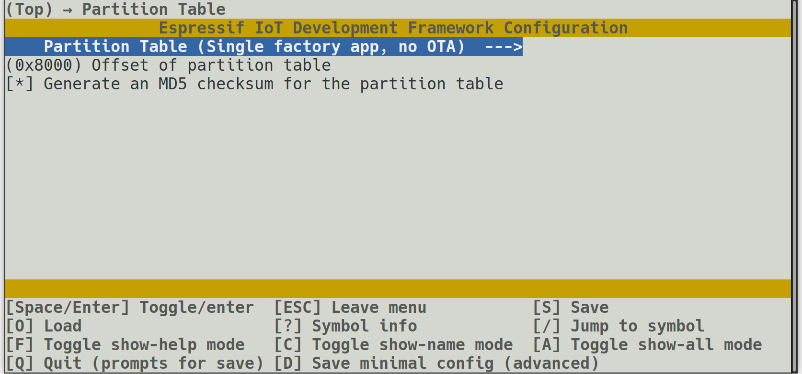

> cf. ~/.platformio/packages/framework-espidf/components/partition_table/

```sh
$ cat ~/.platformio/packages/framework-espidf/components/partition_table/partitions_singleapp.csv
# Name,   Type, SubType, Offset,  Size, Flags
# Note: if you have increased the bootloader size, make sure to update the offsets to avoid overlap
nvs,      data, nvs,     ,        0x6000,
phy_init, data, phy,     ,        0x1000,
factory,  app,  factory, ,        1M,
```

> Il existe d'autres partitionnements disponibles. On utilisera le paramétre `board_build.partitions` dans `platformio.ini` pour changer de format.

Les partitions sont de deux types : `app` ou `data`.

Les partitions `app` peuvent avoir le sous-type `factory` (le type par défaut pour les _firmwares_) ou `ota_x` (x de `0` à `15`).

> [!NOTE]
> [OTA](https://fr.wikipedia.org/wiki/Over-the-air_programming) (_Over The Air_) est un mécanisme de mise à jour du _firmware_ par transfert de données à distance (via WiFi, Bluetooth ou Ethernet).

[OTA](https://docs.espressif.com/projects/esp-idf/en/latest/esp32/api-reference/system/ota.html) nécessite de configurer les tables de partition avec au moins deux partitions d'emplacement d'application OTA (`ota_0` et `ota_1`) et une partition de données OTA (`otadata`).

Les partitions `data` peuvent avoir de nombreux sous-types : `nvs`, `ota`, `spiffs`, `coredump`, ...

Le fichier `default.csv` a été converti au format `.bin` par l'utilitaire `gen_esp32part.py` :

```sh
$ ls -l .pio/build/lolin32/partitions.bin
-rw-rw-r-- 1 tv tv 3072 juil.  7 10:32 .pio/build/lolin32/partitions.bin

$ python3 ~/.platformio/packages/framework-espidf/components/partition_table/gen_esp32part.py .pio/build/lolin32/partitions.bin
Parsing binary partition input...
Verifying table...
# ESP-IDF Partition Table
# Name, Type, SubType, Offset, Size, Flags
nvs,data,nvs,0x9000,24K,
phy_init,data,phy,0xf000,4K,
factory,app,factory,0x10000,1M,
```

Ce qui donne le partionnement suivant :

|  Mémoire flash  |
| :-------------: |
|   bootloader    |
| partition_table |
|    nvs (24K)    |
|    app (1M)     |

Le _firmware_ (`app`) doit être stocké à l'_offset_ `0x10000` pour être chargé par le _bootloader_ (par défaut).

La partition [NVS](https://docs.espressif.com/projects/esp-idf/en/latest/esp32/api-reference/storage/nvs_flash.html) (_Non-Volatile Storage_) est utilisée pour stocker des données de configuration (WiFi, Bluetooth, ...) dans la mémoire falsh (non volatile). La partition `nvs` est aussi utilisé pour stocker des certificats ou des données sensibles car elle prend en charge le cryptage (cf. la partition `nvs_keys` pour y stocker les clés). La taille recommandée pour cette partition est de 12 kB à 64 kB (par défaut 24 kB). Il est recommandé d'utiliser un système de fichiers FAT ou SPIFFS pour le stockage de plus grandes quantités de données.

L'ESP32 supporte trois systèmes de fichiers (pour les partitions de type `data`) :

- `fat` ([FAT Filesystem Support](https://docs.espressif.com/projects/esp-idf/en/latest/esp32/api-reference/storage/fatfs.html))
- `spiffs` ([SPIFFS Filesystem](https://docs.espressif.com/projects/esp-idf/en/latest/esp32/api-reference/storage/spiffs.html))
- `littlefs` ([LittleFS filesystem](https://github.com/littlefs-project/littlefs))

> Il est aussi possible de personnaliser son partitionnement.

### Voir aussi

Il existe une extension pour VSCode :

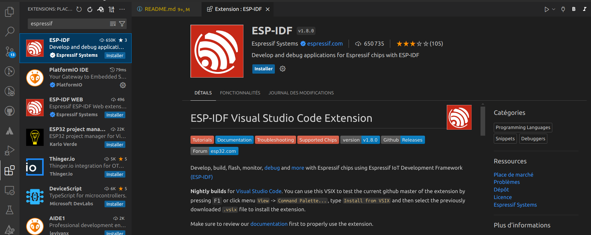

## Débugueur

Lien : https://docs.platformio.org/en/stable/plus/debugging.html

Un débogueur (ou débugueur, de l’anglais _debugger_) est un logiciel qui aide un développeur à analyser les _bugs_ d’un programme.

Pour cela, il permet d’exécuter le programme pas-à-pas, d’afficher la valeur des variables à tout moment, de mettre en place des points d’arrêt sur des conditions ou
sur des lignes du programme ...

Le programme à débuguer est exécuté à travers le débogueur et s’exécute normalement. Le débogueur offre alors au programmeur la possibilité d’observer et de contrôler l’exécution du programme.

[GNU Debugger](https://www.gnu.org/software/gdb/), également appelé `gdb`, est le débogueur standard du projet GNU. Il est portable sur de nombreux systèmes type Unix et fonctionne pour plusieurs langages de programmation, comme le C et le C++. Il fut écrit par Richard Stallman en 1988. `gdb` est un logiciel libre, distribué sous la licence GNU GPL.

L’interface de `gdb` est une simple ligne de commande, mais il est souvent invoqué en arrière-plan par les environnements de développement intégré.

Lien : https://www.gnu.org/software/gdb/

> [!WARNING]
> Suivant la version de GDB utilisé dans la _toolchain_ fourni par Espressif, il peut être nécessaire d'installer la dépendance vers le paquet `libpython2.7` :
> ```sh
> $ ldd ~/.platformio/packages/toolchain-xtensa-esp32/bin/xtensa-esp32-elf-gdb
> 	linux-vdso.so.1 (0x00007ffefcbb7000)
> 	libdl.so.2 => /lib/x86_64-linux-gnu/libdl.so.2 (0x00007ebf7e7c0000)
> 	libpython2.7.so.1.0 => /lib/x86_64-linux-gnu/libpython2.7.so.1.0 (0x00007ebf7e400000)
> 	libpthread.so.0 => /lib/x86_64-linux-gnu/libpthread.so.0 (0x00007ebf7e7bb000)
> 	libutil.so.1 => /lib/x86_64-linux-gnu/libutil.so.1 (0x00007ebf7e7b6000)
> 	libm.so.6 => /lib/x86_64-linux-gnu/libm.so.6 (0x00007ebf7e319000)
> 	libstdc++.so.6 => /lib/x86_64-linux-gnu/libstdc++.so.6 (0x00007ebf7e000000)
> 	libgcc_s.so.1 => /lib/x86_64-linux-gnu/libgcc_s.so.1 (0x00007ebf7e794000)
> 	libc.so.6 => /lib/x86_64-linux-gnu/libc.so.6 (0x00007ebf7dc00000)
> 	libz.so.1 => /lib/x86_64-linux-gnu/libz.so.1 (0x00007ebf7e778000)
> 	/lib64/ld-linux-x86-64.so.2 (0x00007ebf7e7f3000)
> ```
> 
> Si besoin :
> 
> ```sh
> $ sudo apt install python2.7
> ```
>
> Voir aussi : https://registry.platformio.org/tools/espressif/tool-xtensa-esp-elf-gdb

### JTAG

Le terme [JTAG](https://fr.wikipedia.org/wiki/Joint_Test_Action_Group) (pour Joint Test Action Group), désignant le groupe de travail qui a conçu la norme, est abusivement (mais très largement) utilisé au lieu du terme générique _Boundary Scan_ ou du sigle TAP (_Test Access Port_,  port d'accès de test).

La norme JTAG est utilisée pour donner un accès direct au processeur (points d'arrêt, lecture et écriture des registres internes, ...) sans perturber son fonctionnement. On nomme cette technique ICE (_In-Circuit Emulator_) ou ICD (_In-Circuit Debugger_), et elle est omniprésente sur les microprocesseurs et microcontrôleurs modernes.

Le JTAG permet aussi de programmer des mémoires non-volatiles (EEPROM et Flash).

> Le bus JTAG est un bus série synchrone.

Exemple d'une interface JTAG :


Détection :

```sh
$ dmesg
...
[  370.164106] usb 1-3: New USB device found, idVendor=1366, idProduct=0101, bcdDevice= 1.00
[  370.164109] usb 1-3: New USB device strings: Mfr=1, Product=2, SerialNumber=3
[  370.164111] usb 1-3: Product: J-Link
[  370.164112] usb 1-3: Manufacturer: SEGGER
[  370.164113] usb 1-3: SerialNumber: 000028010394

$ lsusb
...
Bus 001 Device 005: ID 1366:0101 SEGGER J-Link PLUS
...
```

> Sous GNU/Linux, cf. https://docs.platformio.org/en/latest/core/installation/udev-rules.html

Liens :

- https://www.microchip.com/en-us/development-tool/AT91SAM-ICE
- https://www.segger.com/products/debug-probes/j-link/models/j-link-plus/
- https://docs.platformio.org/en/stable/plus/debug-tools/jlink.html

Sous GNU/Linux, l'interface JTAG SAM-ICE est pris en charge par [OpenOCD](http://openocd.org/) (_Open On-Chip Debugger_) ou [J-Link SEGGER](https://www.segger.com/jlink-software.html).

|   ESP32 Pin   | JTAG Signal |
| :-----------: | :---------: |
| MTDO / GPIO15 |     TDO     |
| MTDI / GPIO12 |     TDI     |
| MTCK / GPIO13 |     TCK     |
| MTMS / GPIO14 |     TMS     |
|      3V3      |     VCC     |
|      GND      |     GND     |

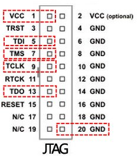

### J-Link SEGGER

Il est possible d'installer [J-Link SEGGER](https://registry.platformio.org/tools/platformio/tool-jlink/installation) avec [PlatformIO CLI](https://docs.platformio.org/en/latest/core/index.html) :

```sh
$ pio pkg install --global --tool "platformio/tool-jlink"
Tool Manager: Installing platformio/tool-jlink
Downloading  [####################################]  100%
Unpacking  [####################################]  100%
Tool Manager: tool-jlink@1.78811.0 has been installed!

$ ls -l ~/.platformio/packages/
...
drwx------ 8 tv tv 4096 juil.  6 08:57 tool-jlink
```

On configurera le fichier de projet `platformio.ini` pour utiliser [J-Link SEGGER](https://registry.platformio.org/tools/platformio/tool-jlink/installation) et l'interface JTAG SAM-ICE :

- pour le _framework_ `arduino` :

```ini
[env:esp32_debug]
build_flags = -DDEBUG -D$PIOENV
debug_tool = jlink
; choisir son point d'arrêt initial
;debug_init_break = break setup
debug_init_break = tbreak loop
;debug_init_break = break main.cpp:22
;build_type = debug
```

- pour le _framework_ `espidf` :

```ini
[env:lolin32]
platform = espressif32
board = lolin32
framework = espidf
build_flags = -DDEBUG
debug_tool = jlink
; choisir son point d'arrêt initial
debug_init_break = break app_main
;debug_init_break = break main.c:52
;build_type = debug
```

> cf. https://docs.platformio.org/en/stable/plus/debug-tools/custom.html

Ensuite, il suffit demarrer une session de débogage :

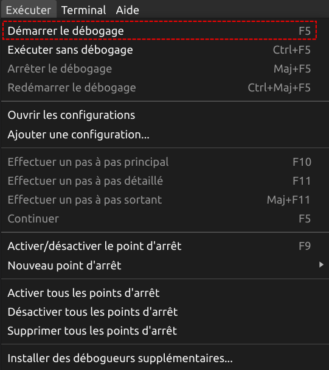

On obtient un session de débogage pour le _framework_ `espidf` :

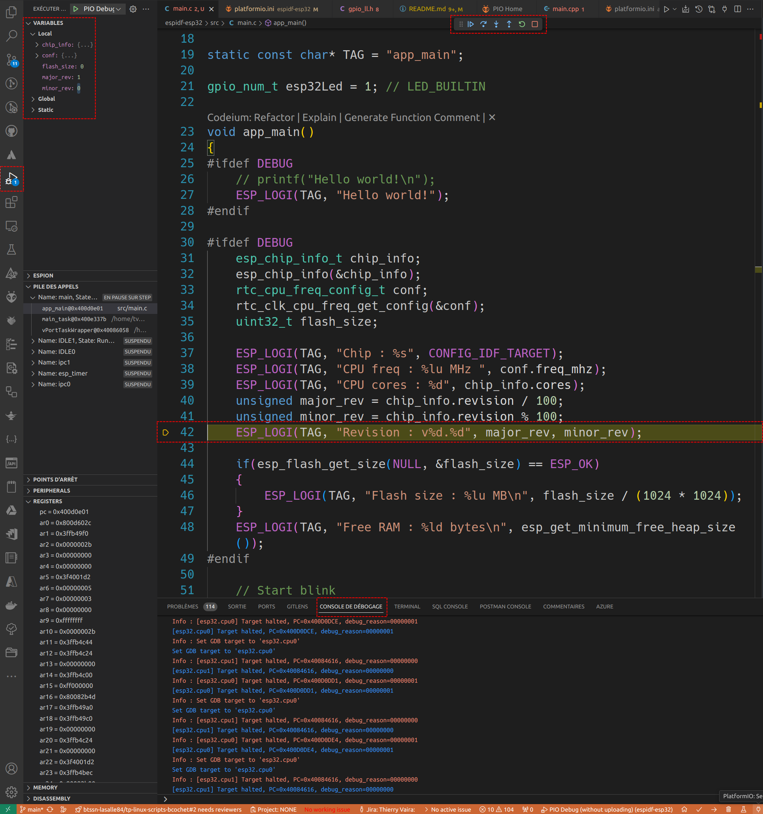

### OpenOCD

[OpenOCD](http://openocd.org/) (_Open On-Chip Debugger_) fournit une prise en charge de la programmation et du débogage sur les microprocesseurs et microcontrôleurs avec une interface JTAG.

Plusieurs interfaces réseau sont disponibles pour interagir avec OpenOCD : telnet et GDB. Le serveur GDB permet à OpenOCD de fonctionner comme une "cible distante" pour le débogage au niveau source des systèmes embarqués à l'aide du programme [GNU GDB](https://www.sourceware.org/gdb/).

Il est possible d'installer [OpenOCD](https://registry.platformio.org/tools/platformio/tool-openocd-esp32/installation) avec [PlatformIO CLI](https://docs.platformio.org/en/latest/core/index.html) :

```sh
$ pio pkg install --global --tool "platformio/tool-openocd-esp32@^2.1200.20230419"

$ ls -l ~/.platformio/packages/
...
drwx------ 4 tv tv 4096 juil.  6 13:38 tool-openocd-esp32

$ ls -l ~/.platformio/packages/tool-openocd-esp32/bin/
-rwxr-xr-x 1 tv tv 3695768 juil.  6  2022 openocd
```

On configurera le fichier de projet `platformio.ini` pour utiliser [OpenOCD](https://registry.platformio.org/tools/platformio/tool-openocd-esp32/installation) et l'interface JTAG SAM-ICE :

```ini
[env:esp32_debug]
build_flags = -DDEBUG -D$PIOENV
; Exemple 2 : openOCD + JTAG
debug_server = 
    $PLATFORMIO_CORE_DIR/packages/tool-openocd-esp32/bin/openocd
    -f
    "board/esp-wroom-32.cfg"
; choisir son point d'arrêt initial
;debug_init_break = break setup
debug_init_break = tbreak loop
;debug_init_break = break main.cpp:22
;build_type = debug
```

> cf. https://docs.platformio.org/en/stable/plus/debug-tools/custom.html

Les cartes supportées sont définies dans `~/.platformio/packages/tool-openocd-esp32/share/openocd/scripts/board/`. 

On va modifier le fichier `esp-wroom-32.cfg` pour l'ESP32 via l'interface `jlink` :

```sh
$ vim ~/.platformio/packages/tool-openocd-esp32/share/openocd/scripts/board/esp-wroom-32.cfg
source [find interface/jlink.cfg]
set ESP32_FLASH_VOLTAGE 3.3
source [find target/esp32.cfg]
adapter speed 5000
```

Démarrer le débogage :


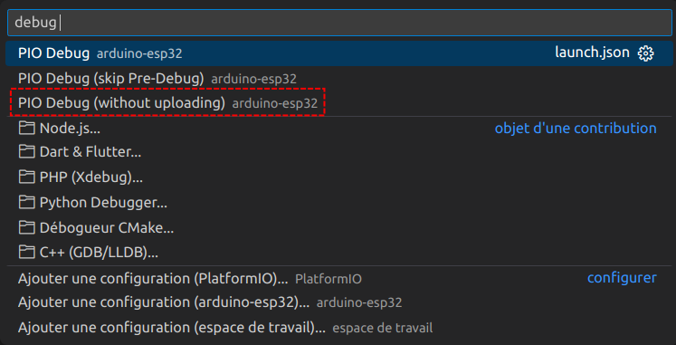

Une session de débogage dans l'IDE pour le _framework_ `arduino` :

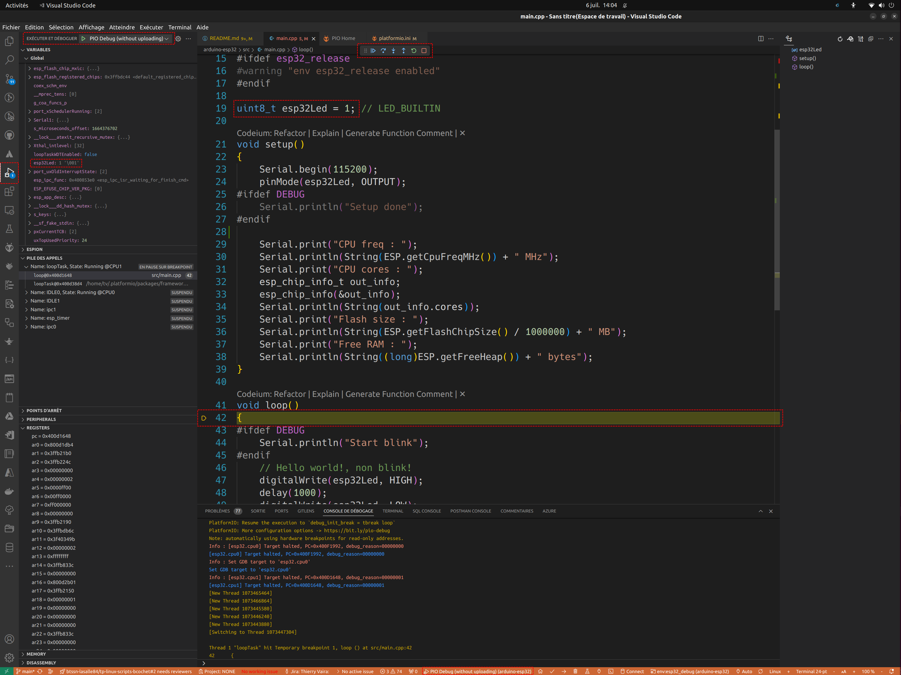

Ou une session de débogage avec PlatformIO CLI :

```sh
$ pio debug -e esp32_debug -v --load-mode=manual --interface=gdb -- -x .pioinit
Reading symbols from ~/Documents/git/bts-lasalle-avignon-ressources/PlatformIO/src/arduino-esp32/.pio/build/esp32_debug/firmware.elf...
PlatformIO Unified Debugger -> https://bit.ly/pio-debug
PlatformIO: debug_tool = custom
PlatformIO: Initializing remote target...
Open On-Chip Debugger  v0.11.0-esp32-20220706 (2022-07-06-15:48)
Licensed under GNU GPL v2
...
adapter speed: 5000 kHz
...
Info : tcl server disabled
Info : telnet server disabled
Info : J-Link ARM V8 compiled Aug 26 2015 15:08:21
Info : Hardware version: 8.00
Info : VTarget = 3.293 V
Info : clock speed 5000 kHz
Info : JTAG tap: esp32.cpu0 tap/device found: 0x120034e5 (mfg: 0x272 (Tensilica), part: 0x2003, ver: 0x1)
Info : JTAG tap: esp32.cpu1 tap/device found: 0x120034e5 (mfg: 0x272 (Tensilica), part: 0x2003, ver: 0x1)
Info : starting gdb server for esp32.cpu0 on pipe
Info : accepting 'gdb' connection from pipe
Info : [esp32.cpu0] Target halted, PC=0x400F1992, debug_reason=00000000
Info : Set GDB target to 'esp32.cpu0'
Info : [esp32.cpu1] Target halted, PC=0x400F1992, debug_reason=00000000
Warn : No symbols for FreeRTOS!
Info : [esp32.cpu0] Target halted, PC=0x40092612, debug_reason=00000001
Info : Flash mapping 0: 0x10020 -> 0x3f400020, 54 KB
Info : Flash mapping 1: 0x20020 -> 0x400d0020, 138 KB
Info : [esp32.cpu0] Target halted, PC=0x40092612, debug_reason=00000001
Info : Auto-detected flash bank 'esp32.cpu0.flash' size 4096 KB
Info : Using flash bank 'esp32.cpu0.flash' size 4096 KB
Info : [esp32.cpu0] Target halted, PC=0x40092612, debug_reason=00000001
Info : Flash mapping 0: 0x10020 -> 0x3f400020, 54 KB
Info : Flash mapping 1: 0x20020 -> 0x400d0020, 138 KB
Info : Using flash bank 'esp32.cpu0.irom' size 140 KB
Info : [esp32.cpu0] Target halted, PC=0x40092612, debug_reason=00000001
Info : Flash mapping 0: 0x10020 -> 0x3f400020, 54 KB
Info : Flash mapping 1: 0x20020 -> 0x400d0020, 138 KB
Info : Using flash bank 'esp32.cpu0.drom' size 56 KB
Info : New GDB Connection: 1, Target esp32.cpu0, state: halted
...
Info : JTAG tap: esp32.cpu0 tap/device found: 0x120034e5 (mfg: 0x272 (Tensilica), part: 0x2003, ver: 0x1)
Info : JTAG tap: esp32.cpu1 tap/device found: 0x120034e5 (mfg: 0x272 (Tensilica), part: 0x2003, ver: 0x1)
JTAG tap: esp32.cpu0 tap/device found: 0x120034e5 (mfg: 0x272 (Tensilica), part: 0x2003, ver: 0x1)
JTAG tap: esp32.cpu1 tap/device found: 0x120034e5 (mfg: 0x272 (Tensilica), part: 0x2003, ver: 0x1)
Info : [esp32.cpu0] requesting target halt and executing a soft reset
[esp32.cpu0] requesting target halt and executing a soft reset
Info : [esp32.cpu0] Debug controller was reset.
[esp32.cpu0] Debug controller was reset.
Info : [esp32.cpu0] Core was reset.
[esp32.cpu0] Core was reset.
Info : [esp32.cpu0] Target halted, PC=0x500000CF, debug_reason=00000000
[esp32.cpu0] Target halted, PC=0x500000CF, debug_reason=00000000
Info : [esp32.cpu1] requesting target halt and executing a soft reset
[esp32.cpu1] requesting target halt and executing a soft reset
Info : [esp32.cpu0] Core was reset.
[esp32.cpu0] Core was reset.
Info : [esp32.cpu0] Target halted, PC=0x40000400, debug_reason=00000000
[esp32.cpu0] Target halted, PC=0x40000400, debug_reason=00000000
Info : [esp32.cpu1] Debug controller was reset.
[esp32.cpu1] Debug controller was reset.
Info : [esp32.cpu1] Core was reset.
[esp32.cpu1] Core was reset.
Info : [esp32.cpu1] Target halted, PC=0x40000400, debug_reason=00000000
[esp32.cpu1] Target halted, PC=0x40000400, debug_reason=00000000
Temporary breakpoint 1 at 0x400d1648: file src/main.cpp, line 42.
PlatformIO: Initialization completed
(gdb) PlatformIO: Resume the execution to `debug_init_break = tbreak loop`
PlatformIO: More configuration options -> https://bit.ly/pio-debug
Continuing.
Note: automatically using hardware breakpoints for read-only addresses.
Info : [esp32.cpu0] Target halted, PC=0x400F1992, debug_reason=00000000
[esp32.cpu0] Target halted, PC=0x400F1992, debug_reason=00000000
Info : Set GDB target to 'esp32.cpu0'
Set GDB target to 'esp32.cpu0'
Info : [esp32.cpu1] Target halted, PC=0x400D1648, debug_reason=00000001
[esp32.cpu1] Target halted, PC=0x400D1648, debug_reason=00000001
[New Thread 1073465464]
[New Thread 1073466864]
[New Thread 1073445580]
[New Thread 1073446240]
[New Thread 1073443880]
[Switching to Thread 1073447304]

Thread 1 "loopTask" hit Temporary breakpoint 1, loop () at src/main.cpp:42
42	{
(gdb) 
```

Quelques commandes de base de `gdb` :

```txt
# Informations
(gdb) info stack
(gdb) info program
(gdb) show endian

# Démarrer le débugage
(gdb) start
# Lancer le programme
(gdb) run

# Ajouter un point d’arrêt sur une ligne
(gdb) break 23
(gdb) run
# Pas à pas
(gdb) step
# Pas à pas
(gdb) next
# Continuer
(gdb) continue

# Arrêter le débugage
(gdb) kill
# Quitter gdb
(gdb) quit
```

### ESP-PROG

[ESP-Prog](https://docs.platformio.org/en/latest/plus/debug-tools/esp-prog.html) est l'un des outils de développement et de débogage d'Espressif pour l'ESP32 permettant notamment le débogage en ligne JTAG.

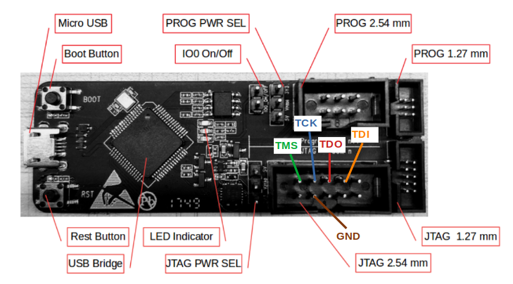

Liens :

- https://docs.espressif.com/projects/esp-iot-solution/en/latest/hw-reference/ESP-Prog_guide.html
- https://docs.espressif.com/projects/esp-dev-kits/en/latest/other/esp-prog/user_guide.html

Dans [PlatformIO](https://docs.platformio.org/en/latest/plus/debug-tools/esp-prog.html), il suffit de modifier le fichier de projet `platfomio.ini` pour intégrer :

```ini
;upload_protocol = esp-prog
debug_tool = esp-prog
; choisir son point d'arrêt initial
;debug_init_break = break setup
;debug_init_break = tbreak loop
;debug_init_break = break main.cpp:22
;build_type = debug
```

> [!TIP]
> Il est possible d'utiliser ESP-Prog pour téléverser le _firmware_ en ajoutant : `upload_protocol = esp-prog`

Branchement :

| ESP32 Pin | JTAG Signal | Broche JTAG |
| :-------: | :---------: | :---------: |
|  GPIO15   |     TDO     |      6      |
|  GPIO12   |     TDI     |      8      |
|  GPIO13   |     TCK     |      4      |
|  GPIO14   |     TMS     |      2      |
|    GND    |     GND     |      3      |

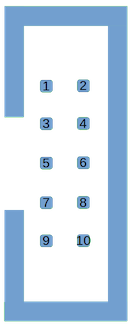

> [!TIP]
> Il est inutile de relier VCC.

Détection :

```sh
$ sudo dmesg
...
[2595778.568440] usb 1-6.3: new high-speed USB device number 32 using xhci_hcd
[2595778.680681] usb 1-6.3: New USB device found, idVendor=0403, idProduct=6010, bcdDevice= 7.00
[2595778.680688] usb 1-6.3: New USB device strings: Mfr=1, Product=2, SerialNumber=0
[2595778.680691] usb 1-6.3: Product: Dual RS232-HS
[2595778.680693] usb 1-6.3: Manufacturer: FTDI
[2595778.715925] usbcore: registered new interface driver ftdi_sio
[2595778.715939] usbserial: USB Serial support registered for FTDI USB Serial Device
[2595778.716005] ftdi_sio 1-6.3:1.0: FTDI USB Serial Device converter detected
[2595778.716041] usb 1-6.3: Detected FT2232H
...
```

Une session de débogage avec l'ESP-Prog :

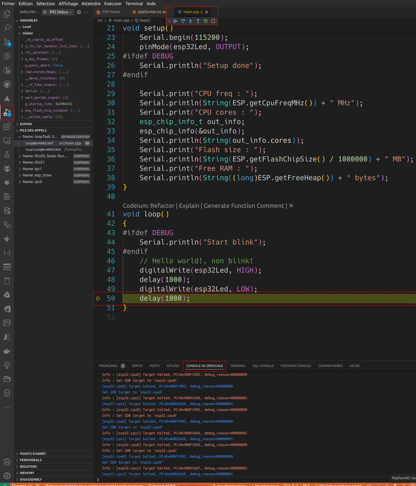

Tutoriel : [Déboguer un ESP32-WROOM sous PlatformIO via son interface JTAG](https://tutoduino.fr/tutoriels/debug-esp32/debug-esp32-platformio-jtag/)

### USB OTG (ESP32-S3)

Le module [ESP32-S3-DevKitC-1](https://docs.espressif.com/projects/esp-idf/en/stable/esp32s3/hw-reference/esp32s3/user-guide-devkitc-1.html) est une carte de développement équipée de l'ESP32-S3-WROOM-1.

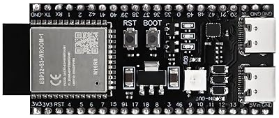

L'ESP32-S3-WROOM-1 est basé sur un processeur dual-core LX7 32 bits à 240 MHz. La mémoire Flash est de 16 MB.

Le module est notamment équipé :

- d'un port USB [OTG](https://fr.wikipedia.org/wiki/USB_On-The-Go) qui permet le **débogage JTAG**
- d'une LED RVB sur GPIO38 (il faut braser le pont sur la carte)

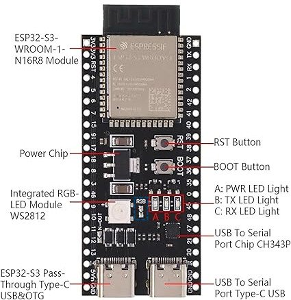

Liens :

- https://www.espressif.com/sites/default/files/documentation/esp32-s3_datasheet_en.pdf
- https://www.espressif.com/sites/default/files/documentation/esp32-s3-wroom-1_wroom-1u_datasheet_en.pdf
- https://docs.espressif.com/projects/esp-idf/en/stable/esp32s3/get-started/index.html
- https://docs.espressif.com/projects/esp-idf/en/stable/esp32s3/get-started/linux-macos-setup.html#get-started-linux-macos-first-steps

Détection (port USB To Serial) :

```sh
$ sudo dmesg
[2532696.311448] usb 1-6.4: new full-speed USB device number 39 using xhci_hcd
[2532696.433296] usb 1-6.4: New USB device found, idVendor=1a86, idProduct=55d3, bcdDevice= 4.45
[2532696.433302] usb 1-6.4: New USB device strings: Mfr=0, Product=2, SerialNumber=3
[2532696.433305] usb 1-6.4: Product: USB Single Serial
[2532696.433307] usb 1-6.4: SerialNumber: 589B040494
[2532696.441693] cdc_acm 1-6.4:1.0: ttyACM1: USB ACM device

$ lsusb
...
Bus 001 Device 039: ID 1a86:55d3 QinHeng Electronics USB Single Serial

$ esptool.py --port /dev/ttyACM1 --chip esp32-s3 flash_id
esptool.py v4.5.1
Serial port /dev/ttyACM1
Connecting....
Chip is ESP32-S3 (revision v0.2)
Features: WiFi, BLE
Crystal is 40MHz
MAC: cc:8d:a2:0c:7f:e8
Uploading stub...
Running stub...
Stub running...
Manufacturer: 68
Device: 4018
Detected flash size: 16MB
Flash type set in eFuse: quad (4 data lines)
Hard resetting via RTS pin...
```

Détection (port USB [OTG](https://fr.wikipedia.org/wiki/USB_On-The-Go)) :

```sh
$ sudo dmesg
...
[2532556.028426] usb 1-6.4: new full-speed USB device number 38 using xhci_hcd
[2532556.150287] usb 1-6.4: New USB device found, idVendor=303a, idProduct=4001, bcdDevice= 1.00
[2532556.150294] usb 1-6.4: New USB device strings: Mfr=1, Product=2, SerialNumber=3
[2532556.150296] usb 1-6.4: Product: Espressif Device
[2532556.150299] usb 1-6.4: Manufacturer: Espressif Systems
[2532556.150301] usb 1-6.4: SerialNumber: 123456
[2532556.158149] cdc_acm 1-6.4:1.0: ttyACM1: USB ACM device

$ lsusb
...
Bus 001 Device 038: ID 303a:4001 Espressif Systems Espressif Device
```

Recherche de la carte :

```sh
$ $ pio boards esp32-s3

Platform: espressif32
===============================================================================================================================================================================================
ID                                   MCU      Frequency    Flash    RAM    Name
-----------------------------------  -------  -----------  -------  -----  ---------------------------------------------------
...
esp32s3_powerfeather                 ESP32S3  240MHz       8MB      320KB  ESP32-S3 PowerFeather
esp32s3box                           ESP32S3  240MHz       16MB     320KB  Espressif ESP32-S3-Box
esp32-s3-devkitc-1                   ESP32S3  240MHz       8MB      320KB  Espressif ESP32-S3-DevKitC-1-N8 (8 MB QD, No PSRAM)
esp32-s3-devkitm-1                   ESP32S3  240MHz       8MB      320KB  Espressif ESP32-S3-DevKitM-1
esp32s3usbotg                        ESP32S3  240MHz       8MB      320KB  Espressif ESP32-S3-USB-OTG
...
```

L'ID `esp32-s3-devkitc-1` fait référence au module ESP32-S3-DevKitC-1-N8 et celui qui est testé ici est le **ESP32-S3-DevKitC-1-N16R8** avec **16 MB* de mémoire _flash_ !

Configuration du projet :

```sh
$ pio project init --board esp32-s3-devkitc-1 --project-option="framework=arduino"
```

La carte `esp32-s3-devkitc-1` est définie par le fichier `esp32-s3-devkitc-1.json` dans `~/.platformio/platforms/espressif32/boards/`.

Il faut créer le fichier `esp32-s3-devkitc-1-n16r8v.json` :

```sh
$ vim ~/.platformio/platforms/espressif32/boards/esp32-s3-devkitc-1-n16r8v.json
{
    "build": {
      "arduino":{
        "ldscript": "esp32s3_out.ld",
        "partitions": "default_16MB.csv",
        "memory_type": "qio_opi"
      },
      "core": "esp32",
      "extra_flags": [
        "-DARDUINO_ESP32S3_DEV",
        "-DBOARD_HAS_PSRAM",
        "-DARDUINO_USB_MODE=1",
        "-DARDUINO_USB_CDC_ON_BOOT=1"
      ],
      "f_cpu": "240000000L",
      "f_flash": "80000000L",
      "flash_mode": "qio",
      "psram_type": "opi",
      "hwids": [
        [
          "0x303A",
          "0x1001"
        ]
      ],
      "mcu": "esp32s3",
      "variant": "esp32s3"
    },
    "connectivity": [
      "wifi",
      "bluetooth"
    ],
    "debug": {
      "default_tool": "esp-builtin",
      "onboard_tools": [
        "esp-builtin"
      ],
      "openocd_target": "esp32s3.cfg"
    },
    "frameworks": [
      "arduino",
      "espidf"
    ],
    "name": "Espressif ESP32-S3-DevKitC-1-N16R8V (16 MB QD, 8MB PSRAM)",
    "upload": {
      "flash_size": "16MB",
      "maximum_ram_size": 327680,
      "maximum_size": 16777216,
      "require_upload_port": true,
      "speed": 921600
    },
    "url": "https://docs.espressif.com/projects/esp-idf/en/latest/esp32s3/hw-reference/esp32s3/user-guide-devkitc-1.html",
    "vendor": "Espressif"
}
```

Puis modifier le fichier de projet `platformio.ini` :

```sh
$ cat platformio.ini
[env:esp32-s3]
platform = espressif32
board = esp32-s3-devkitc-1-n16r8v
framework = arduino
```

Mettre à jour des dépendances et des _packages_ du projet si besoin :

```sh
$ pio pkg update
Resolving esp32-s3 dependencies...
Already up-to-date.
```

La Led RGB est acessible sur la broche `48` définie dans `~/.platformio/packages/framework-arduinoespressif32/variants/esp32s3/pins_arduino.h`

```cpp
#ifndef Pins_Arduino_h
#define Pins_Arduino_h

#include "soc/soc_caps.h"
#include <stdint.h>

#define USB_VID 0x303a
#define USB_PID 0x1001

// Some boards have too low voltage on this pin (board design bug)
// Use different pin with 3V and connect with 48
// and change this setup for the chosen pin (for example 38)
#define PIN_NEOPIXEL 48
// BUILTIN_LED can be used in new Arduino API digitalWrite() like in Blink.ino
static const uint8_t LED_BUILTIN = SOC_GPIO_PIN_COUNT + PIN_NEOPIXEL;
#define BUILTIN_LED LED_BUILTIN // backward compatibility
#define LED_BUILTIN LED_BUILTIN // allow testing #ifdef LED_BUILTIN
// RGB_BUILTIN and RGB_BRIGHTNESS can be used in new Arduino API neopixelWrite()
#define RGB_BUILTIN LED_BUILTIN
#define RGB_BRIGHTNESS 64

...

#endif /* Pins_Arduino_h */
```

Exemple de programme [src/arduino-esp32-s3/src/main.cpp](src/arduino-esp32-s3/src/main.cpp) :

```cpp
#include <Arduino.h>

uint8_t esp32RGBLed = RGB_BUILTIN;

void setup()
{
    Serial.begin(115200);
    Serial.println("Start setup");
    pinMode(esp32RGBLed, OUTPUT);

    Serial.print("CPU freq : ");
    Serial.println(String(ESP.getCpuFreqMHz()) + " MHz");
    Serial.print("CPU cores : ");
    esp_chip_info_t out_info;
    esp_chip_info(&out_info);
    Serial.println(String(out_info.cores));
    Serial.print("Flash size : ");
    Serial.println(String(ESP.getFlashChipSize() / 1000000) + " MB");
    Serial.print("Free RAM : ");
    Serial.println(String((long)ESP.getFreeHeap()) + " bytes");
    Serial.printf("PSRAM : %d MB\n", ESP.getPsramSize() / (1024 * 1024));
    Serial.println("Setup done");
}

void loop()
{
    Serial.println("Start blink");
    // Hello world!, non blink!
    neopixelWrite(esp32RGBLed, RGB_BRIGHTNESS, 0, 0);
    delay(1000);
    neopixelWrite(esp32RGBLed, 0, RGB_BRIGHTNESS, 0);
    delay(1000);
    neopixelWrite(esp32RGBLed, 0, 0, RGB_BRIGHTNESS);
    delay(1000);
    neopixelWrite(esp32RGBLed, 0, 0, 0);
}
```

```sh
$ pio device monitor --baud 115200 --port /dev/ttyACM1
--- Terminal on /dev/ttyACM1 | 115200 8-N-1
--- Available filters and text transformations: colorize, debug, default, direct, esp32_exception_decoder, hexlify, log2file, nocontrol, printable, send_on_enter, time
--- More details at https://bit.ly/pio-monitor-filters
--- Quit: Ctrl+C | Menu: Ctrl+T | Help: Ctrl+T followed by Ctrl+H

ESP-ROM:esp32s3-20210327
Build:Mar 27 2021
rst:0x1 (POWERON),boot:0x8 (SPI_FAST_FLASH_BOOT)
SPIWP:0xee
mode:DIO, clock div:1
load:0x3fce3808,len:0x4bc
load:0x403c9700,len:0xbd8
load:0x403cc700,len:0x2a0c
entry 0x403c98d0
Start setup
CPU freq : 240 MHz
CPU cores : 2
Flash size : 16 MB
Free RAM : 370876 bytes
PSRAM : 7 MB
Setup done
Start blink
Start blink
...
```

Le débogage de la carte ESP32-S3 est pris en charge directement via le port USB OTG :

```ini
[env:esp32-s3]
platform = espressif32
board = esp32-s3-devkitc-1-n16r8v
framework = arduino
board_build.arduino.memory_type = qio_opi
board_build.flash_mode = qio
board_build.prsam_type = opi
board_upload.flash_size = 16MB
board_upload.maximum_size = 16777216
board_build.extra_flags = -DBOARD_HAS_PSRAM
;upload_port = /dev/ttyACM1
;debug_tool = esp-builtin
;debug_init_break = hbreak setup
debug_init_break = thbreak loop
;debug_port = /dev/ttyACM2
```

> On peut placer un point d'arrêt matériel sur la fonction `loop()` avec `thbreak loop`.

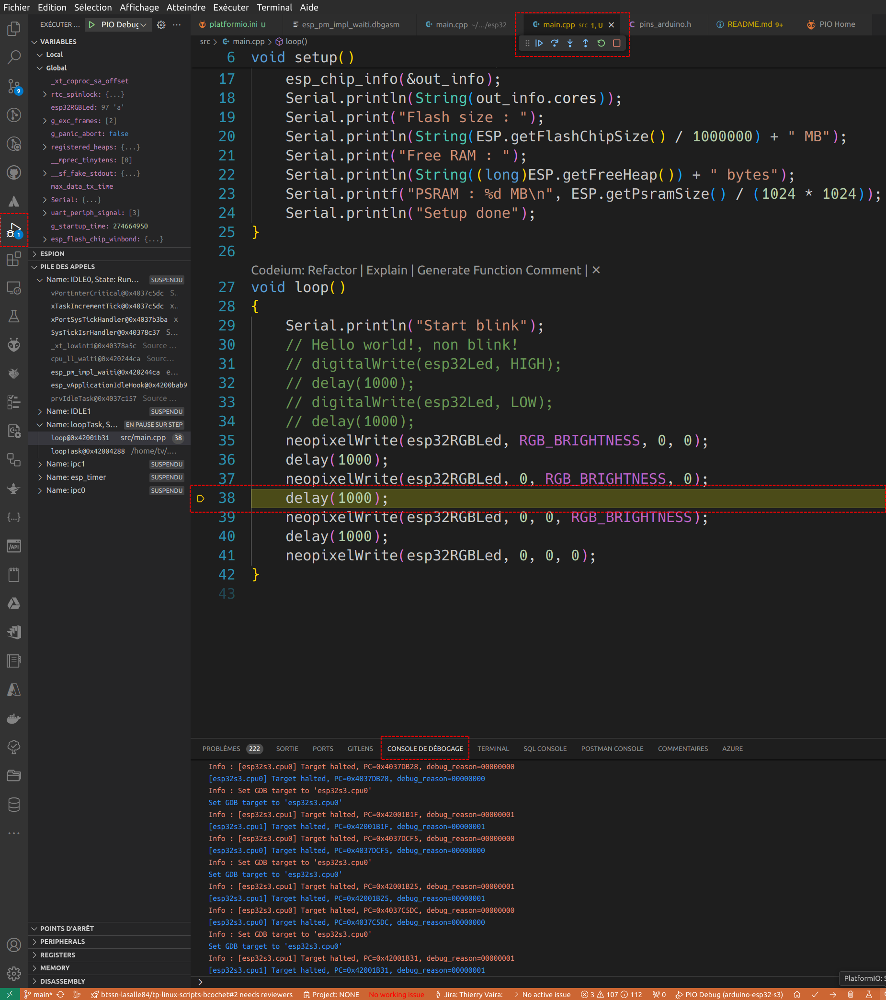

## Tests unitaires (Unity)

Les tests unitaires sont supportés par [PlatformIO](https://platformio.org/) avec le _framework_ [Unity](https://docs.platformio.org/en/latest/advanced/unit-testing/frameworks/unity.html) (par défaut) :

- [Unit Testing](https://docs.platformio.org/en/latest/advanced/unit-testing/index.html)
- [Exemples](https://docs.platformio.org/en/latest/advanced/unit-testing/introduction.html)
- [Unity Assertions Reference](https://github.com/ThrowTheSwitch/Unity/blob/master/docs/UnityAssertionsReference.md)
- [Assertions CheatSheet (PDF)](https://github.com/ThrowTheSwitch/Unity/blob/master/docs/UnityAssertionsCheatSheetSuitableforPrintingandPossiblyFraming.pdf)

> Exemple de classe à tester unitairement : la classe [Led](src/arduino-esp32-tests/lib/led/)

Les tests peuvent être réalisés :

- en local (on utilise alors la plateforme `native`)

```ini
[env:native]
platform = native
test_filter = test_native
```

Les tests unitaires sont placés dans le répertoire `test`. Ici, dans `test/test_native/` :

```cpp
#include <unity.h>

#include "led.h" // La classe Led

void setUp(void)
{
    // set stuff up here
}

void tearDown(void)
{
    // clean stuff up here
}

// Constructeur par défaut
void test_unitaire_constructeur_defaut_led()
{
    Led led;

    led.begin();
    TEST_ASSERT_EQUAL_INT8(led.getPin(), LED_BUILTIN);
    TEST_ASSERT_EQUAL_INT(led.getState(), LED_OFF);
}

// Constructeur d'initialisation"
void test_unitaire_constructeur_led()
{
    Led led(16);

    led.begin();
    TEST_ASSERT_EQUAL_INT8(led.getPin(), 16);
    TEST_ASSERT_EQUAL_INT(led.getState(), LED_OFF);
}

void test_unitaire_led_on()
{
    Led led(16);

    led.on();
    led.readState();
    TEST_ASSERT_EQUAL_INT(led.getState(), LED_ON);
}

void test_unitaire_led_off()
{
    Led led(16);

    led.off();
    led.readState();
    TEST_ASSERT_EQUAL_INT(led.getState(), LED_OFF);
}

int main()
{
    UNITY_BEGIN(); // IMPORTANT LINE!
    RUN_TEST(test_unitaire_constructeur_defaut_led);
    RUN_TEST(test_unitaire_constructeur_led);
    RUN_TEST(test_unitaire_led_on);
    RUN_TEST(test_unitaire_led_off);
    return UNITY_END(); // stop unit testing
}
```

Tests unitaires :

```cpp
$ pio test -e native
Verbosity level can be increased via `-v, -vv, or -vvv` option
Collected 2 tests

Processing test_native in native environment

Building...
Testing...
test/test_native/test_native_main.cpp:46: test_unitaire_constructeur_led	[PASSED]
test/test_native/test_native_main.cpp:47: test_unitaire_led_on	[PASSED]
test/test_native/test_native_main.cpp:48: test_unitaire_led_off	[PASSED]
native:test_native [PASSED] Took 0.32 seconds

SUMMARY
Environment    Test         Status    Duration
-------------  -----------  --------  ------------
native         test_native  PASSED    00:00:00.322
3 test cases: 3 succeeded in 00:00:00.322
```

- en embarqué (ici, on utilise un ESP32 avec le _framework_ Arduino)

```ini
[env:esp32_test]
platform = espressif32
board = lolin32
framework = arduino
build_flags = -DDEBUG -D$PIOENV
test_filter = test_esp32
```

Les tests unitaires sont placés dans le répertoire `test`. Ici, dans `test/test_point_esp32/` :

```cpp
#include <Arduino.h>
#include <unity.h>

#include "led.h" // La classe Led

// idem ...

void setup()
{
    UNITY_BEGIN(); // IMPORTANT LINE!
    RUN_TEST(test_unitaire_constructeur_led);
    RUN_TEST(test_unitaire_led_on);
    RUN_TEST(test_unitaire_led_off);
    UNITY_END(); // stop unit testing
}

void loop()
{
}
```

Tests unitaires sur un **ESP32** :

```cpp
$ pio test -e esp32_test -v
Collected 2 tests (test_esp32, test_native)

Processing test_esp32 in esp32_test environment

Building & Uploading...

Testing...
If you don't see any output for the first 10 secs, please reset board (press reset button)

ets Jun  8 2016 00:22:57

rst:0x1 (POWERON_RESET),boot:0x13 (SPI_FAST_FLASH_BOOT)
configsip: 0, SPIWP:0xee
clk_drv:0x00,q_drv:0x00,d_drv:0x00,cs0_drv:0x00,hd_drv:0x00,wp_drv:0x00
mode:DIO, clock div:2
load:0x3fff0030,len:1184
load:0x40078000,len:13232
load:0x40080400,len:3028
entry 0x400805e4
test/test_esp32/test_esp32_main.cpp:47:test_unitaire_constructeur_led:PASS
test/test_esp32/test_esp32_main.cpp:48:test_unitaire_led_on:PASS
test/test_esp32/test_esp32_main.cpp:49:test_unitaire_led_off:PASS

-----------------------
3 Tests 0 Failures 0 Ignored 

esp32_test:test_esp32 [PASSED] Took 7.63 seconds

SUMMARY
Environment    Test         Status    Duration
-------------  -----------  --------  ------------
native         test_esp32   SKIPPED
native         test_native  SKIPPED
esp32_test     test_esp32   PASSED    00:00:07.625
esp32_test     test_native  SKIPPED
3 test cases: 3 succeeded in 00:00:07.625
```

> Voir aussi :
> - [Github Classroom](https://github.com/btssn-lasalle84/tp-poo-platformio) (notation automatique)
> - [Développement distant](#développement-distant) (test distant)

## Intégration continue (GitHub Actions)

GitHub Actions permet d'automatiser des tâches associées à un dépôt GitHub.

La "tâche" (le travail) est décrite dans un fichier `.yml` stocké dans l'arborescence `.github/workflows/`.

Le fichier peut être créé directement à partir de l'interface web de GitHub dans l'onglet `Actions` puis `New workflow`.

GitHub Actions propose alors des modèles prêts à l'emploi. On peut créer son propre _workflow_ en cliquant sur `set up a workflow yourself`. Un squelette est alors fourni.

Il faut commencer par donner un nom au fichier, par exemple : `build-platformio.yml`

Le _workflow_ doit avoir un **nom** :

```yml
name: Build PlatformIO
```

Puis on définit l'évènement (_on_) déclencheur (_trigger_), ici un `git push` sur la branche principale `main` :

```yml
on:
  push:
    branches: [main]
```

Ensuite, on décrit le travail (_job_) à exécuter (_runs-on_) sur une machine (virtuelle, par exemple Ubuntu), qui est généralement composé d'étapes (_step_) :

- Extraction du dépôt
- Installation et configuration de PlatformIO
- Fabrication du projet PlatformIO

```yml
jobs:
  build:
    runs-on: ubuntu-latest
    steps:
      # Checkout repository
      - name: Checkout code
        uses: actions/checkout@v2

      # Setup PlatformIO in PATH
      - name: Setup PlatformIO
        uses: n-vr/setup-platformio-action@v1

      # Build the PlatformIO project
      - name: Build PlatformIO project
        run: pio run
```

> Le mot clé `uses` permet de récupérer des actions existantes fournies par des contributeurs.

Le fichier `.github/workflows/build-platformio.yml` complet :

```yml
name: Build PlatformIO
on:
  push:
    branches: [main]
  pull_request:
    branches: [main]

jobs:
  build:
    runs-on: ubuntu-latest
    steps:
      # Checkout repository
      - name: Checkout code
        uses: actions/checkout@v2

      # Setup PlatformIO in PATH
      - name: Setup PlatformIO
        uses: n-vr/setup-platformio-action@v1

      # Build the PlatformIO project
      - name: Build PlatformIO project
        run: pio run
```

Il est possible d'associer un badge d'état (une image) à un _workflow_.

Pour cela, il faut aller dans l'onglet `Actions` puis cliquer sur le _workflow_ (dans la liste à gauche). Il faut ensuite cliquer sur les trois petits points `...` (à droite de la zone de recherche) et sélectionner `Create status badge`. Une boîte de dialogue s'affiche et il faut récupérer le code Markdown (`Copy status badge Mardown`).

Ce code est à placer dans le fichier `README.md` du dépôt (généralement au tout début du fichier) pour afficher le badge sur la page d'accueil.

```markdown
[](https://github.com/<organisation>/<depot>/actions/workflows/build-platformio.yml)
```

## Développement distant

Lien : https://docs.platformio.org/en/latest/plus/pio-remote.html

PlatformIO fournit une solution de développement distant permettant d'accéder à ses modules (filaires ou sans fils).

PlatformIO CLI fournit la commande `pio remote` pour gérer les fonctionnalités de l'accès distant :

```sh
$ pio remote --help
Usage: pio remote [OPTIONS] COMMAND [ARGS]...

Options:
  -a, --agent TEXT
  -h, --help        Show this message and exit.

Commands:
  agent   Start a new agent or list active
  device  Monitor remote device or list existing
  run     Process project environments remotely
  test    Remote Unit Testing
  update  Update installed Platforms, Packages and Libraries
```

Ce service permet notamment de :

- lister ses appareils (filaires ou sans fils) `pio remote device list`
- téléverser un _firmware_ `pio remote run`
- effectuer des tests unitaires à distance `pio remote test`

La communication est basée sur un agent à démarrer sur sa machine hôte :

```sh
$ pio remote agent start
2024-07-10 15:39:05 [info] Name: sedatech
2024-07-10 15:39:05 [info] Connecting to PlatformIO Remote Development Cloud
2024-07-10 15:39:06 [info] Successfully connected
2024-07-10 15:39:06 [info] Authenticating
2024-07-10 15:39:06 [info] Successfully authorized
```

Le _broker_ **PIO Cloud** assure le lien entre l'**agent** (démarré sur la machine hôte) et le **client** (par exemple GitHub Actions ou un PC avec PlatformIO CLI `remote`).


On peut lister les appareils disponibles :

```sh
$ pio remote device list
Agent sedatech
==============
/dev/ttyUSB0
------------
Hardware ID: USB VID:PID=10C4:EA60 SER=0001 LOCATION=1-6.3
Description: CP2102 USB to UART Bridge Controller - CP2102 USB to UART Bridge Controller
```

Pour utiliser ce service, il faut disposer d'un compte sur PlatformIO :

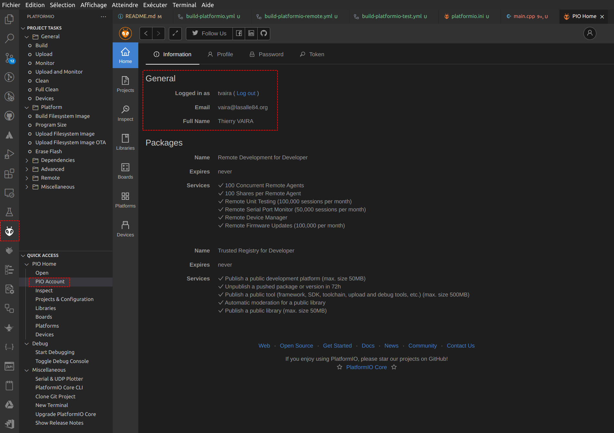

On peut s'authentifier avec son compte GitHub :

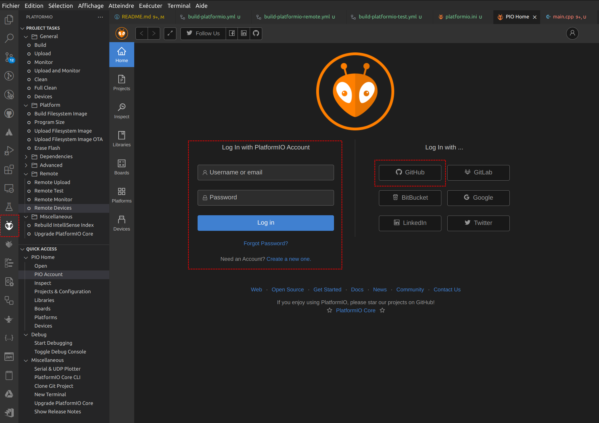


Ensuite, il est possible de créer un _token_ (jeton d'authentification personnel) :

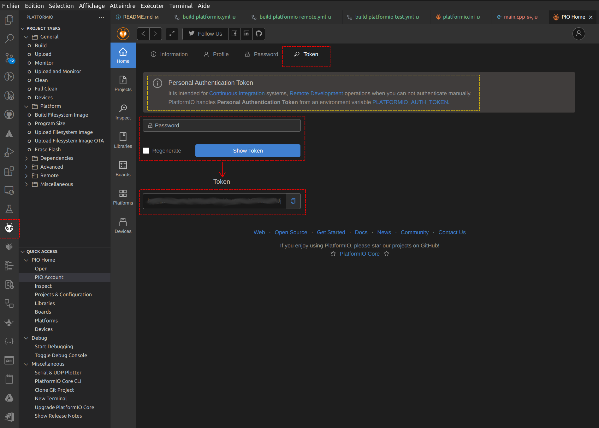

Ce _token_ va servir pour la connexion automatique au compte PlatformIO. Cela sera utile pour le système d'intégration continue **GitHub Actions** en ajoutant un nouveau `secret` (`PLATFORMIO_AUTH_TOKEN`) au dépôt GitHub :

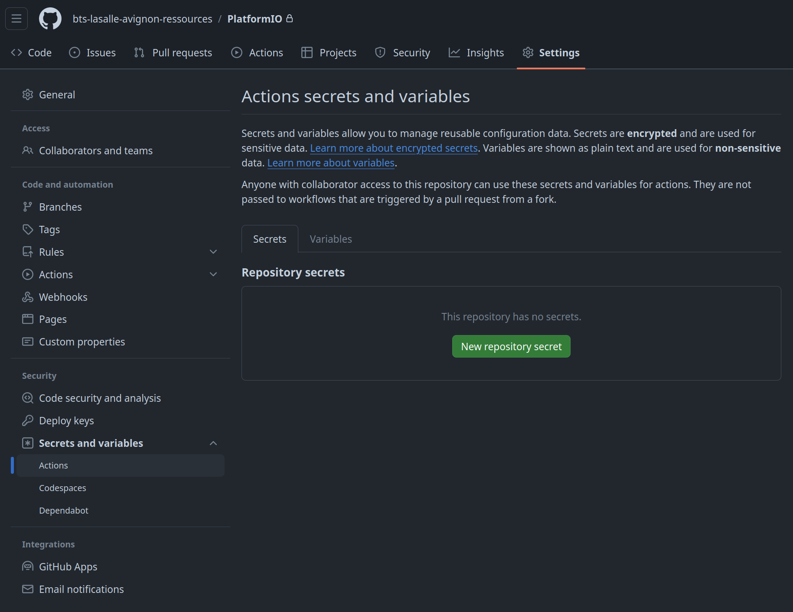

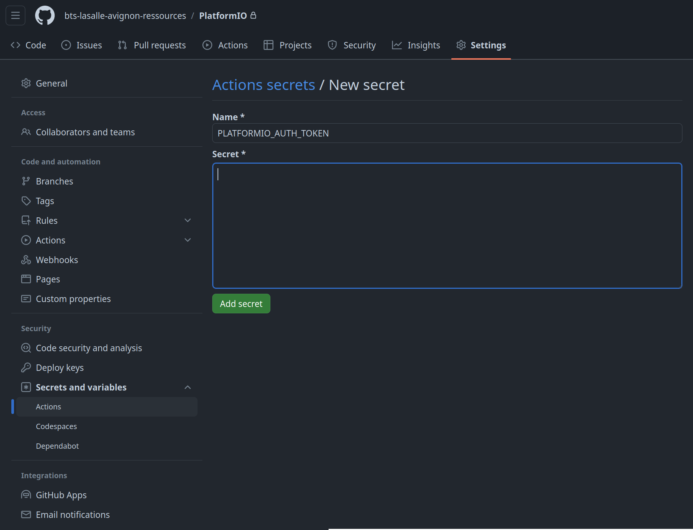

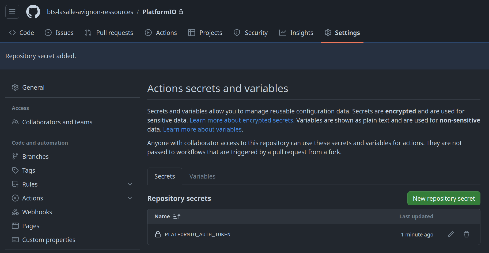

Exécuter des tests distants :

```sh
$ pio remote test --environment esp32_test
Building project locally
Verbosity level can be increased via `-v, -vv, or -vvv` option
Collected 2 tests

Processing test_esp32 in esp32_test environment

Building...
esp32_test:test_esp32 [PASSED] Took 1.33 seconds

0 test cases: 0 succeeded in 00:00:01.329
Testing project remotely
Verbosity level can be increased via `-v, -vv, or -vvv` option
Collected 2 tests

Processing test_esp32 in esp32_test environment

Building & Uploading...
Testing...
If you don't see any output for the first 10 secs, please reset board (press reset button)

test/test_esp32/test_esp32_main.cpp:47: test_unitaire_constructeur_led	[PASSED]
test/test_esp32/test_esp32_main.cpp:48: test_unitaire_led_on	[PASSED]
test/test_esp32/test_esp32_main.cpp:49: test_unitaire_led_off	[PASSED]
esp32_test:test_esp32 [PASSED] Took 5.40 seconds

SUMMARY
Environment    Test        Status    Duration
-------------  ----------  --------  ------------
esp32_test     test_esp32  PASSED    00:00:05.397
3 test cases: 3 succeeded in 00:00:05.397
```

On peut ajouter un _workflow_ pour effectuer les tests distants (on intègre le _token_ `PLATFORMIO_AUTH_TOKEN`) :

```yaml
name: PlatformIO Remote

on:
  push:
    branches:
      - main

jobs:
  build:
    runs-on: ubuntu-latest

    steps:
      - name: Checkout code
        uses: actions/checkout@v3

      - name: Setup PlatformIO
        uses: n-vr/setup-platformio-action@v1

      - name: Run tests on the embedded target
        env:
            PLATFORMIO_AUTH_TOKEN: ${{ secrets.PLATFORMIO_AUTH_TOKEN }}
        run: |
          cd src/arduino-esp32-tests && pio remote test -e esp32_test -v
```

Tutoriel : https://piolabs.com/blog/insights/unit-testing-part-3.html

## Auteurs

- [Thierry VAIRA](thierry.vaira@gmail.com) : [tvaira.free.fr](http://tvaira.free.fr/)

---
©️ 2024 BTS LaSalle Avignon
